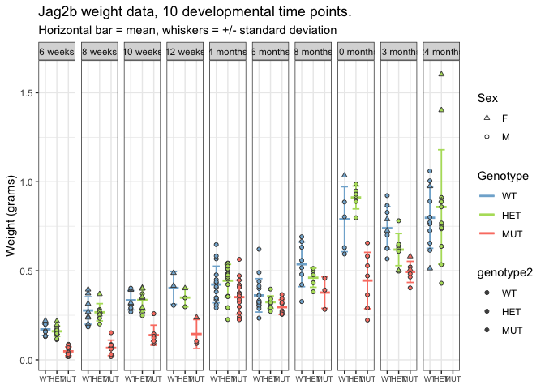

figure 1A, 1B - weight and length
================
Bradley Demarest
2023-03-03

``` r
library(data.table)
```

    ## Warning: package 'data.table' was built under R version 3.6.2

``` r
library(ggplot2)
library(tidyverse)
```

    ## ── Attaching packages ─────────────────────────────────────── tidyverse 1.3.2 ──
    ## ✔ tibble  3.1.6      ✔ dplyr   1.0.10
    ## ✔ tidyr   1.2.0      ✔ stringr 1.4.0 
    ## ✔ readr   2.1.2      ✔ forcats 0.5.2 
    ## ✔ purrr   0.3.4

    ## Warning: package 'tibble' was built under R version 3.6.2

    ## Warning: package 'tidyr' was built under R version 3.6.2

    ## Warning: package 'readr' was built under R version 3.6.2

    ## Warning: package 'purrr' was built under R version 3.6.2

    ## ── Conflicts ────────────────────────────────────────── tidyverse_conflicts() ──
    ## ✖ dplyr::between()   masks data.table::between()
    ## ✖ dplyr::filter()    masks stats::filter()
    ## ✖ dplyr::first()     masks data.table::first()
    ## ✖ dplyr::lag()       masks stats::lag()
    ## ✖ dplyr::last()      masks data.table::last()
    ## ✖ purrr::transpose() masks data.table::transpose()

``` r
library(readxl)
library(gt)
library(here)
```

    ## here() starts at /Users/bdemarest/work/lalmero/jag2b_manuscript_figures

``` r
library(stringr)
```

``` r
# Load data from excel sheet.
# 


tab = readxl::read_excel(path=here("figure_1A_1B",
  "summary_weight_length_data_jag2b_6wpf_to_2yrold_20230303bld.xlsx"),
  na="NA")

tab = as.data.table(tab)

# Standardize all genotypes to uppercase.
tab[, genotype:=toupper(genotype)]
# Set order of genotypes.
tab[, genotype2:=factor(genotype, levels=c("WT", "HET", "MUT"))]

# Change age labels to format "6 weeks", "6 months", etc..    
tab[, age2:=str_replace(age, "month", " months")]
tab[, age2:=str_replace(age2, "wpf", " weeks")]

# Set factor order of age2 column, for plotting.
age_order_vec = c(paste(c(6, 8, 10, 12), "weeks"),
                  paste(c(4, 6, 8, 10, 13, 24), "months"))
tab[, age2:=factor(age2, levels=age_order_vec)]
```

``` r
# Plot weights.

# From ??
genotype_colors  = c( "WT"="#80b1d3",
                     "HET"="#b3de69",
                     "MUT"="#fb8072")
# From Chelsea ( 20220311_lengthanalysis.R )
genotype_colors2 = c( "WT"="#4fa0ca",
                     "HET"="#b3d968",
                     "MUT"="#f47f72")

p1 = ggplot(data=tab, aes(y=weight_gr, x=genotype2,
                          color=genotype2, fill=genotype2)) +
     theme_bw() +
     geom_boxplot(outlier.color=NA, fill=NA, linewidth=0.5) +
     geom_point(size=2, shape=21, color="grey20") +
     scale_color_manual(values=genotype_colors2) +
     scale_fill_manual(values=genotype_colors2) +
     facet_wrap(facets=vars(age2))
     


# Compute summary statistics, grouped by age2 and genotype2.
by_genotype = tab[, list(mean_weight=mean(weight_gr, na.rm=TRUE),
                           sd_weight=sd(weight_gr, na.rm=TRUE),
                         mean_length=mean(length_cm, na.rm=TRUE),
                         sd_length=sd(length_cm, na.rm=TRUE)),
                      by=list(age2, genotype2)]

p2 = ggplot() +
     theme_bw() +
     geom_errorbar(data=by_genotype,
                   aes(x=genotype2,
                       ymin=mean_weight - sd_weight,
                       ymax=mean_weight + sd_weight,
                       color=genotype2),
                   linewidth=0.625,
                   width=0.6) +
     geom_segment(data=by_genotype,
                  aes(y=mean_weight,
                      yend=mean_weight,
                      x=as.integer(genotype2) - 0.45,
                      xend=as.integer(genotype2) + 0.45,
                      color=genotype2),
                  linewidth=1.0) +
     geom_point(data=tab,
                aes(x=genotype2, 
                    y=weight_gr,
                    fill=genotype2,
                    shape=sex),
                #shape=21,
                color="grey30",
                size=1.4) +
     scale_shape_manual(values=c(M=21, F=24)) +
     scale_color_manual(values=genotype_colors) +
     scale_fill_manual(values=genotype_colors) +
     # theme(panel.grid.minor.y=element_blank()) +
     # theme(panel.grid.major.x=element_blank()) +
     theme(axis.text.x=element_text(size=rel(0.8))) +
     labs(title="Jag2b weight data, 10 developmental time points.") +
     labs(subtitle="Horizontal bar = mean, whiskers = +/- standard deviation") +
     labs(x=NULL, y="Weight (grams)", color="Genotype", shape="Sex") +
     facet_grid(cols=vars(age2))

ggsave(here("figure_1A_1B", "weights_10ages_20230303.pdf"),
       plot=p2, height=4, width=10)
```

    ## Warning: Removed 2 rows containing missing values (`geom_point()`).

``` r
print(p2)
```

    ## Warning: Removed 2 rows containing missing values (`geom_point()`).

<!-- -->
