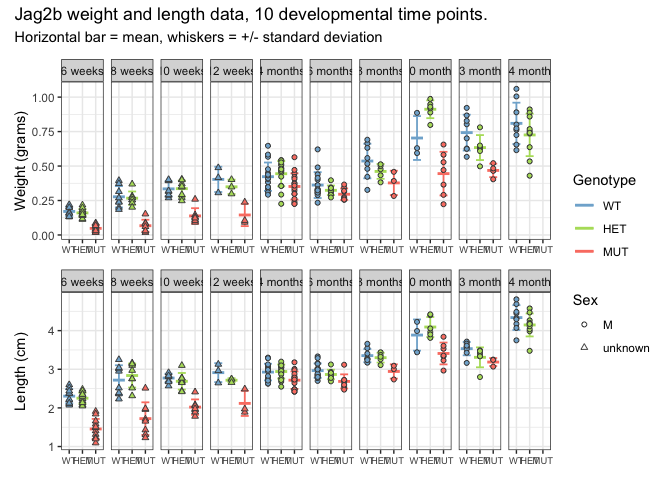

figure 1A, 1B - weight and length
================
Bradley Demarest
2023-03-03

``` r
library(data.table)
library(ggplot2)
library(tidyverse)
library(readxl)
library(gt)
library(here)
library(stringr)
library(patchwork)
```

``` r
# Load data from excel sheet.
# 

tab = readxl::read_excel(path=here("figure_1A_1B",
  "summary_weight_length_data_jag2b_6wpf_to_2yrold_20230303bld.xlsx"),
  na="NA")

tab = as.data.table(tab)

# Standardize all genotypes to uppercase.
tab[, genotype:=toupper(genotype)]
# Set order of genotypes.
tab[, genotype2:=factor(genotype, levels=c("WT", "HET", "MUT"))]

# Change age labels to format "6 weeks", "6 months", etc..    
tab[, age2:=str_replace(age, "month", " months")]
tab[, age2:=str_replace(age2, "wpf", " weeks")]

# Set factor order of age2 column, for plotting.
age_order_vec = c(paste(c(6, 8, 10, 12), "weeks"),
                  paste(c(4, 6, 8, 10, 13, 24), "months"))
tab[, age2:=factor(age2, levels=age_order_vec)]

# Convert dob to character.
tab[, dob:=as.character(dob)]
```

``` r
# Table showing sample size for all time points, genotypes.

dcast(data=tab, genotype2 ~ age2, fun.aggregate=length) %>% 
  as_tibble() %>%
  gt() %>%
  tab_header(title="1. jag2b fish counts by timepoint and genotype.")
```

<style>html {
  font-family: -apple-system, BlinkMacSystemFont, 'Segoe UI', Roboto, Oxygen, Ubuntu, Cantarell, 'Helvetica Neue', 'Fira Sans', 'Droid Sans', Arial, sans-serif;
}

#txhpeadgkm .gt_table {
  display: table;
  border-collapse: collapse;
  margin-left: auto;
  /* table.margin.left */
  margin-right: auto;
  /* table.margin.right */
  color: #333333;
  font-size: 16px;
  /* table.font.size */
  background-color: #FFFFFF;
  /* table.background.color */
  width: auto;
  /* table.width */
  border-top-style: solid;
  /* table.border.top.style */
  border-top-width: 2px;
  /* table.border.top.width */
  border-top-color: #A8A8A8;
  /* table.border.top.color */
  border-bottom-style: solid;
  /* table.border.bottom.style */
  border-bottom-width: 2px;
  /* table.border.bottom.width */
  border-bottom-color: #A8A8A8;
  /* table.border.bottom.color */
}

#txhpeadgkm .gt_heading {
  background-color: #FFFFFF;
  /* heading.background.color */
  border-bottom-color: #FFFFFF;
  /* table.background.color */
  border-left-style: hidden;
  /* heading.border.lr.style */
  border-left-width: 1px;
  /* heading.border.lr.width */
  border-left-color: #D3D3D3;
  /* heading.border.lr.color */
  border-right-style: hidden;
  /* heading.border.lr.style */
  border-right-width: 1px;
  /* heading.border.lr.width */
  border-right-color: #D3D3D3;
  /* heading.border.lr.color */
}

#txhpeadgkm .gt_title {
  color: #333333;
  font-size: 125%;
  /* heading.title.font.size */
  font-weight: initial;
  /* heading.title.font.weight */
  padding-top: 4px;
  /* heading.top.padding - not yet used */
  padding-bottom: 4px;
  border-bottom-color: #FFFFFF;
  /* table.background.color */
  border-bottom-width: 0;
}

#txhpeadgkm .gt_subtitle {
  color: #333333;
  font-size: 85%;
  /* heading.subtitle.font.size */
  font-weight: initial;
  /* heading.subtitle.font.weight */
  padding-top: 0;
  padding-bottom: 4px;
  /* heading.bottom.padding - not yet used */
  border-top-color: #FFFFFF;
  /* table.background.color */
  border-top-width: 0;
}

#txhpeadgkm .gt_bottom_border {
  border-bottom-style: solid;
  /* heading.border.bottom.style */
  border-bottom-width: 2px;
  /* heading.border.bottom.width */
  border-bottom-color: #D3D3D3;
  /* heading.border.bottom.color */
}

#txhpeadgkm .gt_column_spanner {
  border-bottom-style: solid;
  border-bottom-width: 2px;
  border-bottom-color: #D3D3D3;
  padding-top: 4px;
  padding-bottom: 4px;
}

#txhpeadgkm .gt_col_headings {
  border-top-style: solid;
  /* column_labels.border.top.style */
  border-top-width: 2px;
  /* column_labels.border.top.width */
  border-top-color: #D3D3D3;
  /* column_labels.border.top.color */
  border-bottom-style: solid;
  /* column_labels.border.bottom.style */
  border-bottom-width: 2px;
  /* column_labels.border.bottom.width */
  border-bottom-color: #D3D3D3;
  /* column_labels.border.bottom.color */
  border-left-style: none;
  /* column_labels.border.lr.style */
  border-left-width: 1px;
  /* column_labels.border.lr.width */
  border-left-color: #D3D3D3;
  /* column_labels.border.lr.color */
  border-right-style: none;
  /* column_labels.border.lr.style */
  border-right-width: 1px;
  /* column_labels.border.lr.width */
  border-right-color: #D3D3D3;
  /* column_labels.border.lr.color */
}

#txhpeadgkm .gt_col_heading {
  color: #333333;
  background-color: #FFFFFF;
  /* column_labels.background.color */
  font-size: 100%;
  /* column_labels.font.size */
  font-weight: normal;
  /* column_labels.font.weight */
  text-transform: inherit;
  /* column_labels.text_transform */
  vertical-align: middle;
  padding: 5px;
  margin: 10px;
  overflow-x: hidden;
}

#txhpeadgkm .gt_sep_right {
  border-right: 5px solid #FFFFFF;
}

#txhpeadgkm .gt_group_heading {
  padding: 8px;
  /* row_group.padding */
  color: #333333;
  background-color: #FFFFFF;
  /* row_group.background.color */
  font-size: 100%;
  /* row_group.font.size */
  font-weight: initial;
  /* row_group.font.weight */
  text-transform: inherit;
  /* row_group.text_transform */
  border-top-style: solid;
  /* row_group.border.top.style */
  border-top-width: 2px;
  /* row_group.border.top.width */
  border-top-color: #D3D3D3;
  /* row_group.border.top.color */
  border-bottom-style: solid;
  /* row_group.border.bottom.style */
  border-bottom-width: 2px;
  /* row_group.border.bottom.width */
  border-bottom-color: #D3D3D3;
  /* row_group.border.bottom.color */
  border-left-style: none;
  /* row_group.border.left.style */
  border-left-width: 1px;
  /* row_group.border.left.width */
  border-left-color: #D3D3D3;
  /* row_group.border.left.color */
  border-right-style: none;
  /* row_group.border.right.style */
  border-right-width: 1px;
  /* row_group.border.right.width */
  border-right-color: #D3D3D3;
  /* row_group.border.right.color */
  vertical-align: middle;
}

#txhpeadgkm .gt_empty_group_heading {
  padding: 0.5px;
  color: #333333;
  background-color: #FFFFFF;
  /* row_group.background.color */
  font-size: 100%;
  /* row_group.font.size */
  font-weight: initial;
  /* row_group.font.weight */
  border-top-style: solid;
  /* row_group.border.top.style */
  border-top-width: 2px;
  /* row_group.border.top.width */
  border-top-color: #D3D3D3;
  /* row_group.border.top.color */
  border-bottom-style: solid;
  /* row_group.border.bottom.style */
  border-bottom-width: 2px;
  /* row_group.border.bottom.width */
  border-bottom-color: #D3D3D3;
  /* row_group.border.bottom.color */
  vertical-align: middle;
}

#txhpeadgkm .gt_striped {
  background-color: rgba(128, 128, 128, 0.05);
  /* row.striping.background_color */
}

#txhpeadgkm .gt_from_md > :first-child {
  margin-top: 0;
}

#txhpeadgkm .gt_from_md > :last-child {
  margin-bottom: 0;
}

#txhpeadgkm .gt_row {
  padding-top: 8px;
  /* data_row.padding */
  padding-bottom: 8px;
  /* data_row.padding */
  padding-left: 5px;
  padding-right: 5px;
  margin: 10px;
  border-top-style: solid;
  /* table_body.hlines.style */
  border-top-width: 1px;
  /* table_body.hlines.width */
  border-top-color: #D3D3D3;
  /* table_body.hlines.color */
  border-left-style: none;
  /* table_body.vlines.style */
  border-left-width: 1px;
  /* table_body.vlines.width */
  border-left-color: #D3D3D3;
  /* table_body.vlines.color */
  border-right-style: none;
  /* table_body.vlines.style */
  border-right-width: 1px;
  /* table_body.vlines.width */
  border-right-color: #D3D3D3;
  /* table_body.vlines.color */
  vertical-align: middle;
  overflow-x: hidden;
}

#txhpeadgkm .gt_stub {
  color: #333333;
  background-color: #FFFFFF;
  /* stub.background.color */
  font-weight: initial;
  /* stub.font.weight */
  text-transform: inherit;
  /* stub.text_transform */
  border-right-style: solid;
  /* stub.border.style */
  border-right-width: 2px;
  /* stub.border.width */
  border-right-color: #D3D3D3;
  /* stub.border.color */
  padding-left: 12px;
}

#txhpeadgkm .gt_summary_row {
  color: #333333;
  background-color: #FFFFFF;
  /* summary_row.background.color */
  text-transform: inherit;
  /* summary_row.text_transform */
  padding-top: 8px;
  /* summary_row.padding */
  padding-bottom: 8px;
  /* summary_row.padding */
  padding-left: 5px;
  padding-right: 5px;
}

#txhpeadgkm .gt_first_summary_row {
  padding-top: 8px;
  /* summary_row.padding */
  padding-bottom: 8px;
  /* summary_row.padding */
  padding-left: 5px;
  padding-right: 5px;
  border-top-style: solid;
  /* summary_row.border.style */
  border-top-width: 2px;
  /* summary_row.border.width */
  border-top-color: #D3D3D3;
  /* summary_row.border.color */
}

#txhpeadgkm .gt_grand_summary_row {
  color: #333333;
  background-color: #FFFFFF;
  /* grand_summary_row.background.color */
  text-transform: inherit;
  /* grand_summary_row.text_transform */
  padding-top: 8px;
  /* grand_summary_row.padding */
  padding-bottom: 8px;
  /* grand_summary_row.padding */
  padding-left: 5px;
  padding-right: 5px;
}

#txhpeadgkm .gt_first_grand_summary_row {
  padding-top: 8px;
  /* grand_summary_row.padding */
  padding-bottom: 8px;
  /* grand_summary_row.padding */
  padding-left: 5px;
  padding-right: 5px;
  border-top-style: double;
  /* grand_summary_row.border.style */
  border-top-width: 6px;
  /* grand_summary_row.border.width */
  border-top-color: #D3D3D3;
  /* grand_summary_row.border.color */
}

#txhpeadgkm .gt_table_body {
  border-top-style: solid;
  /* table_body.border.top.style */
  border-top-width: 2px;
  /* table_body.border.top.width */
  border-top-color: #D3D3D3;
  /* table_body.border.top.color */
  border-bottom-style: solid;
  /* table_body.border.bottom.style */
  border-bottom-width: 2px;
  /* table_body.border.bottom.width */
  border-bottom-color: #D3D3D3;
  /* table_body.border.bottom.color */
}

#txhpeadgkm .gt_footnotes {
  color: #333333;
  background-color: #FFFFFF;
  /* footnotes.background.color */
  border-bottom-style: none;
  /* footnotes.border.bottom.style */
  border-bottom-width: 2px;
  /* footnotes.border.bottom.width */
  border-bottom-color: #D3D3D3;
  /* footnotes.border.bottom.color */
  border-left-style: none;
  /* footnotes.border.lr.color */
  border-left-width: 2px;
  /* footnotes.border.lr.color */
  border-left-color: #D3D3D3;
  /* footnotes.border.lr.color */
  border-right-style: none;
  /* footnotes.border.lr.color */
  border-right-width: 2px;
  /* footnotes.border.lr.color */
  border-right-color: #D3D3D3;
  /* footnotes.border.lr.color */
}

#txhpeadgkm .gt_footnote {
  margin: 0px;
  font-size: 90%;
  /* footnotes.font.size */
  padding: 4px;
  /* footnotes.padding */
}

#txhpeadgkm .gt_sourcenotes {
  color: #333333;
  background-color: #FFFFFF;
  /* source_notes.background.color */
  border-bottom-style: none;
  /* source_notes.border.bottom.style */
  border-bottom-width: 2px;
  /* source_notes.border.bottom.width */
  border-bottom-color: #D3D3D3;
  /* source_notes.border.bottom.color */
  border-left-style: none;
  /* source_notes.border.lr.style */
  border-left-width: 2px;
  /* source_notes.border.lr.style */
  border-left-color: #D3D3D3;
  /* source_notes.border.lr.style */
  border-right-style: none;
  /* source_notes.border.lr.style */
  border-right-width: 2px;
  /* source_notes.border.lr.style */
  border-right-color: #D3D3D3;
  /* source_notes.border.lr.style */
}

#txhpeadgkm .gt_sourcenote {
  font-size: 90%;
  /* source_notes.font.size */
  padding: 4px;
  /* source_notes.padding */
}

#txhpeadgkm .gt_left {
  text-align: left;
}

#txhpeadgkm .gt_center {
  text-align: center;
}

#txhpeadgkm .gt_right {
  text-align: right;
  font-variant-numeric: tabular-nums;
}

#txhpeadgkm .gt_font_normal {
  font-weight: normal;
}

#txhpeadgkm .gt_font_bold {
  font-weight: bold;
}

#txhpeadgkm .gt_font_italic {
  font-style: italic;
}

#txhpeadgkm .gt_super {
  font-size: 65%;
}

#txhpeadgkm .gt_footnote_marks {
  font-style: italic;
  font-size: 65%;
}
</style>
<div id="txhpeadgkm" style="overflow-x:auto;overflow-y:auto;width:auto;height:auto;"><table class="gt_table">
  <thead class="gt_header">
    <tr>
      <th colspan="11" class="gt_heading gt_title gt_font_normal gt_center" style>1. jag2b fish counts by timepoint and genotype.</th>
    </tr>
    <tr>
      <th colspan="11" class="gt_heading gt_subtitle gt_font_normal gt_center gt_bottom_border" style></th>
    </tr>
  </thead>
  <thead class="gt_col_headings">
    <tr>
      <th class="gt_col_heading gt_columns_bottom_border gt_center" rowspan="1" colspan="1">genotype2</th>
      <th class="gt_col_heading gt_columns_bottom_border gt_center" rowspan="1" colspan="1">6 weeks</th>
      <th class="gt_col_heading gt_columns_bottom_border gt_center" rowspan="1" colspan="1">8 weeks</th>
      <th class="gt_col_heading gt_columns_bottom_border gt_center" rowspan="1" colspan="1">10 weeks</th>
      <th class="gt_col_heading gt_columns_bottom_border gt_center" rowspan="1" colspan="1">12 weeks</th>
      <th class="gt_col_heading gt_columns_bottom_border gt_center" rowspan="1" colspan="1">4 months</th>
      <th class="gt_col_heading gt_columns_bottom_border gt_center" rowspan="1" colspan="1">6 months</th>
      <th class="gt_col_heading gt_columns_bottom_border gt_center" rowspan="1" colspan="1">8 months</th>
      <th class="gt_col_heading gt_columns_bottom_border gt_center" rowspan="1" colspan="1">10 months</th>
      <th class="gt_col_heading gt_columns_bottom_border gt_center" rowspan="1" colspan="1">13 months</th>
      <th class="gt_col_heading gt_columns_bottom_border gt_center" rowspan="1" colspan="1">24 months</th>
    </tr>
  </thead>
  <tbody class="gt_table_body">
    <tr>
      <td class="gt_row gt_center">WT</td>
      <td class="gt_row gt_center">10</td>
      <td class="gt_row gt_center">8</td>
      <td class="gt_row gt_center">8</td>
      <td class="gt_row gt_center">3</td>
      <td class="gt_row gt_center">16</td>
      <td class="gt_row gt_center">16</td>
      <td class="gt_row gt_center">8</td>
      <td class="gt_row gt_center">4</td>
      <td class="gt_row gt_center">10</td>
      <td class="gt_row gt_center">11</td>
    </tr>
    <tr>
      <td class="gt_row gt_center gt_striped">HET</td>
      <td class="gt_row gt_center gt_striped">13</td>
      <td class="gt_row gt_center gt_striped">8</td>
      <td class="gt_row gt_center gt_striped">8</td>
      <td class="gt_row gt_center gt_striped">3</td>
      <td class="gt_row gt_center gt_striped">18</td>
      <td class="gt_row gt_center gt_striped">10</td>
      <td class="gt_row gt_center gt_striped">5</td>
      <td class="gt_row gt_center gt_striped">6</td>
      <td class="gt_row gt_center gt_striped">8</td>
      <td class="gt_row gt_center gt_striped">13</td>
    </tr>
    <tr>
      <td class="gt_row gt_center">MUT</td>
      <td class="gt_row gt_center">12</td>
      <td class="gt_row gt_center">8</td>
      <td class="gt_row gt_center">7</td>
      <td class="gt_row gt_center">3</td>
      <td class="gt_row gt_center">16</td>
      <td class="gt_row gt_center">9</td>
      <td class="gt_row gt_center">3</td>
      <td class="gt_row gt_center">7</td>
      <td class="gt_row gt_center">6</td>
      <td class="gt_row gt_center">0</td>
    </tr>
  </tbody>
  
  
</table></div>

``` r
# Table for all time points and sexes, grouped by genotype.

dcast(data=tab, sex + genotype2 ~ age2, fun.aggregate=length) %>% 
  as_tibble() %>%
  group_by(genotype2) %>%
  gt() %>%
  tab_header(title="2. jag2b fish counts by timepoint, genotype, and sex") %>%
  tab_source_note(
    source_note=md("Data modifications: For plots and stats analysis, we will
    
    1. Combine males and females for 6- to 12-week timepoints, changing sex to \"unknown\" for these fish.
    2. Discard females for timepoints 10- to 24-month.
    
    Rationale: Determining sex for 6- to 12-week old fish is difficult and error prone.
    Sex differences in weight and length are generally minimal at these ages,
    and jag2b mutants are impossible to sex.
    The number of females of ages 10- to 24-months is too small to allow
    adding sex to the ANOVA model."))
```

<style>html {
  font-family: -apple-system, BlinkMacSystemFont, 'Segoe UI', Roboto, Oxygen, Ubuntu, Cantarell, 'Helvetica Neue', 'Fira Sans', 'Droid Sans', Arial, sans-serif;
}

#wnodfueqtt .gt_table {
  display: table;
  border-collapse: collapse;
  margin-left: auto;
  /* table.margin.left */
  margin-right: auto;
  /* table.margin.right */
  color: #333333;
  font-size: 16px;
  /* table.font.size */
  background-color: #FFFFFF;
  /* table.background.color */
  width: auto;
  /* table.width */
  border-top-style: solid;
  /* table.border.top.style */
  border-top-width: 2px;
  /* table.border.top.width */
  border-top-color: #A8A8A8;
  /* table.border.top.color */
  border-bottom-style: solid;
  /* table.border.bottom.style */
  border-bottom-width: 2px;
  /* table.border.bottom.width */
  border-bottom-color: #A8A8A8;
  /* table.border.bottom.color */
}

#wnodfueqtt .gt_heading {
  background-color: #FFFFFF;
  /* heading.background.color */
  border-bottom-color: #FFFFFF;
  /* table.background.color */
  border-left-style: hidden;
  /* heading.border.lr.style */
  border-left-width: 1px;
  /* heading.border.lr.width */
  border-left-color: #D3D3D3;
  /* heading.border.lr.color */
  border-right-style: hidden;
  /* heading.border.lr.style */
  border-right-width: 1px;
  /* heading.border.lr.width */
  border-right-color: #D3D3D3;
  /* heading.border.lr.color */
}

#wnodfueqtt .gt_title {
  color: #333333;
  font-size: 125%;
  /* heading.title.font.size */
  font-weight: initial;
  /* heading.title.font.weight */
  padding-top: 4px;
  /* heading.top.padding - not yet used */
  padding-bottom: 4px;
  border-bottom-color: #FFFFFF;
  /* table.background.color */
  border-bottom-width: 0;
}

#wnodfueqtt .gt_subtitle {
  color: #333333;
  font-size: 85%;
  /* heading.subtitle.font.size */
  font-weight: initial;
  /* heading.subtitle.font.weight */
  padding-top: 0;
  padding-bottom: 4px;
  /* heading.bottom.padding - not yet used */
  border-top-color: #FFFFFF;
  /* table.background.color */
  border-top-width: 0;
}

#wnodfueqtt .gt_bottom_border {
  border-bottom-style: solid;
  /* heading.border.bottom.style */
  border-bottom-width: 2px;
  /* heading.border.bottom.width */
  border-bottom-color: #D3D3D3;
  /* heading.border.bottom.color */
}

#wnodfueqtt .gt_column_spanner {
  border-bottom-style: solid;
  border-bottom-width: 2px;
  border-bottom-color: #D3D3D3;
  padding-top: 4px;
  padding-bottom: 4px;
}

#wnodfueqtt .gt_col_headings {
  border-top-style: solid;
  /* column_labels.border.top.style */
  border-top-width: 2px;
  /* column_labels.border.top.width */
  border-top-color: #D3D3D3;
  /* column_labels.border.top.color */
  border-bottom-style: solid;
  /* column_labels.border.bottom.style */
  border-bottom-width: 2px;
  /* column_labels.border.bottom.width */
  border-bottom-color: #D3D3D3;
  /* column_labels.border.bottom.color */
  border-left-style: none;
  /* column_labels.border.lr.style */
  border-left-width: 1px;
  /* column_labels.border.lr.width */
  border-left-color: #D3D3D3;
  /* column_labels.border.lr.color */
  border-right-style: none;
  /* column_labels.border.lr.style */
  border-right-width: 1px;
  /* column_labels.border.lr.width */
  border-right-color: #D3D3D3;
  /* column_labels.border.lr.color */
}

#wnodfueqtt .gt_col_heading {
  color: #333333;
  background-color: #FFFFFF;
  /* column_labels.background.color */
  font-size: 100%;
  /* column_labels.font.size */
  font-weight: normal;
  /* column_labels.font.weight */
  text-transform: inherit;
  /* column_labels.text_transform */
  vertical-align: middle;
  padding: 5px;
  margin: 10px;
  overflow-x: hidden;
}

#wnodfueqtt .gt_sep_right {
  border-right: 5px solid #FFFFFF;
}

#wnodfueqtt .gt_group_heading {
  padding: 8px;
  /* row_group.padding */
  color: #333333;
  background-color: #FFFFFF;
  /* row_group.background.color */
  font-size: 100%;
  /* row_group.font.size */
  font-weight: initial;
  /* row_group.font.weight */
  text-transform: inherit;
  /* row_group.text_transform */
  border-top-style: solid;
  /* row_group.border.top.style */
  border-top-width: 2px;
  /* row_group.border.top.width */
  border-top-color: #D3D3D3;
  /* row_group.border.top.color */
  border-bottom-style: solid;
  /* row_group.border.bottom.style */
  border-bottom-width: 2px;
  /* row_group.border.bottom.width */
  border-bottom-color: #D3D3D3;
  /* row_group.border.bottom.color */
  border-left-style: none;
  /* row_group.border.left.style */
  border-left-width: 1px;
  /* row_group.border.left.width */
  border-left-color: #D3D3D3;
  /* row_group.border.left.color */
  border-right-style: none;
  /* row_group.border.right.style */
  border-right-width: 1px;
  /* row_group.border.right.width */
  border-right-color: #D3D3D3;
  /* row_group.border.right.color */
  vertical-align: middle;
}

#wnodfueqtt .gt_empty_group_heading {
  padding: 0.5px;
  color: #333333;
  background-color: #FFFFFF;
  /* row_group.background.color */
  font-size: 100%;
  /* row_group.font.size */
  font-weight: initial;
  /* row_group.font.weight */
  border-top-style: solid;
  /* row_group.border.top.style */
  border-top-width: 2px;
  /* row_group.border.top.width */
  border-top-color: #D3D3D3;
  /* row_group.border.top.color */
  border-bottom-style: solid;
  /* row_group.border.bottom.style */
  border-bottom-width: 2px;
  /* row_group.border.bottom.width */
  border-bottom-color: #D3D3D3;
  /* row_group.border.bottom.color */
  vertical-align: middle;
}

#wnodfueqtt .gt_striped {
  background-color: rgba(128, 128, 128, 0.05);
  /* row.striping.background_color */
}

#wnodfueqtt .gt_from_md > :first-child {
  margin-top: 0;
}

#wnodfueqtt .gt_from_md > :last-child {
  margin-bottom: 0;
}

#wnodfueqtt .gt_row {
  padding-top: 8px;
  /* data_row.padding */
  padding-bottom: 8px;
  /* data_row.padding */
  padding-left: 5px;
  padding-right: 5px;
  margin: 10px;
  border-top-style: solid;
  /* table_body.hlines.style */
  border-top-width: 1px;
  /* table_body.hlines.width */
  border-top-color: #D3D3D3;
  /* table_body.hlines.color */
  border-left-style: none;
  /* table_body.vlines.style */
  border-left-width: 1px;
  /* table_body.vlines.width */
  border-left-color: #D3D3D3;
  /* table_body.vlines.color */
  border-right-style: none;
  /* table_body.vlines.style */
  border-right-width: 1px;
  /* table_body.vlines.width */
  border-right-color: #D3D3D3;
  /* table_body.vlines.color */
  vertical-align: middle;
  overflow-x: hidden;
}

#wnodfueqtt .gt_stub {
  color: #333333;
  background-color: #FFFFFF;
  /* stub.background.color */
  font-weight: initial;
  /* stub.font.weight */
  text-transform: inherit;
  /* stub.text_transform */
  border-right-style: solid;
  /* stub.border.style */
  border-right-width: 2px;
  /* stub.border.width */
  border-right-color: #D3D3D3;
  /* stub.border.color */
  padding-left: 12px;
}

#wnodfueqtt .gt_summary_row {
  color: #333333;
  background-color: #FFFFFF;
  /* summary_row.background.color */
  text-transform: inherit;
  /* summary_row.text_transform */
  padding-top: 8px;
  /* summary_row.padding */
  padding-bottom: 8px;
  /* summary_row.padding */
  padding-left: 5px;
  padding-right: 5px;
}

#wnodfueqtt .gt_first_summary_row {
  padding-top: 8px;
  /* summary_row.padding */
  padding-bottom: 8px;
  /* summary_row.padding */
  padding-left: 5px;
  padding-right: 5px;
  border-top-style: solid;
  /* summary_row.border.style */
  border-top-width: 2px;
  /* summary_row.border.width */
  border-top-color: #D3D3D3;
  /* summary_row.border.color */
}

#wnodfueqtt .gt_grand_summary_row {
  color: #333333;
  background-color: #FFFFFF;
  /* grand_summary_row.background.color */
  text-transform: inherit;
  /* grand_summary_row.text_transform */
  padding-top: 8px;
  /* grand_summary_row.padding */
  padding-bottom: 8px;
  /* grand_summary_row.padding */
  padding-left: 5px;
  padding-right: 5px;
}

#wnodfueqtt .gt_first_grand_summary_row {
  padding-top: 8px;
  /* grand_summary_row.padding */
  padding-bottom: 8px;
  /* grand_summary_row.padding */
  padding-left: 5px;
  padding-right: 5px;
  border-top-style: double;
  /* grand_summary_row.border.style */
  border-top-width: 6px;
  /* grand_summary_row.border.width */
  border-top-color: #D3D3D3;
  /* grand_summary_row.border.color */
}

#wnodfueqtt .gt_table_body {
  border-top-style: solid;
  /* table_body.border.top.style */
  border-top-width: 2px;
  /* table_body.border.top.width */
  border-top-color: #D3D3D3;
  /* table_body.border.top.color */
  border-bottom-style: solid;
  /* table_body.border.bottom.style */
  border-bottom-width: 2px;
  /* table_body.border.bottom.width */
  border-bottom-color: #D3D3D3;
  /* table_body.border.bottom.color */
}

#wnodfueqtt .gt_footnotes {
  color: #333333;
  background-color: #FFFFFF;
  /* footnotes.background.color */
  border-bottom-style: none;
  /* footnotes.border.bottom.style */
  border-bottom-width: 2px;
  /* footnotes.border.bottom.width */
  border-bottom-color: #D3D3D3;
  /* footnotes.border.bottom.color */
  border-left-style: none;
  /* footnotes.border.lr.color */
  border-left-width: 2px;
  /* footnotes.border.lr.color */
  border-left-color: #D3D3D3;
  /* footnotes.border.lr.color */
  border-right-style: none;
  /* footnotes.border.lr.color */
  border-right-width: 2px;
  /* footnotes.border.lr.color */
  border-right-color: #D3D3D3;
  /* footnotes.border.lr.color */
}

#wnodfueqtt .gt_footnote {
  margin: 0px;
  font-size: 90%;
  /* footnotes.font.size */
  padding: 4px;
  /* footnotes.padding */
}

#wnodfueqtt .gt_sourcenotes {
  color: #333333;
  background-color: #FFFFFF;
  /* source_notes.background.color */
  border-bottom-style: none;
  /* source_notes.border.bottom.style */
  border-bottom-width: 2px;
  /* source_notes.border.bottom.width */
  border-bottom-color: #D3D3D3;
  /* source_notes.border.bottom.color */
  border-left-style: none;
  /* source_notes.border.lr.style */
  border-left-width: 2px;
  /* source_notes.border.lr.style */
  border-left-color: #D3D3D3;
  /* source_notes.border.lr.style */
  border-right-style: none;
  /* source_notes.border.lr.style */
  border-right-width: 2px;
  /* source_notes.border.lr.style */
  border-right-color: #D3D3D3;
  /* source_notes.border.lr.style */
}

#wnodfueqtt .gt_sourcenote {
  font-size: 90%;
  /* source_notes.font.size */
  padding: 4px;
  /* source_notes.padding */
}

#wnodfueqtt .gt_left {
  text-align: left;
}

#wnodfueqtt .gt_center {
  text-align: center;
}

#wnodfueqtt .gt_right {
  text-align: right;
  font-variant-numeric: tabular-nums;
}

#wnodfueqtt .gt_font_normal {
  font-weight: normal;
}

#wnodfueqtt .gt_font_bold {
  font-weight: bold;
}

#wnodfueqtt .gt_font_italic {
  font-style: italic;
}

#wnodfueqtt .gt_super {
  font-size: 65%;
}

#wnodfueqtt .gt_footnote_marks {
  font-style: italic;
  font-size: 65%;
}
</style>
<div id="wnodfueqtt" style="overflow-x:auto;overflow-y:auto;width:auto;height:auto;"><table class="gt_table">
  <thead class="gt_header">
    <tr>
      <th colspan="11" class="gt_heading gt_title gt_font_normal gt_center" style>2. jag2b fish counts by timepoint, genotype, and sex</th>
    </tr>
    <tr>
      <th colspan="11" class="gt_heading gt_subtitle gt_font_normal gt_center gt_bottom_border" style></th>
    </tr>
  </thead>
  <thead class="gt_col_headings">
    <tr>
      <th class="gt_col_heading gt_columns_bottom_border gt_left" rowspan="1" colspan="1">sex</th>
      <th class="gt_col_heading gt_columns_bottom_border gt_center" rowspan="1" colspan="1">6 weeks</th>
      <th class="gt_col_heading gt_columns_bottom_border gt_center" rowspan="1" colspan="1">8 weeks</th>
      <th class="gt_col_heading gt_columns_bottom_border gt_center" rowspan="1" colspan="1">10 weeks</th>
      <th class="gt_col_heading gt_columns_bottom_border gt_center" rowspan="1" colspan="1">12 weeks</th>
      <th class="gt_col_heading gt_columns_bottom_border gt_center" rowspan="1" colspan="1">4 months</th>
      <th class="gt_col_heading gt_columns_bottom_border gt_center" rowspan="1" colspan="1">6 months</th>
      <th class="gt_col_heading gt_columns_bottom_border gt_center" rowspan="1" colspan="1">8 months</th>
      <th class="gt_col_heading gt_columns_bottom_border gt_center" rowspan="1" colspan="1">10 months</th>
      <th class="gt_col_heading gt_columns_bottom_border gt_center" rowspan="1" colspan="1">13 months</th>
      <th class="gt_col_heading gt_columns_bottom_border gt_center" rowspan="1" colspan="1">24 months</th>
    </tr>
  </thead>
  <tbody class="gt_table_body">
    <tr class="gt_group_heading_row">
      <td colspan="11" class="gt_group_heading">WT</td>
    </tr>
    <tr>
      <td class="gt_row gt_left">F</td>
      <td class="gt_row gt_center">2</td>
      <td class="gt_row gt_center">7</td>
      <td class="gt_row gt_center">4</td>
      <td class="gt_row gt_center">2</td>
      <td class="gt_row gt_center">0</td>
      <td class="gt_row gt_center">0</td>
      <td class="gt_row gt_center">0</td>
      <td class="gt_row gt_center">1</td>
      <td class="gt_row gt_center">2</td>
      <td class="gt_row gt_center">2</td>
    </tr>
    <tr>
      <td class="gt_row gt_left gt_striped">M</td>
      <td class="gt_row gt_center gt_striped">8</td>
      <td class="gt_row gt_center gt_striped">1</td>
      <td class="gt_row gt_center gt_striped">4</td>
      <td class="gt_row gt_center gt_striped">1</td>
      <td class="gt_row gt_center gt_striped">16</td>
      <td class="gt_row gt_center gt_striped">16</td>
      <td class="gt_row gt_center gt_striped">8</td>
      <td class="gt_row gt_center gt_striped">3</td>
      <td class="gt_row gt_center gt_striped">8</td>
      <td class="gt_row gt_center gt_striped">9</td>
    </tr>
    <tr class="gt_group_heading_row">
      <td colspan="11" class="gt_group_heading">HET</td>
    </tr>
    <tr>
      <td class="gt_row gt_left">F</td>
      <td class="gt_row gt_center">3</td>
      <td class="gt_row gt_center">4</td>
      <td class="gt_row gt_center">6</td>
      <td class="gt_row gt_center">1</td>
      <td class="gt_row gt_center">0</td>
      <td class="gt_row gt_center">0</td>
      <td class="gt_row gt_center">0</td>
      <td class="gt_row gt_center">0</td>
      <td class="gt_row gt_center">2</td>
      <td class="gt_row gt_center">3</td>
    </tr>
    <tr>
      <td class="gt_row gt_left gt_striped">M</td>
      <td class="gt_row gt_center gt_striped">10</td>
      <td class="gt_row gt_center gt_striped">4</td>
      <td class="gt_row gt_center gt_striped">2</td>
      <td class="gt_row gt_center gt_striped">2</td>
      <td class="gt_row gt_center gt_striped">18</td>
      <td class="gt_row gt_center gt_striped">10</td>
      <td class="gt_row gt_center gt_striped">5</td>
      <td class="gt_row gt_center gt_striped">6</td>
      <td class="gt_row gt_center gt_striped">6</td>
      <td class="gt_row gt_center gt_striped">10</td>
    </tr>
    <tr class="gt_group_heading_row">
      <td colspan="11" class="gt_group_heading">MUT</td>
    </tr>
    <tr>
      <td class="gt_row gt_left">F</td>
      <td class="gt_row gt_center">3</td>
      <td class="gt_row gt_center">1</td>
      <td class="gt_row gt_center">1</td>
      <td class="gt_row gt_center">1</td>
      <td class="gt_row gt_center">0</td>
      <td class="gt_row gt_center">0</td>
      <td class="gt_row gt_center">0</td>
      <td class="gt_row gt_center">0</td>
      <td class="gt_row gt_center">2</td>
      <td class="gt_row gt_center">0</td>
    </tr>
    <tr>
      <td class="gt_row gt_left gt_striped">M</td>
      <td class="gt_row gt_center gt_striped">9</td>
      <td class="gt_row gt_center gt_striped">7</td>
      <td class="gt_row gt_center gt_striped">6</td>
      <td class="gt_row gt_center gt_striped">2</td>
      <td class="gt_row gt_center gt_striped">16</td>
      <td class="gt_row gt_center gt_striped">9</td>
      <td class="gt_row gt_center gt_striped">3</td>
      <td class="gt_row gt_center gt_striped">7</td>
      <td class="gt_row gt_center gt_striped">4</td>
      <td class="gt_row gt_center gt_striped">0</td>
    </tr>
  </tbody>
  <tfoot class="gt_sourcenotes">
    <tr>
      <td class="gt_sourcenote" colspan="11">Data modifications: For plots and stats analysis, we will</p>
<pre><code>1. Combine males and females for 6- to 12-week timepoints, changing sex to &quot;unknown&quot; for these fish.
2. Discard females for timepoints 10- to 24-month.

Rationale: Determining sex for 6- to 12-week old fish is difficult and error prone.
Sex differences in weight and length are generally minimal at these ages,
and jag2b mutants are impossible to sex.
The number of females of ages 10- to 24-months is too small to allow
adding sex to the ANOVA model.
</code></pre>
</td>
    </tr>
  </tfoot>
  
</table></div>

``` r
# Table dob batches, by time point.

dcast(data=tab, dob ~ age2, fun.aggregate=length) %>% 
  as_tibble() %>%
  gt() %>%
  tab_header(title="jag2b fish counts by timepoint and date-of-birth.")
```

<style>html {
  font-family: -apple-system, BlinkMacSystemFont, 'Segoe UI', Roboto, Oxygen, Ubuntu, Cantarell, 'Helvetica Neue', 'Fira Sans', 'Droid Sans', Arial, sans-serif;
}

#mopcdilbpi .gt_table {
  display: table;
  border-collapse: collapse;
  margin-left: auto;
  /* table.margin.left */
  margin-right: auto;
  /* table.margin.right */
  color: #333333;
  font-size: 16px;
  /* table.font.size */
  background-color: #FFFFFF;
  /* table.background.color */
  width: auto;
  /* table.width */
  border-top-style: solid;
  /* table.border.top.style */
  border-top-width: 2px;
  /* table.border.top.width */
  border-top-color: #A8A8A8;
  /* table.border.top.color */
  border-bottom-style: solid;
  /* table.border.bottom.style */
  border-bottom-width: 2px;
  /* table.border.bottom.width */
  border-bottom-color: #A8A8A8;
  /* table.border.bottom.color */
}

#mopcdilbpi .gt_heading {
  background-color: #FFFFFF;
  /* heading.background.color */
  border-bottom-color: #FFFFFF;
  /* table.background.color */
  border-left-style: hidden;
  /* heading.border.lr.style */
  border-left-width: 1px;
  /* heading.border.lr.width */
  border-left-color: #D3D3D3;
  /* heading.border.lr.color */
  border-right-style: hidden;
  /* heading.border.lr.style */
  border-right-width: 1px;
  /* heading.border.lr.width */
  border-right-color: #D3D3D3;
  /* heading.border.lr.color */
}

#mopcdilbpi .gt_title {
  color: #333333;
  font-size: 125%;
  /* heading.title.font.size */
  font-weight: initial;
  /* heading.title.font.weight */
  padding-top: 4px;
  /* heading.top.padding - not yet used */
  padding-bottom: 4px;
  border-bottom-color: #FFFFFF;
  /* table.background.color */
  border-bottom-width: 0;
}

#mopcdilbpi .gt_subtitle {
  color: #333333;
  font-size: 85%;
  /* heading.subtitle.font.size */
  font-weight: initial;
  /* heading.subtitle.font.weight */
  padding-top: 0;
  padding-bottom: 4px;
  /* heading.bottom.padding - not yet used */
  border-top-color: #FFFFFF;
  /* table.background.color */
  border-top-width: 0;
}

#mopcdilbpi .gt_bottom_border {
  border-bottom-style: solid;
  /* heading.border.bottom.style */
  border-bottom-width: 2px;
  /* heading.border.bottom.width */
  border-bottom-color: #D3D3D3;
  /* heading.border.bottom.color */
}

#mopcdilbpi .gt_column_spanner {
  border-bottom-style: solid;
  border-bottom-width: 2px;
  border-bottom-color: #D3D3D3;
  padding-top: 4px;
  padding-bottom: 4px;
}

#mopcdilbpi .gt_col_headings {
  border-top-style: solid;
  /* column_labels.border.top.style */
  border-top-width: 2px;
  /* column_labels.border.top.width */
  border-top-color: #D3D3D3;
  /* column_labels.border.top.color */
  border-bottom-style: solid;
  /* column_labels.border.bottom.style */
  border-bottom-width: 2px;
  /* column_labels.border.bottom.width */
  border-bottom-color: #D3D3D3;
  /* column_labels.border.bottom.color */
  border-left-style: none;
  /* column_labels.border.lr.style */
  border-left-width: 1px;
  /* column_labels.border.lr.width */
  border-left-color: #D3D3D3;
  /* column_labels.border.lr.color */
  border-right-style: none;
  /* column_labels.border.lr.style */
  border-right-width: 1px;
  /* column_labels.border.lr.width */
  border-right-color: #D3D3D3;
  /* column_labels.border.lr.color */
}

#mopcdilbpi .gt_col_heading {
  color: #333333;
  background-color: #FFFFFF;
  /* column_labels.background.color */
  font-size: 100%;
  /* column_labels.font.size */
  font-weight: normal;
  /* column_labels.font.weight */
  text-transform: inherit;
  /* column_labels.text_transform */
  vertical-align: middle;
  padding: 5px;
  margin: 10px;
  overflow-x: hidden;
}

#mopcdilbpi .gt_sep_right {
  border-right: 5px solid #FFFFFF;
}

#mopcdilbpi .gt_group_heading {
  padding: 8px;
  /* row_group.padding */
  color: #333333;
  background-color: #FFFFFF;
  /* row_group.background.color */
  font-size: 100%;
  /* row_group.font.size */
  font-weight: initial;
  /* row_group.font.weight */
  text-transform: inherit;
  /* row_group.text_transform */
  border-top-style: solid;
  /* row_group.border.top.style */
  border-top-width: 2px;
  /* row_group.border.top.width */
  border-top-color: #D3D3D3;
  /* row_group.border.top.color */
  border-bottom-style: solid;
  /* row_group.border.bottom.style */
  border-bottom-width: 2px;
  /* row_group.border.bottom.width */
  border-bottom-color: #D3D3D3;
  /* row_group.border.bottom.color */
  border-left-style: none;
  /* row_group.border.left.style */
  border-left-width: 1px;
  /* row_group.border.left.width */
  border-left-color: #D3D3D3;
  /* row_group.border.left.color */
  border-right-style: none;
  /* row_group.border.right.style */
  border-right-width: 1px;
  /* row_group.border.right.width */
  border-right-color: #D3D3D3;
  /* row_group.border.right.color */
  vertical-align: middle;
}

#mopcdilbpi .gt_empty_group_heading {
  padding: 0.5px;
  color: #333333;
  background-color: #FFFFFF;
  /* row_group.background.color */
  font-size: 100%;
  /* row_group.font.size */
  font-weight: initial;
  /* row_group.font.weight */
  border-top-style: solid;
  /* row_group.border.top.style */
  border-top-width: 2px;
  /* row_group.border.top.width */
  border-top-color: #D3D3D3;
  /* row_group.border.top.color */
  border-bottom-style: solid;
  /* row_group.border.bottom.style */
  border-bottom-width: 2px;
  /* row_group.border.bottom.width */
  border-bottom-color: #D3D3D3;
  /* row_group.border.bottom.color */
  vertical-align: middle;
}

#mopcdilbpi .gt_striped {
  background-color: rgba(128, 128, 128, 0.05);
  /* row.striping.background_color */
}

#mopcdilbpi .gt_from_md > :first-child {
  margin-top: 0;
}

#mopcdilbpi .gt_from_md > :last-child {
  margin-bottom: 0;
}

#mopcdilbpi .gt_row {
  padding-top: 8px;
  /* data_row.padding */
  padding-bottom: 8px;
  /* data_row.padding */
  padding-left: 5px;
  padding-right: 5px;
  margin: 10px;
  border-top-style: solid;
  /* table_body.hlines.style */
  border-top-width: 1px;
  /* table_body.hlines.width */
  border-top-color: #D3D3D3;
  /* table_body.hlines.color */
  border-left-style: none;
  /* table_body.vlines.style */
  border-left-width: 1px;
  /* table_body.vlines.width */
  border-left-color: #D3D3D3;
  /* table_body.vlines.color */
  border-right-style: none;
  /* table_body.vlines.style */
  border-right-width: 1px;
  /* table_body.vlines.width */
  border-right-color: #D3D3D3;
  /* table_body.vlines.color */
  vertical-align: middle;
  overflow-x: hidden;
}

#mopcdilbpi .gt_stub {
  color: #333333;
  background-color: #FFFFFF;
  /* stub.background.color */
  font-weight: initial;
  /* stub.font.weight */
  text-transform: inherit;
  /* stub.text_transform */
  border-right-style: solid;
  /* stub.border.style */
  border-right-width: 2px;
  /* stub.border.width */
  border-right-color: #D3D3D3;
  /* stub.border.color */
  padding-left: 12px;
}

#mopcdilbpi .gt_summary_row {
  color: #333333;
  background-color: #FFFFFF;
  /* summary_row.background.color */
  text-transform: inherit;
  /* summary_row.text_transform */
  padding-top: 8px;
  /* summary_row.padding */
  padding-bottom: 8px;
  /* summary_row.padding */
  padding-left: 5px;
  padding-right: 5px;
}

#mopcdilbpi .gt_first_summary_row {
  padding-top: 8px;
  /* summary_row.padding */
  padding-bottom: 8px;
  /* summary_row.padding */
  padding-left: 5px;
  padding-right: 5px;
  border-top-style: solid;
  /* summary_row.border.style */
  border-top-width: 2px;
  /* summary_row.border.width */
  border-top-color: #D3D3D3;
  /* summary_row.border.color */
}

#mopcdilbpi .gt_grand_summary_row {
  color: #333333;
  background-color: #FFFFFF;
  /* grand_summary_row.background.color */
  text-transform: inherit;
  /* grand_summary_row.text_transform */
  padding-top: 8px;
  /* grand_summary_row.padding */
  padding-bottom: 8px;
  /* grand_summary_row.padding */
  padding-left: 5px;
  padding-right: 5px;
}

#mopcdilbpi .gt_first_grand_summary_row {
  padding-top: 8px;
  /* grand_summary_row.padding */
  padding-bottom: 8px;
  /* grand_summary_row.padding */
  padding-left: 5px;
  padding-right: 5px;
  border-top-style: double;
  /* grand_summary_row.border.style */
  border-top-width: 6px;
  /* grand_summary_row.border.width */
  border-top-color: #D3D3D3;
  /* grand_summary_row.border.color */
}

#mopcdilbpi .gt_table_body {
  border-top-style: solid;
  /* table_body.border.top.style */
  border-top-width: 2px;
  /* table_body.border.top.width */
  border-top-color: #D3D3D3;
  /* table_body.border.top.color */
  border-bottom-style: solid;
  /* table_body.border.bottom.style */
  border-bottom-width: 2px;
  /* table_body.border.bottom.width */
  border-bottom-color: #D3D3D3;
  /* table_body.border.bottom.color */
}

#mopcdilbpi .gt_footnotes {
  color: #333333;
  background-color: #FFFFFF;
  /* footnotes.background.color */
  border-bottom-style: none;
  /* footnotes.border.bottom.style */
  border-bottom-width: 2px;
  /* footnotes.border.bottom.width */
  border-bottom-color: #D3D3D3;
  /* footnotes.border.bottom.color */
  border-left-style: none;
  /* footnotes.border.lr.color */
  border-left-width: 2px;
  /* footnotes.border.lr.color */
  border-left-color: #D3D3D3;
  /* footnotes.border.lr.color */
  border-right-style: none;
  /* footnotes.border.lr.color */
  border-right-width: 2px;
  /* footnotes.border.lr.color */
  border-right-color: #D3D3D3;
  /* footnotes.border.lr.color */
}

#mopcdilbpi .gt_footnote {
  margin: 0px;
  font-size: 90%;
  /* footnotes.font.size */
  padding: 4px;
  /* footnotes.padding */
}

#mopcdilbpi .gt_sourcenotes {
  color: #333333;
  background-color: #FFFFFF;
  /* source_notes.background.color */
  border-bottom-style: none;
  /* source_notes.border.bottom.style */
  border-bottom-width: 2px;
  /* source_notes.border.bottom.width */
  border-bottom-color: #D3D3D3;
  /* source_notes.border.bottom.color */
  border-left-style: none;
  /* source_notes.border.lr.style */
  border-left-width: 2px;
  /* source_notes.border.lr.style */
  border-left-color: #D3D3D3;
  /* source_notes.border.lr.style */
  border-right-style: none;
  /* source_notes.border.lr.style */
  border-right-width: 2px;
  /* source_notes.border.lr.style */
  border-right-color: #D3D3D3;
  /* source_notes.border.lr.style */
}

#mopcdilbpi .gt_sourcenote {
  font-size: 90%;
  /* source_notes.font.size */
  padding: 4px;
  /* source_notes.padding */
}

#mopcdilbpi .gt_left {
  text-align: left;
}

#mopcdilbpi .gt_center {
  text-align: center;
}

#mopcdilbpi .gt_right {
  text-align: right;
  font-variant-numeric: tabular-nums;
}

#mopcdilbpi .gt_font_normal {
  font-weight: normal;
}

#mopcdilbpi .gt_font_bold {
  font-weight: bold;
}

#mopcdilbpi .gt_font_italic {
  font-style: italic;
}

#mopcdilbpi .gt_super {
  font-size: 65%;
}

#mopcdilbpi .gt_footnote_marks {
  font-style: italic;
  font-size: 65%;
}
</style>
<div id="mopcdilbpi" style="overflow-x:auto;overflow-y:auto;width:auto;height:auto;"><table class="gt_table">
  <thead class="gt_header">
    <tr>
      <th colspan="11" class="gt_heading gt_title gt_font_normal gt_center" style>jag2b fish counts by timepoint and date-of-birth.</th>
    </tr>
    <tr>
      <th colspan="11" class="gt_heading gt_subtitle gt_font_normal gt_center gt_bottom_border" style></th>
    </tr>
  </thead>
  <thead class="gt_col_headings">
    <tr>
      <th class="gt_col_heading gt_columns_bottom_border gt_left" rowspan="1" colspan="1">dob</th>
      <th class="gt_col_heading gt_columns_bottom_border gt_center" rowspan="1" colspan="1">6 weeks</th>
      <th class="gt_col_heading gt_columns_bottom_border gt_center" rowspan="1" colspan="1">8 weeks</th>
      <th class="gt_col_heading gt_columns_bottom_border gt_center" rowspan="1" colspan="1">10 weeks</th>
      <th class="gt_col_heading gt_columns_bottom_border gt_center" rowspan="1" colspan="1">12 weeks</th>
      <th class="gt_col_heading gt_columns_bottom_border gt_center" rowspan="1" colspan="1">4 months</th>
      <th class="gt_col_heading gt_columns_bottom_border gt_center" rowspan="1" colspan="1">6 months</th>
      <th class="gt_col_heading gt_columns_bottom_border gt_center" rowspan="1" colspan="1">8 months</th>
      <th class="gt_col_heading gt_columns_bottom_border gt_center" rowspan="1" colspan="1">10 months</th>
      <th class="gt_col_heading gt_columns_bottom_border gt_center" rowspan="1" colspan="1">13 months</th>
      <th class="gt_col_heading gt_columns_bottom_border gt_center" rowspan="1" colspan="1">24 months</th>
    </tr>
  </thead>
  <tbody class="gt_table_body">
    <tr>
      <td class="gt_row gt_left">20190813</td>
      <td class="gt_row gt_center">0</td>
      <td class="gt_row gt_center">0</td>
      <td class="gt_row gt_center">0</td>
      <td class="gt_row gt_center">0</td>
      <td class="gt_row gt_center">0</td>
      <td class="gt_row gt_center">0</td>
      <td class="gt_row gt_center">0</td>
      <td class="gt_row gt_center">0</td>
      <td class="gt_row gt_center">0</td>
      <td class="gt_row gt_center">24</td>
    </tr>
    <tr>
      <td class="gt_row gt_left gt_striped">20200922</td>
      <td class="gt_row gt_center gt_striped">0</td>
      <td class="gt_row gt_center gt_striped">0</td>
      <td class="gt_row gt_center gt_striped">0</td>
      <td class="gt_row gt_center gt_striped">0</td>
      <td class="gt_row gt_center gt_striped">0</td>
      <td class="gt_row gt_center gt_striped">0</td>
      <td class="gt_row gt_center gt_striped">0</td>
      <td class="gt_row gt_center gt_striped">17</td>
      <td class="gt_row gt_center gt_striped">0</td>
      <td class="gt_row gt_center gt_striped">0</td>
    </tr>
    <tr>
      <td class="gt_row gt_left">20201014</td>
      <td class="gt_row gt_center">0</td>
      <td class="gt_row gt_center">0</td>
      <td class="gt_row gt_center">0</td>
      <td class="gt_row gt_center">0</td>
      <td class="gt_row gt_center">0</td>
      <td class="gt_row gt_center">0</td>
      <td class="gt_row gt_center">0</td>
      <td class="gt_row gt_center">0</td>
      <td class="gt_row gt_center">24</td>
      <td class="gt_row gt_center">0</td>
    </tr>
    <tr>
      <td class="gt_row gt_left gt_striped">20210715</td>
      <td class="gt_row gt_center gt_striped">10</td>
      <td class="gt_row gt_center gt_striped">12</td>
      <td class="gt_row gt_center gt_striped">12</td>
      <td class="gt_row gt_center gt_striped">9</td>
      <td class="gt_row gt_center gt_striped">0</td>
      <td class="gt_row gt_center gt_striped">0</td>
      <td class="gt_row gt_center gt_striped">0</td>
      <td class="gt_row gt_center gt_striped">0</td>
      <td class="gt_row gt_center gt_striped">0</td>
      <td class="gt_row gt_center gt_striped">0</td>
    </tr>
    <tr>
      <td class="gt_row gt_left">20210728</td>
      <td class="gt_row gt_center">13</td>
      <td class="gt_row gt_center">12</td>
      <td class="gt_row gt_center">11</td>
      <td class="gt_row gt_center">0</td>
      <td class="gt_row gt_center">0</td>
      <td class="gt_row gt_center">0</td>
      <td class="gt_row gt_center">0</td>
      <td class="gt_row gt_center">0</td>
      <td class="gt_row gt_center">0</td>
      <td class="gt_row gt_center">0</td>
    </tr>
    <tr>
      <td class="gt_row gt_left gt_striped">20210819</td>
      <td class="gt_row gt_center gt_striped">12</td>
      <td class="gt_row gt_center gt_striped">0</td>
      <td class="gt_row gt_center gt_striped">0</td>
      <td class="gt_row gt_center gt_striped">0</td>
      <td class="gt_row gt_center gt_striped">50</td>
      <td class="gt_row gt_center gt_striped">0</td>
      <td class="gt_row gt_center gt_striped">0</td>
      <td class="gt_row gt_center gt_striped">0</td>
      <td class="gt_row gt_center gt_striped">0</td>
      <td class="gt_row gt_center gt_striped">0</td>
    </tr>
    <tr>
      <td class="gt_row gt_left">20211003</td>
      <td class="gt_row gt_center">0</td>
      <td class="gt_row gt_center">0</td>
      <td class="gt_row gt_center">0</td>
      <td class="gt_row gt_center">0</td>
      <td class="gt_row gt_center">0</td>
      <td class="gt_row gt_center">0</td>
      <td class="gt_row gt_center">16</td>
      <td class="gt_row gt_center">0</td>
      <td class="gt_row gt_center">0</td>
      <td class="gt_row gt_center">0</td>
    </tr>
    <tr>
      <td class="gt_row gt_left gt_striped">20211210</td>
      <td class="gt_row gt_center gt_striped">0</td>
      <td class="gt_row gt_center gt_striped">0</td>
      <td class="gt_row gt_center gt_striped">0</td>
      <td class="gt_row gt_center gt_striped">0</td>
      <td class="gt_row gt_center gt_striped">0</td>
      <td class="gt_row gt_center gt_striped">35</td>
      <td class="gt_row gt_center gt_striped">0</td>
      <td class="gt_row gt_center gt_striped">0</td>
      <td class="gt_row gt_center gt_striped">0</td>
      <td class="gt_row gt_center gt_striped">0</td>
    </tr>
  </tbody>
  
  
</table></div>

``` r
# Table genotype by time point, grouped by dob.

dcast(data=tab, dob + genotype2 ~ age2, fun.aggregate=length) %>% 
  as_tibble() %>%
  group_by(dob) %>%
  gt() %>%
  tab_header(title="jag2b fish counts by timepoint, data-of-birth, and genotype.")
```

<style>html {
  font-family: -apple-system, BlinkMacSystemFont, 'Segoe UI', Roboto, Oxygen, Ubuntu, Cantarell, 'Helvetica Neue', 'Fira Sans', 'Droid Sans', Arial, sans-serif;
}

#vbyfkzjqgn .gt_table {
  display: table;
  border-collapse: collapse;
  margin-left: auto;
  /* table.margin.left */
  margin-right: auto;
  /* table.margin.right */
  color: #333333;
  font-size: 16px;
  /* table.font.size */
  background-color: #FFFFFF;
  /* table.background.color */
  width: auto;
  /* table.width */
  border-top-style: solid;
  /* table.border.top.style */
  border-top-width: 2px;
  /* table.border.top.width */
  border-top-color: #A8A8A8;
  /* table.border.top.color */
  border-bottom-style: solid;
  /* table.border.bottom.style */
  border-bottom-width: 2px;
  /* table.border.bottom.width */
  border-bottom-color: #A8A8A8;
  /* table.border.bottom.color */
}

#vbyfkzjqgn .gt_heading {
  background-color: #FFFFFF;
  /* heading.background.color */
  border-bottom-color: #FFFFFF;
  /* table.background.color */
  border-left-style: hidden;
  /* heading.border.lr.style */
  border-left-width: 1px;
  /* heading.border.lr.width */
  border-left-color: #D3D3D3;
  /* heading.border.lr.color */
  border-right-style: hidden;
  /* heading.border.lr.style */
  border-right-width: 1px;
  /* heading.border.lr.width */
  border-right-color: #D3D3D3;
  /* heading.border.lr.color */
}

#vbyfkzjqgn .gt_title {
  color: #333333;
  font-size: 125%;
  /* heading.title.font.size */
  font-weight: initial;
  /* heading.title.font.weight */
  padding-top: 4px;
  /* heading.top.padding - not yet used */
  padding-bottom: 4px;
  border-bottom-color: #FFFFFF;
  /* table.background.color */
  border-bottom-width: 0;
}

#vbyfkzjqgn .gt_subtitle {
  color: #333333;
  font-size: 85%;
  /* heading.subtitle.font.size */
  font-weight: initial;
  /* heading.subtitle.font.weight */
  padding-top: 0;
  padding-bottom: 4px;
  /* heading.bottom.padding - not yet used */
  border-top-color: #FFFFFF;
  /* table.background.color */
  border-top-width: 0;
}

#vbyfkzjqgn .gt_bottom_border {
  border-bottom-style: solid;
  /* heading.border.bottom.style */
  border-bottom-width: 2px;
  /* heading.border.bottom.width */
  border-bottom-color: #D3D3D3;
  /* heading.border.bottom.color */
}

#vbyfkzjqgn .gt_column_spanner {
  border-bottom-style: solid;
  border-bottom-width: 2px;
  border-bottom-color: #D3D3D3;
  padding-top: 4px;
  padding-bottom: 4px;
}

#vbyfkzjqgn .gt_col_headings {
  border-top-style: solid;
  /* column_labels.border.top.style */
  border-top-width: 2px;
  /* column_labels.border.top.width */
  border-top-color: #D3D3D3;
  /* column_labels.border.top.color */
  border-bottom-style: solid;
  /* column_labels.border.bottom.style */
  border-bottom-width: 2px;
  /* column_labels.border.bottom.width */
  border-bottom-color: #D3D3D3;
  /* column_labels.border.bottom.color */
  border-left-style: none;
  /* column_labels.border.lr.style */
  border-left-width: 1px;
  /* column_labels.border.lr.width */
  border-left-color: #D3D3D3;
  /* column_labels.border.lr.color */
  border-right-style: none;
  /* column_labels.border.lr.style */
  border-right-width: 1px;
  /* column_labels.border.lr.width */
  border-right-color: #D3D3D3;
  /* column_labels.border.lr.color */
}

#vbyfkzjqgn .gt_col_heading {
  color: #333333;
  background-color: #FFFFFF;
  /* column_labels.background.color */
  font-size: 100%;
  /* column_labels.font.size */
  font-weight: normal;
  /* column_labels.font.weight */
  text-transform: inherit;
  /* column_labels.text_transform */
  vertical-align: middle;
  padding: 5px;
  margin: 10px;
  overflow-x: hidden;
}

#vbyfkzjqgn .gt_sep_right {
  border-right: 5px solid #FFFFFF;
}

#vbyfkzjqgn .gt_group_heading {
  padding: 8px;
  /* row_group.padding */
  color: #333333;
  background-color: #FFFFFF;
  /* row_group.background.color */
  font-size: 100%;
  /* row_group.font.size */
  font-weight: initial;
  /* row_group.font.weight */
  text-transform: inherit;
  /* row_group.text_transform */
  border-top-style: solid;
  /* row_group.border.top.style */
  border-top-width: 2px;
  /* row_group.border.top.width */
  border-top-color: #D3D3D3;
  /* row_group.border.top.color */
  border-bottom-style: solid;
  /* row_group.border.bottom.style */
  border-bottom-width: 2px;
  /* row_group.border.bottom.width */
  border-bottom-color: #D3D3D3;
  /* row_group.border.bottom.color */
  border-left-style: none;
  /* row_group.border.left.style */
  border-left-width: 1px;
  /* row_group.border.left.width */
  border-left-color: #D3D3D3;
  /* row_group.border.left.color */
  border-right-style: none;
  /* row_group.border.right.style */
  border-right-width: 1px;
  /* row_group.border.right.width */
  border-right-color: #D3D3D3;
  /* row_group.border.right.color */
  vertical-align: middle;
}

#vbyfkzjqgn .gt_empty_group_heading {
  padding: 0.5px;
  color: #333333;
  background-color: #FFFFFF;
  /* row_group.background.color */
  font-size: 100%;
  /* row_group.font.size */
  font-weight: initial;
  /* row_group.font.weight */
  border-top-style: solid;
  /* row_group.border.top.style */
  border-top-width: 2px;
  /* row_group.border.top.width */
  border-top-color: #D3D3D3;
  /* row_group.border.top.color */
  border-bottom-style: solid;
  /* row_group.border.bottom.style */
  border-bottom-width: 2px;
  /* row_group.border.bottom.width */
  border-bottom-color: #D3D3D3;
  /* row_group.border.bottom.color */
  vertical-align: middle;
}

#vbyfkzjqgn .gt_striped {
  background-color: rgba(128, 128, 128, 0.05);
  /* row.striping.background_color */
}

#vbyfkzjqgn .gt_from_md > :first-child {
  margin-top: 0;
}

#vbyfkzjqgn .gt_from_md > :last-child {
  margin-bottom: 0;
}

#vbyfkzjqgn .gt_row {
  padding-top: 8px;
  /* data_row.padding */
  padding-bottom: 8px;
  /* data_row.padding */
  padding-left: 5px;
  padding-right: 5px;
  margin: 10px;
  border-top-style: solid;
  /* table_body.hlines.style */
  border-top-width: 1px;
  /* table_body.hlines.width */
  border-top-color: #D3D3D3;
  /* table_body.hlines.color */
  border-left-style: none;
  /* table_body.vlines.style */
  border-left-width: 1px;
  /* table_body.vlines.width */
  border-left-color: #D3D3D3;
  /* table_body.vlines.color */
  border-right-style: none;
  /* table_body.vlines.style */
  border-right-width: 1px;
  /* table_body.vlines.width */
  border-right-color: #D3D3D3;
  /* table_body.vlines.color */
  vertical-align: middle;
  overflow-x: hidden;
}

#vbyfkzjqgn .gt_stub {
  color: #333333;
  background-color: #FFFFFF;
  /* stub.background.color */
  font-weight: initial;
  /* stub.font.weight */
  text-transform: inherit;
  /* stub.text_transform */
  border-right-style: solid;
  /* stub.border.style */
  border-right-width: 2px;
  /* stub.border.width */
  border-right-color: #D3D3D3;
  /* stub.border.color */
  padding-left: 12px;
}

#vbyfkzjqgn .gt_summary_row {
  color: #333333;
  background-color: #FFFFFF;
  /* summary_row.background.color */
  text-transform: inherit;
  /* summary_row.text_transform */
  padding-top: 8px;
  /* summary_row.padding */
  padding-bottom: 8px;
  /* summary_row.padding */
  padding-left: 5px;
  padding-right: 5px;
}

#vbyfkzjqgn .gt_first_summary_row {
  padding-top: 8px;
  /* summary_row.padding */
  padding-bottom: 8px;
  /* summary_row.padding */
  padding-left: 5px;
  padding-right: 5px;
  border-top-style: solid;
  /* summary_row.border.style */
  border-top-width: 2px;
  /* summary_row.border.width */
  border-top-color: #D3D3D3;
  /* summary_row.border.color */
}

#vbyfkzjqgn .gt_grand_summary_row {
  color: #333333;
  background-color: #FFFFFF;
  /* grand_summary_row.background.color */
  text-transform: inherit;
  /* grand_summary_row.text_transform */
  padding-top: 8px;
  /* grand_summary_row.padding */
  padding-bottom: 8px;
  /* grand_summary_row.padding */
  padding-left: 5px;
  padding-right: 5px;
}

#vbyfkzjqgn .gt_first_grand_summary_row {
  padding-top: 8px;
  /* grand_summary_row.padding */
  padding-bottom: 8px;
  /* grand_summary_row.padding */
  padding-left: 5px;
  padding-right: 5px;
  border-top-style: double;
  /* grand_summary_row.border.style */
  border-top-width: 6px;
  /* grand_summary_row.border.width */
  border-top-color: #D3D3D3;
  /* grand_summary_row.border.color */
}

#vbyfkzjqgn .gt_table_body {
  border-top-style: solid;
  /* table_body.border.top.style */
  border-top-width: 2px;
  /* table_body.border.top.width */
  border-top-color: #D3D3D3;
  /* table_body.border.top.color */
  border-bottom-style: solid;
  /* table_body.border.bottom.style */
  border-bottom-width: 2px;
  /* table_body.border.bottom.width */
  border-bottom-color: #D3D3D3;
  /* table_body.border.bottom.color */
}

#vbyfkzjqgn .gt_footnotes {
  color: #333333;
  background-color: #FFFFFF;
  /* footnotes.background.color */
  border-bottom-style: none;
  /* footnotes.border.bottom.style */
  border-bottom-width: 2px;
  /* footnotes.border.bottom.width */
  border-bottom-color: #D3D3D3;
  /* footnotes.border.bottom.color */
  border-left-style: none;
  /* footnotes.border.lr.color */
  border-left-width: 2px;
  /* footnotes.border.lr.color */
  border-left-color: #D3D3D3;
  /* footnotes.border.lr.color */
  border-right-style: none;
  /* footnotes.border.lr.color */
  border-right-width: 2px;
  /* footnotes.border.lr.color */
  border-right-color: #D3D3D3;
  /* footnotes.border.lr.color */
}

#vbyfkzjqgn .gt_footnote {
  margin: 0px;
  font-size: 90%;
  /* footnotes.font.size */
  padding: 4px;
  /* footnotes.padding */
}

#vbyfkzjqgn .gt_sourcenotes {
  color: #333333;
  background-color: #FFFFFF;
  /* source_notes.background.color */
  border-bottom-style: none;
  /* source_notes.border.bottom.style */
  border-bottom-width: 2px;
  /* source_notes.border.bottom.width */
  border-bottom-color: #D3D3D3;
  /* source_notes.border.bottom.color */
  border-left-style: none;
  /* source_notes.border.lr.style */
  border-left-width: 2px;
  /* source_notes.border.lr.style */
  border-left-color: #D3D3D3;
  /* source_notes.border.lr.style */
  border-right-style: none;
  /* source_notes.border.lr.style */
  border-right-width: 2px;
  /* source_notes.border.lr.style */
  border-right-color: #D3D3D3;
  /* source_notes.border.lr.style */
}

#vbyfkzjqgn .gt_sourcenote {
  font-size: 90%;
  /* source_notes.font.size */
  padding: 4px;
  /* source_notes.padding */
}

#vbyfkzjqgn .gt_left {
  text-align: left;
}

#vbyfkzjqgn .gt_center {
  text-align: center;
}

#vbyfkzjqgn .gt_right {
  text-align: right;
  font-variant-numeric: tabular-nums;
}

#vbyfkzjqgn .gt_font_normal {
  font-weight: normal;
}

#vbyfkzjqgn .gt_font_bold {
  font-weight: bold;
}

#vbyfkzjqgn .gt_font_italic {
  font-style: italic;
}

#vbyfkzjqgn .gt_super {
  font-size: 65%;
}

#vbyfkzjqgn .gt_footnote_marks {
  font-style: italic;
  font-size: 65%;
}
</style>
<div id="vbyfkzjqgn" style="overflow-x:auto;overflow-y:auto;width:auto;height:auto;"><table class="gt_table">
  <thead class="gt_header">
    <tr>
      <th colspan="11" class="gt_heading gt_title gt_font_normal gt_center" style>jag2b fish counts by timepoint, data-of-birth, and genotype.</th>
    </tr>
    <tr>
      <th colspan="11" class="gt_heading gt_subtitle gt_font_normal gt_center gt_bottom_border" style></th>
    </tr>
  </thead>
  <thead class="gt_col_headings">
    <tr>
      <th class="gt_col_heading gt_columns_bottom_border gt_center" rowspan="1" colspan="1">genotype2</th>
      <th class="gt_col_heading gt_columns_bottom_border gt_center" rowspan="1" colspan="1">6 weeks</th>
      <th class="gt_col_heading gt_columns_bottom_border gt_center" rowspan="1" colspan="1">8 weeks</th>
      <th class="gt_col_heading gt_columns_bottom_border gt_center" rowspan="1" colspan="1">10 weeks</th>
      <th class="gt_col_heading gt_columns_bottom_border gt_center" rowspan="1" colspan="1">12 weeks</th>
      <th class="gt_col_heading gt_columns_bottom_border gt_center" rowspan="1" colspan="1">4 months</th>
      <th class="gt_col_heading gt_columns_bottom_border gt_center" rowspan="1" colspan="1">6 months</th>
      <th class="gt_col_heading gt_columns_bottom_border gt_center" rowspan="1" colspan="1">8 months</th>
      <th class="gt_col_heading gt_columns_bottom_border gt_center" rowspan="1" colspan="1">10 months</th>
      <th class="gt_col_heading gt_columns_bottom_border gt_center" rowspan="1" colspan="1">13 months</th>
      <th class="gt_col_heading gt_columns_bottom_border gt_center" rowspan="1" colspan="1">24 months</th>
    </tr>
  </thead>
  <tbody class="gt_table_body">
    <tr class="gt_group_heading_row">
      <td colspan="11" class="gt_group_heading">20190813</td>
    </tr>
    <tr>
      <td class="gt_row gt_center">WT</td>
      <td class="gt_row gt_center">0</td>
      <td class="gt_row gt_center">0</td>
      <td class="gt_row gt_center">0</td>
      <td class="gt_row gt_center">0</td>
      <td class="gt_row gt_center">0</td>
      <td class="gt_row gt_center">0</td>
      <td class="gt_row gt_center">0</td>
      <td class="gt_row gt_center">0</td>
      <td class="gt_row gt_center">0</td>
      <td class="gt_row gt_center">11</td>
    </tr>
    <tr>
      <td class="gt_row gt_center gt_striped">HET</td>
      <td class="gt_row gt_center gt_striped">0</td>
      <td class="gt_row gt_center gt_striped">0</td>
      <td class="gt_row gt_center gt_striped">0</td>
      <td class="gt_row gt_center gt_striped">0</td>
      <td class="gt_row gt_center gt_striped">0</td>
      <td class="gt_row gt_center gt_striped">0</td>
      <td class="gt_row gt_center gt_striped">0</td>
      <td class="gt_row gt_center gt_striped">0</td>
      <td class="gt_row gt_center gt_striped">0</td>
      <td class="gt_row gt_center gt_striped">13</td>
    </tr>
    <tr class="gt_group_heading_row">
      <td colspan="11" class="gt_group_heading">20200922</td>
    </tr>
    <tr>
      <td class="gt_row gt_center">WT</td>
      <td class="gt_row gt_center">0</td>
      <td class="gt_row gt_center">0</td>
      <td class="gt_row gt_center">0</td>
      <td class="gt_row gt_center">0</td>
      <td class="gt_row gt_center">0</td>
      <td class="gt_row gt_center">0</td>
      <td class="gt_row gt_center">0</td>
      <td class="gt_row gt_center">4</td>
      <td class="gt_row gt_center">0</td>
      <td class="gt_row gt_center">0</td>
    </tr>
    <tr>
      <td class="gt_row gt_center gt_striped">HET</td>
      <td class="gt_row gt_center gt_striped">0</td>
      <td class="gt_row gt_center gt_striped">0</td>
      <td class="gt_row gt_center gt_striped">0</td>
      <td class="gt_row gt_center gt_striped">0</td>
      <td class="gt_row gt_center gt_striped">0</td>
      <td class="gt_row gt_center gt_striped">0</td>
      <td class="gt_row gt_center gt_striped">0</td>
      <td class="gt_row gt_center gt_striped">6</td>
      <td class="gt_row gt_center gt_striped">0</td>
      <td class="gt_row gt_center gt_striped">0</td>
    </tr>
    <tr>
      <td class="gt_row gt_center">MUT</td>
      <td class="gt_row gt_center">0</td>
      <td class="gt_row gt_center">0</td>
      <td class="gt_row gt_center">0</td>
      <td class="gt_row gt_center">0</td>
      <td class="gt_row gt_center">0</td>
      <td class="gt_row gt_center">0</td>
      <td class="gt_row gt_center">0</td>
      <td class="gt_row gt_center">7</td>
      <td class="gt_row gt_center">0</td>
      <td class="gt_row gt_center">0</td>
    </tr>
    <tr class="gt_group_heading_row">
      <td colspan="11" class="gt_group_heading">20201014</td>
    </tr>
    <tr>
      <td class="gt_row gt_center gt_striped">WT</td>
      <td class="gt_row gt_center gt_striped">0</td>
      <td class="gt_row gt_center gt_striped">0</td>
      <td class="gt_row gt_center gt_striped">0</td>
      <td class="gt_row gt_center gt_striped">0</td>
      <td class="gt_row gt_center gt_striped">0</td>
      <td class="gt_row gt_center gt_striped">0</td>
      <td class="gt_row gt_center gt_striped">0</td>
      <td class="gt_row gt_center gt_striped">0</td>
      <td class="gt_row gt_center gt_striped">10</td>
      <td class="gt_row gt_center gt_striped">0</td>
    </tr>
    <tr>
      <td class="gt_row gt_center">HET</td>
      <td class="gt_row gt_center">0</td>
      <td class="gt_row gt_center">0</td>
      <td class="gt_row gt_center">0</td>
      <td class="gt_row gt_center">0</td>
      <td class="gt_row gt_center">0</td>
      <td class="gt_row gt_center">0</td>
      <td class="gt_row gt_center">0</td>
      <td class="gt_row gt_center">0</td>
      <td class="gt_row gt_center">8</td>
      <td class="gt_row gt_center">0</td>
    </tr>
    <tr>
      <td class="gt_row gt_center gt_striped">MUT</td>
      <td class="gt_row gt_center gt_striped">0</td>
      <td class="gt_row gt_center gt_striped">0</td>
      <td class="gt_row gt_center gt_striped">0</td>
      <td class="gt_row gt_center gt_striped">0</td>
      <td class="gt_row gt_center gt_striped">0</td>
      <td class="gt_row gt_center gt_striped">0</td>
      <td class="gt_row gt_center gt_striped">0</td>
      <td class="gt_row gt_center gt_striped">0</td>
      <td class="gt_row gt_center gt_striped">6</td>
      <td class="gt_row gt_center gt_striped">0</td>
    </tr>
    <tr class="gt_group_heading_row">
      <td colspan="11" class="gt_group_heading">20210715</td>
    </tr>
    <tr>
      <td class="gt_row gt_center">WT</td>
      <td class="gt_row gt_center">3</td>
      <td class="gt_row gt_center">4</td>
      <td class="gt_row gt_center">4</td>
      <td class="gt_row gt_center">3</td>
      <td class="gt_row gt_center">0</td>
      <td class="gt_row gt_center">0</td>
      <td class="gt_row gt_center">0</td>
      <td class="gt_row gt_center">0</td>
      <td class="gt_row gt_center">0</td>
      <td class="gt_row gt_center">0</td>
    </tr>
    <tr>
      <td class="gt_row gt_center gt_striped">HET</td>
      <td class="gt_row gt_center gt_striped">4</td>
      <td class="gt_row gt_center gt_striped">4</td>
      <td class="gt_row gt_center gt_striped">4</td>
      <td class="gt_row gt_center gt_striped">3</td>
      <td class="gt_row gt_center gt_striped">0</td>
      <td class="gt_row gt_center gt_striped">0</td>
      <td class="gt_row gt_center gt_striped">0</td>
      <td class="gt_row gt_center gt_striped">0</td>
      <td class="gt_row gt_center gt_striped">0</td>
      <td class="gt_row gt_center gt_striped">0</td>
    </tr>
    <tr>
      <td class="gt_row gt_center">MUT</td>
      <td class="gt_row gt_center">3</td>
      <td class="gt_row gt_center">4</td>
      <td class="gt_row gt_center">4</td>
      <td class="gt_row gt_center">3</td>
      <td class="gt_row gt_center">0</td>
      <td class="gt_row gt_center">0</td>
      <td class="gt_row gt_center">0</td>
      <td class="gt_row gt_center">0</td>
      <td class="gt_row gt_center">0</td>
      <td class="gt_row gt_center">0</td>
    </tr>
    <tr class="gt_group_heading_row">
      <td colspan="11" class="gt_group_heading">20210728</td>
    </tr>
    <tr>
      <td class="gt_row gt_center gt_striped">WT</td>
      <td class="gt_row gt_center gt_striped">3</td>
      <td class="gt_row gt_center gt_striped">4</td>
      <td class="gt_row gt_center gt_striped">4</td>
      <td class="gt_row gt_center gt_striped">0</td>
      <td class="gt_row gt_center gt_striped">0</td>
      <td class="gt_row gt_center gt_striped">0</td>
      <td class="gt_row gt_center gt_striped">0</td>
      <td class="gt_row gt_center gt_striped">0</td>
      <td class="gt_row gt_center gt_striped">0</td>
      <td class="gt_row gt_center gt_striped">0</td>
    </tr>
    <tr>
      <td class="gt_row gt_center">HET</td>
      <td class="gt_row gt_center">5</td>
      <td class="gt_row gt_center">4</td>
      <td class="gt_row gt_center">4</td>
      <td class="gt_row gt_center">0</td>
      <td class="gt_row gt_center">0</td>
      <td class="gt_row gt_center">0</td>
      <td class="gt_row gt_center">0</td>
      <td class="gt_row gt_center">0</td>
      <td class="gt_row gt_center">0</td>
      <td class="gt_row gt_center">0</td>
    </tr>
    <tr>
      <td class="gt_row gt_center gt_striped">MUT</td>
      <td class="gt_row gt_center gt_striped">5</td>
      <td class="gt_row gt_center gt_striped">4</td>
      <td class="gt_row gt_center gt_striped">3</td>
      <td class="gt_row gt_center gt_striped">0</td>
      <td class="gt_row gt_center gt_striped">0</td>
      <td class="gt_row gt_center gt_striped">0</td>
      <td class="gt_row gt_center gt_striped">0</td>
      <td class="gt_row gt_center gt_striped">0</td>
      <td class="gt_row gt_center gt_striped">0</td>
      <td class="gt_row gt_center gt_striped">0</td>
    </tr>
    <tr class="gt_group_heading_row">
      <td colspan="11" class="gt_group_heading">20210819</td>
    </tr>
    <tr>
      <td class="gt_row gt_center">WT</td>
      <td class="gt_row gt_center">4</td>
      <td class="gt_row gt_center">0</td>
      <td class="gt_row gt_center">0</td>
      <td class="gt_row gt_center">0</td>
      <td class="gt_row gt_center">16</td>
      <td class="gt_row gt_center">0</td>
      <td class="gt_row gt_center">0</td>
      <td class="gt_row gt_center">0</td>
      <td class="gt_row gt_center">0</td>
      <td class="gt_row gt_center">0</td>
    </tr>
    <tr>
      <td class="gt_row gt_center gt_striped">HET</td>
      <td class="gt_row gt_center gt_striped">4</td>
      <td class="gt_row gt_center gt_striped">0</td>
      <td class="gt_row gt_center gt_striped">0</td>
      <td class="gt_row gt_center gt_striped">0</td>
      <td class="gt_row gt_center gt_striped">18</td>
      <td class="gt_row gt_center gt_striped">0</td>
      <td class="gt_row gt_center gt_striped">0</td>
      <td class="gt_row gt_center gt_striped">0</td>
      <td class="gt_row gt_center gt_striped">0</td>
      <td class="gt_row gt_center gt_striped">0</td>
    </tr>
    <tr>
      <td class="gt_row gt_center">MUT</td>
      <td class="gt_row gt_center">4</td>
      <td class="gt_row gt_center">0</td>
      <td class="gt_row gt_center">0</td>
      <td class="gt_row gt_center">0</td>
      <td class="gt_row gt_center">16</td>
      <td class="gt_row gt_center">0</td>
      <td class="gt_row gt_center">0</td>
      <td class="gt_row gt_center">0</td>
      <td class="gt_row gt_center">0</td>
      <td class="gt_row gt_center">0</td>
    </tr>
    <tr class="gt_group_heading_row">
      <td colspan="11" class="gt_group_heading">20211003</td>
    </tr>
    <tr>
      <td class="gt_row gt_center gt_striped">WT</td>
      <td class="gt_row gt_center gt_striped">0</td>
      <td class="gt_row gt_center gt_striped">0</td>
      <td class="gt_row gt_center gt_striped">0</td>
      <td class="gt_row gt_center gt_striped">0</td>
      <td class="gt_row gt_center gt_striped">0</td>
      <td class="gt_row gt_center gt_striped">0</td>
      <td class="gt_row gt_center gt_striped">8</td>
      <td class="gt_row gt_center gt_striped">0</td>
      <td class="gt_row gt_center gt_striped">0</td>
      <td class="gt_row gt_center gt_striped">0</td>
    </tr>
    <tr>
      <td class="gt_row gt_center">HET</td>
      <td class="gt_row gt_center">0</td>
      <td class="gt_row gt_center">0</td>
      <td class="gt_row gt_center">0</td>
      <td class="gt_row gt_center">0</td>
      <td class="gt_row gt_center">0</td>
      <td class="gt_row gt_center">0</td>
      <td class="gt_row gt_center">5</td>
      <td class="gt_row gt_center">0</td>
      <td class="gt_row gt_center">0</td>
      <td class="gt_row gt_center">0</td>
    </tr>
    <tr>
      <td class="gt_row gt_center gt_striped">MUT</td>
      <td class="gt_row gt_center gt_striped">0</td>
      <td class="gt_row gt_center gt_striped">0</td>
      <td class="gt_row gt_center gt_striped">0</td>
      <td class="gt_row gt_center gt_striped">0</td>
      <td class="gt_row gt_center gt_striped">0</td>
      <td class="gt_row gt_center gt_striped">0</td>
      <td class="gt_row gt_center gt_striped">3</td>
      <td class="gt_row gt_center gt_striped">0</td>
      <td class="gt_row gt_center gt_striped">0</td>
      <td class="gt_row gt_center gt_striped">0</td>
    </tr>
    <tr class="gt_group_heading_row">
      <td colspan="11" class="gt_group_heading">20211210</td>
    </tr>
    <tr>
      <td class="gt_row gt_center">WT</td>
      <td class="gt_row gt_center">0</td>
      <td class="gt_row gt_center">0</td>
      <td class="gt_row gt_center">0</td>
      <td class="gt_row gt_center">0</td>
      <td class="gt_row gt_center">0</td>
      <td class="gt_row gt_center">16</td>
      <td class="gt_row gt_center">0</td>
      <td class="gt_row gt_center">0</td>
      <td class="gt_row gt_center">0</td>
      <td class="gt_row gt_center">0</td>
    </tr>
    <tr>
      <td class="gt_row gt_center gt_striped">HET</td>
      <td class="gt_row gt_center gt_striped">0</td>
      <td class="gt_row gt_center gt_striped">0</td>
      <td class="gt_row gt_center gt_striped">0</td>
      <td class="gt_row gt_center gt_striped">0</td>
      <td class="gt_row gt_center gt_striped">0</td>
      <td class="gt_row gt_center gt_striped">10</td>
      <td class="gt_row gt_center gt_striped">0</td>
      <td class="gt_row gt_center gt_striped">0</td>
      <td class="gt_row gt_center gt_striped">0</td>
      <td class="gt_row gt_center gt_striped">0</td>
    </tr>
    <tr>
      <td class="gt_row gt_center">MUT</td>
      <td class="gt_row gt_center">0</td>
      <td class="gt_row gt_center">0</td>
      <td class="gt_row gt_center">0</td>
      <td class="gt_row gt_center">0</td>
      <td class="gt_row gt_center">0</td>
      <td class="gt_row gt_center">9</td>
      <td class="gt_row gt_center">0</td>
      <td class="gt_row gt_center">0</td>
      <td class="gt_row gt_center">0</td>
      <td class="gt_row gt_center">0</td>
    </tr>
  </tbody>
  
  
</table></div>

``` r
# Edit the data set.
# 1. Remove females 10-, 13-, and 24-months.
# 2. For 6- through 12-week fish, relabel males and females as 'unknown'.

tab2 = tab[!(age %in% c("10month", "13month", "24month") & sex %in% "F")]

# Show that females of correct ages were removed
dcast(data=tab2, sex ~ age2, fun.aggregate=length) %>% 
  as_tibble() %>%
  gt() %>%
  tab_header(title="Updated jag2b fish counts by timepoint and sex.",
             subtitle="Females removed for timepoints 10-, 13-, 24-months")
```

<style>html {
  font-family: -apple-system, BlinkMacSystemFont, 'Segoe UI', Roboto, Oxygen, Ubuntu, Cantarell, 'Helvetica Neue', 'Fira Sans', 'Droid Sans', Arial, sans-serif;
}

#spqsaymfhn .gt_table {
  display: table;
  border-collapse: collapse;
  margin-left: auto;
  /* table.margin.left */
  margin-right: auto;
  /* table.margin.right */
  color: #333333;
  font-size: 16px;
  /* table.font.size */
  background-color: #FFFFFF;
  /* table.background.color */
  width: auto;
  /* table.width */
  border-top-style: solid;
  /* table.border.top.style */
  border-top-width: 2px;
  /* table.border.top.width */
  border-top-color: #A8A8A8;
  /* table.border.top.color */
  border-bottom-style: solid;
  /* table.border.bottom.style */
  border-bottom-width: 2px;
  /* table.border.bottom.width */
  border-bottom-color: #A8A8A8;
  /* table.border.bottom.color */
}

#spqsaymfhn .gt_heading {
  background-color: #FFFFFF;
  /* heading.background.color */
  border-bottom-color: #FFFFFF;
  /* table.background.color */
  border-left-style: hidden;
  /* heading.border.lr.style */
  border-left-width: 1px;
  /* heading.border.lr.width */
  border-left-color: #D3D3D3;
  /* heading.border.lr.color */
  border-right-style: hidden;
  /* heading.border.lr.style */
  border-right-width: 1px;
  /* heading.border.lr.width */
  border-right-color: #D3D3D3;
  /* heading.border.lr.color */
}

#spqsaymfhn .gt_title {
  color: #333333;
  font-size: 125%;
  /* heading.title.font.size */
  font-weight: initial;
  /* heading.title.font.weight */
  padding-top: 4px;
  /* heading.top.padding - not yet used */
  padding-bottom: 4px;
  border-bottom-color: #FFFFFF;
  /* table.background.color */
  border-bottom-width: 0;
}

#spqsaymfhn .gt_subtitle {
  color: #333333;
  font-size: 85%;
  /* heading.subtitle.font.size */
  font-weight: initial;
  /* heading.subtitle.font.weight */
  padding-top: 0;
  padding-bottom: 4px;
  /* heading.bottom.padding - not yet used */
  border-top-color: #FFFFFF;
  /* table.background.color */
  border-top-width: 0;
}

#spqsaymfhn .gt_bottom_border {
  border-bottom-style: solid;
  /* heading.border.bottom.style */
  border-bottom-width: 2px;
  /* heading.border.bottom.width */
  border-bottom-color: #D3D3D3;
  /* heading.border.bottom.color */
}

#spqsaymfhn .gt_column_spanner {
  border-bottom-style: solid;
  border-bottom-width: 2px;
  border-bottom-color: #D3D3D3;
  padding-top: 4px;
  padding-bottom: 4px;
}

#spqsaymfhn .gt_col_headings {
  border-top-style: solid;
  /* column_labels.border.top.style */
  border-top-width: 2px;
  /* column_labels.border.top.width */
  border-top-color: #D3D3D3;
  /* column_labels.border.top.color */
  border-bottom-style: solid;
  /* column_labels.border.bottom.style */
  border-bottom-width: 2px;
  /* column_labels.border.bottom.width */
  border-bottom-color: #D3D3D3;
  /* column_labels.border.bottom.color */
  border-left-style: none;
  /* column_labels.border.lr.style */
  border-left-width: 1px;
  /* column_labels.border.lr.width */
  border-left-color: #D3D3D3;
  /* column_labels.border.lr.color */
  border-right-style: none;
  /* column_labels.border.lr.style */
  border-right-width: 1px;
  /* column_labels.border.lr.width */
  border-right-color: #D3D3D3;
  /* column_labels.border.lr.color */
}

#spqsaymfhn .gt_col_heading {
  color: #333333;
  background-color: #FFFFFF;
  /* column_labels.background.color */
  font-size: 100%;
  /* column_labels.font.size */
  font-weight: normal;
  /* column_labels.font.weight */
  text-transform: inherit;
  /* column_labels.text_transform */
  vertical-align: middle;
  padding: 5px;
  margin: 10px;
  overflow-x: hidden;
}

#spqsaymfhn .gt_sep_right {
  border-right: 5px solid #FFFFFF;
}

#spqsaymfhn .gt_group_heading {
  padding: 8px;
  /* row_group.padding */
  color: #333333;
  background-color: #FFFFFF;
  /* row_group.background.color */
  font-size: 100%;
  /* row_group.font.size */
  font-weight: initial;
  /* row_group.font.weight */
  text-transform: inherit;
  /* row_group.text_transform */
  border-top-style: solid;
  /* row_group.border.top.style */
  border-top-width: 2px;
  /* row_group.border.top.width */
  border-top-color: #D3D3D3;
  /* row_group.border.top.color */
  border-bottom-style: solid;
  /* row_group.border.bottom.style */
  border-bottom-width: 2px;
  /* row_group.border.bottom.width */
  border-bottom-color: #D3D3D3;
  /* row_group.border.bottom.color */
  border-left-style: none;
  /* row_group.border.left.style */
  border-left-width: 1px;
  /* row_group.border.left.width */
  border-left-color: #D3D3D3;
  /* row_group.border.left.color */
  border-right-style: none;
  /* row_group.border.right.style */
  border-right-width: 1px;
  /* row_group.border.right.width */
  border-right-color: #D3D3D3;
  /* row_group.border.right.color */
  vertical-align: middle;
}

#spqsaymfhn .gt_empty_group_heading {
  padding: 0.5px;
  color: #333333;
  background-color: #FFFFFF;
  /* row_group.background.color */
  font-size: 100%;
  /* row_group.font.size */
  font-weight: initial;
  /* row_group.font.weight */
  border-top-style: solid;
  /* row_group.border.top.style */
  border-top-width: 2px;
  /* row_group.border.top.width */
  border-top-color: #D3D3D3;
  /* row_group.border.top.color */
  border-bottom-style: solid;
  /* row_group.border.bottom.style */
  border-bottom-width: 2px;
  /* row_group.border.bottom.width */
  border-bottom-color: #D3D3D3;
  /* row_group.border.bottom.color */
  vertical-align: middle;
}

#spqsaymfhn .gt_striped {
  background-color: rgba(128, 128, 128, 0.05);
  /* row.striping.background_color */
}

#spqsaymfhn .gt_from_md > :first-child {
  margin-top: 0;
}

#spqsaymfhn .gt_from_md > :last-child {
  margin-bottom: 0;
}

#spqsaymfhn .gt_row {
  padding-top: 8px;
  /* data_row.padding */
  padding-bottom: 8px;
  /* data_row.padding */
  padding-left: 5px;
  padding-right: 5px;
  margin: 10px;
  border-top-style: solid;
  /* table_body.hlines.style */
  border-top-width: 1px;
  /* table_body.hlines.width */
  border-top-color: #D3D3D3;
  /* table_body.hlines.color */
  border-left-style: none;
  /* table_body.vlines.style */
  border-left-width: 1px;
  /* table_body.vlines.width */
  border-left-color: #D3D3D3;
  /* table_body.vlines.color */
  border-right-style: none;
  /* table_body.vlines.style */
  border-right-width: 1px;
  /* table_body.vlines.width */
  border-right-color: #D3D3D3;
  /* table_body.vlines.color */
  vertical-align: middle;
  overflow-x: hidden;
}

#spqsaymfhn .gt_stub {
  color: #333333;
  background-color: #FFFFFF;
  /* stub.background.color */
  font-weight: initial;
  /* stub.font.weight */
  text-transform: inherit;
  /* stub.text_transform */
  border-right-style: solid;
  /* stub.border.style */
  border-right-width: 2px;
  /* stub.border.width */
  border-right-color: #D3D3D3;
  /* stub.border.color */
  padding-left: 12px;
}

#spqsaymfhn .gt_summary_row {
  color: #333333;
  background-color: #FFFFFF;
  /* summary_row.background.color */
  text-transform: inherit;
  /* summary_row.text_transform */
  padding-top: 8px;
  /* summary_row.padding */
  padding-bottom: 8px;
  /* summary_row.padding */
  padding-left: 5px;
  padding-right: 5px;
}

#spqsaymfhn .gt_first_summary_row {
  padding-top: 8px;
  /* summary_row.padding */
  padding-bottom: 8px;
  /* summary_row.padding */
  padding-left: 5px;
  padding-right: 5px;
  border-top-style: solid;
  /* summary_row.border.style */
  border-top-width: 2px;
  /* summary_row.border.width */
  border-top-color: #D3D3D3;
  /* summary_row.border.color */
}

#spqsaymfhn .gt_grand_summary_row {
  color: #333333;
  background-color: #FFFFFF;
  /* grand_summary_row.background.color */
  text-transform: inherit;
  /* grand_summary_row.text_transform */
  padding-top: 8px;
  /* grand_summary_row.padding */
  padding-bottom: 8px;
  /* grand_summary_row.padding */
  padding-left: 5px;
  padding-right: 5px;
}

#spqsaymfhn .gt_first_grand_summary_row {
  padding-top: 8px;
  /* grand_summary_row.padding */
  padding-bottom: 8px;
  /* grand_summary_row.padding */
  padding-left: 5px;
  padding-right: 5px;
  border-top-style: double;
  /* grand_summary_row.border.style */
  border-top-width: 6px;
  /* grand_summary_row.border.width */
  border-top-color: #D3D3D3;
  /* grand_summary_row.border.color */
}

#spqsaymfhn .gt_table_body {
  border-top-style: solid;
  /* table_body.border.top.style */
  border-top-width: 2px;
  /* table_body.border.top.width */
  border-top-color: #D3D3D3;
  /* table_body.border.top.color */
  border-bottom-style: solid;
  /* table_body.border.bottom.style */
  border-bottom-width: 2px;
  /* table_body.border.bottom.width */
  border-bottom-color: #D3D3D3;
  /* table_body.border.bottom.color */
}

#spqsaymfhn .gt_footnotes {
  color: #333333;
  background-color: #FFFFFF;
  /* footnotes.background.color */
  border-bottom-style: none;
  /* footnotes.border.bottom.style */
  border-bottom-width: 2px;
  /* footnotes.border.bottom.width */
  border-bottom-color: #D3D3D3;
  /* footnotes.border.bottom.color */
  border-left-style: none;
  /* footnotes.border.lr.color */
  border-left-width: 2px;
  /* footnotes.border.lr.color */
  border-left-color: #D3D3D3;
  /* footnotes.border.lr.color */
  border-right-style: none;
  /* footnotes.border.lr.color */
  border-right-width: 2px;
  /* footnotes.border.lr.color */
  border-right-color: #D3D3D3;
  /* footnotes.border.lr.color */
}

#spqsaymfhn .gt_footnote {
  margin: 0px;
  font-size: 90%;
  /* footnotes.font.size */
  padding: 4px;
  /* footnotes.padding */
}

#spqsaymfhn .gt_sourcenotes {
  color: #333333;
  background-color: #FFFFFF;
  /* source_notes.background.color */
  border-bottom-style: none;
  /* source_notes.border.bottom.style */
  border-bottom-width: 2px;
  /* source_notes.border.bottom.width */
  border-bottom-color: #D3D3D3;
  /* source_notes.border.bottom.color */
  border-left-style: none;
  /* source_notes.border.lr.style */
  border-left-width: 2px;
  /* source_notes.border.lr.style */
  border-left-color: #D3D3D3;
  /* source_notes.border.lr.style */
  border-right-style: none;
  /* source_notes.border.lr.style */
  border-right-width: 2px;
  /* source_notes.border.lr.style */
  border-right-color: #D3D3D3;
  /* source_notes.border.lr.style */
}

#spqsaymfhn .gt_sourcenote {
  font-size: 90%;
  /* source_notes.font.size */
  padding: 4px;
  /* source_notes.padding */
}

#spqsaymfhn .gt_left {
  text-align: left;
}

#spqsaymfhn .gt_center {
  text-align: center;
}

#spqsaymfhn .gt_right {
  text-align: right;
  font-variant-numeric: tabular-nums;
}

#spqsaymfhn .gt_font_normal {
  font-weight: normal;
}

#spqsaymfhn .gt_font_bold {
  font-weight: bold;
}

#spqsaymfhn .gt_font_italic {
  font-style: italic;
}

#spqsaymfhn .gt_super {
  font-size: 65%;
}

#spqsaymfhn .gt_footnote_marks {
  font-style: italic;
  font-size: 65%;
}
</style>
<div id="spqsaymfhn" style="overflow-x:auto;overflow-y:auto;width:auto;height:auto;"><table class="gt_table">
  <thead class="gt_header">
    <tr>
      <th colspan="11" class="gt_heading gt_title gt_font_normal gt_center" style>Updated jag2b fish counts by timepoint and sex.</th>
    </tr>
    <tr>
      <th colspan="11" class="gt_heading gt_subtitle gt_font_normal gt_center gt_bottom_border" style>Females removed for timepoints 10-, 13-, 24-months</th>
    </tr>
  </thead>
  <thead class="gt_col_headings">
    <tr>
      <th class="gt_col_heading gt_columns_bottom_border gt_left" rowspan="1" colspan="1">sex</th>
      <th class="gt_col_heading gt_columns_bottom_border gt_center" rowspan="1" colspan="1">6 weeks</th>
      <th class="gt_col_heading gt_columns_bottom_border gt_center" rowspan="1" colspan="1">8 weeks</th>
      <th class="gt_col_heading gt_columns_bottom_border gt_center" rowspan="1" colspan="1">10 weeks</th>
      <th class="gt_col_heading gt_columns_bottom_border gt_center" rowspan="1" colspan="1">12 weeks</th>
      <th class="gt_col_heading gt_columns_bottom_border gt_center" rowspan="1" colspan="1">4 months</th>
      <th class="gt_col_heading gt_columns_bottom_border gt_center" rowspan="1" colspan="1">6 months</th>
      <th class="gt_col_heading gt_columns_bottom_border gt_center" rowspan="1" colspan="1">8 months</th>
      <th class="gt_col_heading gt_columns_bottom_border gt_center" rowspan="1" colspan="1">10 months</th>
      <th class="gt_col_heading gt_columns_bottom_border gt_center" rowspan="1" colspan="1">13 months</th>
      <th class="gt_col_heading gt_columns_bottom_border gt_center" rowspan="1" colspan="1">24 months</th>
    </tr>
  </thead>
  <tbody class="gt_table_body">
    <tr>
      <td class="gt_row gt_left">F</td>
      <td class="gt_row gt_center">8</td>
      <td class="gt_row gt_center">12</td>
      <td class="gt_row gt_center">11</td>
      <td class="gt_row gt_center">4</td>
      <td class="gt_row gt_center">0</td>
      <td class="gt_row gt_center">0</td>
      <td class="gt_row gt_center">0</td>
      <td class="gt_row gt_center">0</td>
      <td class="gt_row gt_center">0</td>
      <td class="gt_row gt_center">0</td>
    </tr>
    <tr>
      <td class="gt_row gt_left gt_striped">M</td>
      <td class="gt_row gt_center gt_striped">27</td>
      <td class="gt_row gt_center gt_striped">12</td>
      <td class="gt_row gt_center gt_striped">12</td>
      <td class="gt_row gt_center gt_striped">5</td>
      <td class="gt_row gt_center gt_striped">50</td>
      <td class="gt_row gt_center gt_striped">35</td>
      <td class="gt_row gt_center gt_striped">16</td>
      <td class="gt_row gt_center gt_striped">16</td>
      <td class="gt_row gt_center gt_striped">18</td>
      <td class="gt_row gt_center gt_striped">19</td>
    </tr>
  </tbody>
  
  
</table></div>

``` r
tab2[age %in% c("6wpf", "8wpf", "10wpf", "12wpf"), sex:="unknown"]

dcast(data=tab2, sex ~ age2, fun.aggregate=length) %>% 
  as_tibble() %>%
  gt() %>%
  tab_header(title="Updated jag2b fish sex labels.",
             subtitle="Males and females re-labeled as \'unknown\' for ages 6- through 12-weeks.")
```

<style>html {
  font-family: -apple-system, BlinkMacSystemFont, 'Segoe UI', Roboto, Oxygen, Ubuntu, Cantarell, 'Helvetica Neue', 'Fira Sans', 'Droid Sans', Arial, sans-serif;
}

#afedwvooul .gt_table {
  display: table;
  border-collapse: collapse;
  margin-left: auto;
  /* table.margin.left */
  margin-right: auto;
  /* table.margin.right */
  color: #333333;
  font-size: 16px;
  /* table.font.size */
  background-color: #FFFFFF;
  /* table.background.color */
  width: auto;
  /* table.width */
  border-top-style: solid;
  /* table.border.top.style */
  border-top-width: 2px;
  /* table.border.top.width */
  border-top-color: #A8A8A8;
  /* table.border.top.color */
  border-bottom-style: solid;
  /* table.border.bottom.style */
  border-bottom-width: 2px;
  /* table.border.bottom.width */
  border-bottom-color: #A8A8A8;
  /* table.border.bottom.color */
}

#afedwvooul .gt_heading {
  background-color: #FFFFFF;
  /* heading.background.color */
  border-bottom-color: #FFFFFF;
  /* table.background.color */
  border-left-style: hidden;
  /* heading.border.lr.style */
  border-left-width: 1px;
  /* heading.border.lr.width */
  border-left-color: #D3D3D3;
  /* heading.border.lr.color */
  border-right-style: hidden;
  /* heading.border.lr.style */
  border-right-width: 1px;
  /* heading.border.lr.width */
  border-right-color: #D3D3D3;
  /* heading.border.lr.color */
}

#afedwvooul .gt_title {
  color: #333333;
  font-size: 125%;
  /* heading.title.font.size */
  font-weight: initial;
  /* heading.title.font.weight */
  padding-top: 4px;
  /* heading.top.padding - not yet used */
  padding-bottom: 4px;
  border-bottom-color: #FFFFFF;
  /* table.background.color */
  border-bottom-width: 0;
}

#afedwvooul .gt_subtitle {
  color: #333333;
  font-size: 85%;
  /* heading.subtitle.font.size */
  font-weight: initial;
  /* heading.subtitle.font.weight */
  padding-top: 0;
  padding-bottom: 4px;
  /* heading.bottom.padding - not yet used */
  border-top-color: #FFFFFF;
  /* table.background.color */
  border-top-width: 0;
}

#afedwvooul .gt_bottom_border {
  border-bottom-style: solid;
  /* heading.border.bottom.style */
  border-bottom-width: 2px;
  /* heading.border.bottom.width */
  border-bottom-color: #D3D3D3;
  /* heading.border.bottom.color */
}

#afedwvooul .gt_column_spanner {
  border-bottom-style: solid;
  border-bottom-width: 2px;
  border-bottom-color: #D3D3D3;
  padding-top: 4px;
  padding-bottom: 4px;
}

#afedwvooul .gt_col_headings {
  border-top-style: solid;
  /* column_labels.border.top.style */
  border-top-width: 2px;
  /* column_labels.border.top.width */
  border-top-color: #D3D3D3;
  /* column_labels.border.top.color */
  border-bottom-style: solid;
  /* column_labels.border.bottom.style */
  border-bottom-width: 2px;
  /* column_labels.border.bottom.width */
  border-bottom-color: #D3D3D3;
  /* column_labels.border.bottom.color */
  border-left-style: none;
  /* column_labels.border.lr.style */
  border-left-width: 1px;
  /* column_labels.border.lr.width */
  border-left-color: #D3D3D3;
  /* column_labels.border.lr.color */
  border-right-style: none;
  /* column_labels.border.lr.style */
  border-right-width: 1px;
  /* column_labels.border.lr.width */
  border-right-color: #D3D3D3;
  /* column_labels.border.lr.color */
}

#afedwvooul .gt_col_heading {
  color: #333333;
  background-color: #FFFFFF;
  /* column_labels.background.color */
  font-size: 100%;
  /* column_labels.font.size */
  font-weight: normal;
  /* column_labels.font.weight */
  text-transform: inherit;
  /* column_labels.text_transform */
  vertical-align: middle;
  padding: 5px;
  margin: 10px;
  overflow-x: hidden;
}

#afedwvooul .gt_sep_right {
  border-right: 5px solid #FFFFFF;
}

#afedwvooul .gt_group_heading {
  padding: 8px;
  /* row_group.padding */
  color: #333333;
  background-color: #FFFFFF;
  /* row_group.background.color */
  font-size: 100%;
  /* row_group.font.size */
  font-weight: initial;
  /* row_group.font.weight */
  text-transform: inherit;
  /* row_group.text_transform */
  border-top-style: solid;
  /* row_group.border.top.style */
  border-top-width: 2px;
  /* row_group.border.top.width */
  border-top-color: #D3D3D3;
  /* row_group.border.top.color */
  border-bottom-style: solid;
  /* row_group.border.bottom.style */
  border-bottom-width: 2px;
  /* row_group.border.bottom.width */
  border-bottom-color: #D3D3D3;
  /* row_group.border.bottom.color */
  border-left-style: none;
  /* row_group.border.left.style */
  border-left-width: 1px;
  /* row_group.border.left.width */
  border-left-color: #D3D3D3;
  /* row_group.border.left.color */
  border-right-style: none;
  /* row_group.border.right.style */
  border-right-width: 1px;
  /* row_group.border.right.width */
  border-right-color: #D3D3D3;
  /* row_group.border.right.color */
  vertical-align: middle;
}

#afedwvooul .gt_empty_group_heading {
  padding: 0.5px;
  color: #333333;
  background-color: #FFFFFF;
  /* row_group.background.color */
  font-size: 100%;
  /* row_group.font.size */
  font-weight: initial;
  /* row_group.font.weight */
  border-top-style: solid;
  /* row_group.border.top.style */
  border-top-width: 2px;
  /* row_group.border.top.width */
  border-top-color: #D3D3D3;
  /* row_group.border.top.color */
  border-bottom-style: solid;
  /* row_group.border.bottom.style */
  border-bottom-width: 2px;
  /* row_group.border.bottom.width */
  border-bottom-color: #D3D3D3;
  /* row_group.border.bottom.color */
  vertical-align: middle;
}

#afedwvooul .gt_striped {
  background-color: rgba(128, 128, 128, 0.05);
  /* row.striping.background_color */
}

#afedwvooul .gt_from_md > :first-child {
  margin-top: 0;
}

#afedwvooul .gt_from_md > :last-child {
  margin-bottom: 0;
}

#afedwvooul .gt_row {
  padding-top: 8px;
  /* data_row.padding */
  padding-bottom: 8px;
  /* data_row.padding */
  padding-left: 5px;
  padding-right: 5px;
  margin: 10px;
  border-top-style: solid;
  /* table_body.hlines.style */
  border-top-width: 1px;
  /* table_body.hlines.width */
  border-top-color: #D3D3D3;
  /* table_body.hlines.color */
  border-left-style: none;
  /* table_body.vlines.style */
  border-left-width: 1px;
  /* table_body.vlines.width */
  border-left-color: #D3D3D3;
  /* table_body.vlines.color */
  border-right-style: none;
  /* table_body.vlines.style */
  border-right-width: 1px;
  /* table_body.vlines.width */
  border-right-color: #D3D3D3;
  /* table_body.vlines.color */
  vertical-align: middle;
  overflow-x: hidden;
}

#afedwvooul .gt_stub {
  color: #333333;
  background-color: #FFFFFF;
  /* stub.background.color */
  font-weight: initial;
  /* stub.font.weight */
  text-transform: inherit;
  /* stub.text_transform */
  border-right-style: solid;
  /* stub.border.style */
  border-right-width: 2px;
  /* stub.border.width */
  border-right-color: #D3D3D3;
  /* stub.border.color */
  padding-left: 12px;
}

#afedwvooul .gt_summary_row {
  color: #333333;
  background-color: #FFFFFF;
  /* summary_row.background.color */
  text-transform: inherit;
  /* summary_row.text_transform */
  padding-top: 8px;
  /* summary_row.padding */
  padding-bottom: 8px;
  /* summary_row.padding */
  padding-left: 5px;
  padding-right: 5px;
}

#afedwvooul .gt_first_summary_row {
  padding-top: 8px;
  /* summary_row.padding */
  padding-bottom: 8px;
  /* summary_row.padding */
  padding-left: 5px;
  padding-right: 5px;
  border-top-style: solid;
  /* summary_row.border.style */
  border-top-width: 2px;
  /* summary_row.border.width */
  border-top-color: #D3D3D3;
  /* summary_row.border.color */
}

#afedwvooul .gt_grand_summary_row {
  color: #333333;
  background-color: #FFFFFF;
  /* grand_summary_row.background.color */
  text-transform: inherit;
  /* grand_summary_row.text_transform */
  padding-top: 8px;
  /* grand_summary_row.padding */
  padding-bottom: 8px;
  /* grand_summary_row.padding */
  padding-left: 5px;
  padding-right: 5px;
}

#afedwvooul .gt_first_grand_summary_row {
  padding-top: 8px;
  /* grand_summary_row.padding */
  padding-bottom: 8px;
  /* grand_summary_row.padding */
  padding-left: 5px;
  padding-right: 5px;
  border-top-style: double;
  /* grand_summary_row.border.style */
  border-top-width: 6px;
  /* grand_summary_row.border.width */
  border-top-color: #D3D3D3;
  /* grand_summary_row.border.color */
}

#afedwvooul .gt_table_body {
  border-top-style: solid;
  /* table_body.border.top.style */
  border-top-width: 2px;
  /* table_body.border.top.width */
  border-top-color: #D3D3D3;
  /* table_body.border.top.color */
  border-bottom-style: solid;
  /* table_body.border.bottom.style */
  border-bottom-width: 2px;
  /* table_body.border.bottom.width */
  border-bottom-color: #D3D3D3;
  /* table_body.border.bottom.color */
}

#afedwvooul .gt_footnotes {
  color: #333333;
  background-color: #FFFFFF;
  /* footnotes.background.color */
  border-bottom-style: none;
  /* footnotes.border.bottom.style */
  border-bottom-width: 2px;
  /* footnotes.border.bottom.width */
  border-bottom-color: #D3D3D3;
  /* footnotes.border.bottom.color */
  border-left-style: none;
  /* footnotes.border.lr.color */
  border-left-width: 2px;
  /* footnotes.border.lr.color */
  border-left-color: #D3D3D3;
  /* footnotes.border.lr.color */
  border-right-style: none;
  /* footnotes.border.lr.color */
  border-right-width: 2px;
  /* footnotes.border.lr.color */
  border-right-color: #D3D3D3;
  /* footnotes.border.lr.color */
}

#afedwvooul .gt_footnote {
  margin: 0px;
  font-size: 90%;
  /* footnotes.font.size */
  padding: 4px;
  /* footnotes.padding */
}

#afedwvooul .gt_sourcenotes {
  color: #333333;
  background-color: #FFFFFF;
  /* source_notes.background.color */
  border-bottom-style: none;
  /* source_notes.border.bottom.style */
  border-bottom-width: 2px;
  /* source_notes.border.bottom.width */
  border-bottom-color: #D3D3D3;
  /* source_notes.border.bottom.color */
  border-left-style: none;
  /* source_notes.border.lr.style */
  border-left-width: 2px;
  /* source_notes.border.lr.style */
  border-left-color: #D3D3D3;
  /* source_notes.border.lr.style */
  border-right-style: none;
  /* source_notes.border.lr.style */
  border-right-width: 2px;
  /* source_notes.border.lr.style */
  border-right-color: #D3D3D3;
  /* source_notes.border.lr.style */
}

#afedwvooul .gt_sourcenote {
  font-size: 90%;
  /* source_notes.font.size */
  padding: 4px;
  /* source_notes.padding */
}

#afedwvooul .gt_left {
  text-align: left;
}

#afedwvooul .gt_center {
  text-align: center;
}

#afedwvooul .gt_right {
  text-align: right;
  font-variant-numeric: tabular-nums;
}

#afedwvooul .gt_font_normal {
  font-weight: normal;
}

#afedwvooul .gt_font_bold {
  font-weight: bold;
}

#afedwvooul .gt_font_italic {
  font-style: italic;
}

#afedwvooul .gt_super {
  font-size: 65%;
}

#afedwvooul .gt_footnote_marks {
  font-style: italic;
  font-size: 65%;
}
</style>
<div id="afedwvooul" style="overflow-x:auto;overflow-y:auto;width:auto;height:auto;"><table class="gt_table">
  <thead class="gt_header">
    <tr>
      <th colspan="11" class="gt_heading gt_title gt_font_normal gt_center" style>Updated jag2b fish sex labels.</th>
    </tr>
    <tr>
      <th colspan="11" class="gt_heading gt_subtitle gt_font_normal gt_center gt_bottom_border" style>Males and females re-labeled as 'unknown' for ages 6- through 12-weeks.</th>
    </tr>
  </thead>
  <thead class="gt_col_headings">
    <tr>
      <th class="gt_col_heading gt_columns_bottom_border gt_left" rowspan="1" colspan="1">sex</th>
      <th class="gt_col_heading gt_columns_bottom_border gt_center" rowspan="1" colspan="1">6 weeks</th>
      <th class="gt_col_heading gt_columns_bottom_border gt_center" rowspan="1" colspan="1">8 weeks</th>
      <th class="gt_col_heading gt_columns_bottom_border gt_center" rowspan="1" colspan="1">10 weeks</th>
      <th class="gt_col_heading gt_columns_bottom_border gt_center" rowspan="1" colspan="1">12 weeks</th>
      <th class="gt_col_heading gt_columns_bottom_border gt_center" rowspan="1" colspan="1">4 months</th>
      <th class="gt_col_heading gt_columns_bottom_border gt_center" rowspan="1" colspan="1">6 months</th>
      <th class="gt_col_heading gt_columns_bottom_border gt_center" rowspan="1" colspan="1">8 months</th>
      <th class="gt_col_heading gt_columns_bottom_border gt_center" rowspan="1" colspan="1">10 months</th>
      <th class="gt_col_heading gt_columns_bottom_border gt_center" rowspan="1" colspan="1">13 months</th>
      <th class="gt_col_heading gt_columns_bottom_border gt_center" rowspan="1" colspan="1">24 months</th>
    </tr>
  </thead>
  <tbody class="gt_table_body">
    <tr>
      <td class="gt_row gt_left">M</td>
      <td class="gt_row gt_center">0</td>
      <td class="gt_row gt_center">0</td>
      <td class="gt_row gt_center">0</td>
      <td class="gt_row gt_center">0</td>
      <td class="gt_row gt_center">50</td>
      <td class="gt_row gt_center">35</td>
      <td class="gt_row gt_center">16</td>
      <td class="gt_row gt_center">16</td>
      <td class="gt_row gt_center">18</td>
      <td class="gt_row gt_center">19</td>
    </tr>
    <tr>
      <td class="gt_row gt_left gt_striped">unknown</td>
      <td class="gt_row gt_center gt_striped">35</td>
      <td class="gt_row gt_center gt_striped">24</td>
      <td class="gt_row gt_center gt_striped">23</td>
      <td class="gt_row gt_center gt_striped">9</td>
      <td class="gt_row gt_center gt_striped">0</td>
      <td class="gt_row gt_center gt_striped">0</td>
      <td class="gt_row gt_center gt_striped">0</td>
      <td class="gt_row gt_center gt_striped">0</td>
      <td class="gt_row gt_center gt_striped">0</td>
      <td class="gt_row gt_center gt_striped">0</td>
    </tr>
  </tbody>
  
  
</table></div>

``` r
# Plot weights and lengths.
# Use 'tab2' data (updated to combine males and females, remove some females).

genotype_colors  = c( "WT"="#80b1d3",
                     "HET"="#b3de69",
                     "MUT"="#fb8072")

# Compute summary statistics, grouped by age2 and genotype2.
by_genotype = tab2[, list(mean_weight=mean(weight_gr, na.rm=TRUE),
                           sd_weight=sd(weight_gr, na.rm=TRUE),
                         mean_length=mean(length_cm, na.rm=TRUE),
                         sd_length=sd(length_cm, na.rm=TRUE)),
                      by=list(age2, genotype2)]

p2 = ggplot() +
     theme_bw() +
     geom_errorbar(data=by_genotype,
                   aes(x=genotype2,
                       ymin=mean_weight - sd_weight,
                       ymax=mean_weight + sd_weight,
                       color=genotype2),
                   linewidth=0.625,
                   width=0.6) +
     geom_segment(data=by_genotype,
                  aes(y=mean_weight,
                      yend=mean_weight,
                      x=as.integer(genotype2) - 0.45,
                      xend=as.integer(genotype2) + 0.45,
                      color=genotype2),
                  linewidth=1.0) +
     geom_point(data=tab2,
                aes(x=genotype2, 
                    y=weight_gr,
                    fill=genotype2,
                    shape=sex),
                #shape=21,
                color="grey30",
                size=1.4) +
     scale_shape_manual(values=c(M=21, unknown=24)) +
     scale_color_manual(values=genotype_colors) +
     scale_fill_manual(values=genotype_colors) +
     guides(fill="none") +
     # theme(panel.grid.minor.y=element_blank()) +
     # theme(panel.grid.major.x=element_blank()) +
     theme(axis.text.x=element_text(size=rel(0.8))) +
#     labs(title="Jag2b weight data, 10 developmental time points.") +
#     labs(subtitle="Horizontal bar = mean, whiskers = +/- standard deviation") +
     labs(x=NULL, y="Weight (grams)", color="Genotype", shape="Sex") +
     facet_grid(cols=vars(age2))


# Lengths.
p3 = ggplot() +
     theme_bw() +
     geom_errorbar(data=by_genotype,
                   aes(x=genotype2,
                       ymin=mean_length - sd_length,
                       ymax=mean_length + sd_length,
                       color=genotype2),
                   linewidth=0.625,
                   width=0.6) +
     geom_segment(data=by_genotype,
                  aes(y=mean_length,
                      yend=mean_length,
                      x=as.integer(genotype2) - 0.45,
                      xend=as.integer(genotype2) + 0.45,
                      color=genotype2),
                  linewidth=1.0) +
     geom_point(data=tab2,
                aes(x=genotype2, 
                    y=length_cm,
                    fill=genotype2,
                    shape=sex),
                #shape=21,
                color="grey30",
                size=1.4) +
     scale_shape_manual(values=c(M=21, unknown=24)) +
     scale_color_manual(values=genotype_colors) +
     scale_fill_manual(values=genotype_colors) +
     guides(fill="none") +
     # theme(panel.grid.minor.y=element_blank()) +
     # theme(panel.grid.major.x=element_blank()) +
     theme(axis.text.x=element_text(size=rel(0.8))) +
#      labs(title="Jag2b length data, 10 developmental time points.") +
#      labs(subtitle="Horizontal bar = mean, whiskers = +/- standard deviation") +
     labs(x=NULL, y="Length (cm)", color="Genotype", shape="Sex") +
     facet_grid(cols=vars(age2))


p2_p3 = p2 / p3 + plot_layout(guides='collect') +
         plot_annotation(title="Jag2b weight and length data, 10 developmental time points.",
                         subtitle="Horizontal bar = mean, whiskers = +/- standard deviation")


# add 'useDingbats=FALSE' to allow file to open correctly in Illustrator.
ggsave(here("figure_1A_1B", "weights_lengths_10ages_20230307.pdf"),
       plot=p2_p3, 
       height=6, width=10, 
       useDingbats=FALSE)
```

    ## Warning: Removed 2 rows containing missing values (`geom_point()`).

    ## Warning: Removed 4 rows containing missing values (`geom_point()`).

``` r
print(p2_p3)
```

    ## Warning: Removed 2 rows containing missing values (`geom_point()`).
    ## Removed 4 rows containing missing values (`geom_point()`).

<!-- -->

``` r
# Statistics. Use 'tab2' data set!!
# 1. Do ANOVA for weight, length ~ age + genotype
# 2. Possibly do pairwise t-tests for genotypes at each timepoint.


lm_w = lm(weight_gr ~ age2 + genotype2, data=tab2)
summary(lm_w)
```

    ## 
    ## Call:
    ## lm(formula = weight_gr ~ age2 + genotype2, data = tab2)
    ## 
    ## Residuals:
    ##      Min       1Q   Median       3Q      Max 
    ## -0.36012 -0.05580 -0.00548  0.05521  0.28700 
    ## 
    ## Coefficients:
    ##               Estimate Std. Error t value Pr(>|t|)    
    ## (Intercept)    0.18526    0.01945   9.524  < 2e-16 ***
    ## age28 weeks    0.07698    0.02648   2.908    0.004 ** 
    ## age210 weeks   0.14415    0.02682   5.374 1.87e-07 ***
    ## age212 weeks   0.17254    0.03733   4.622 6.33e-06 ***
    ## age24 months   0.27965    0.02221  12.592  < 2e-16 ***
    ## age26 months   0.19437    0.02399   8.103 3.10e-14 ***
    ## age28 months   0.33254    0.03030  10.977  < 2e-16 ***
    ## age210 months  0.55929    0.03018  18.531  < 2e-16 ***
    ## age213 months  0.50077    0.02906  17.233  < 2e-16 ***
    ## age224 months  0.58774    0.02890  20.340  < 2e-16 ***
    ## genotype2HET  -0.01430    0.01526  -0.937    0.350    
    ## genotype2MUT  -0.16143    0.01644  -9.820  < 2e-16 ***
    ## ---
    ## Signif. codes:  0 '***' 0.001 '**' 0.01 '*' 0.05 '.' 0.1 ' ' 1
    ## 
    ## Residual standard error: 0.09987 on 231 degrees of freedom
    ##   (2 observations deleted due to missingness)
    ## Multiple R-squared:  0.8151, Adjusted R-squared:  0.8063 
    ## F-statistic: 92.55 on 11 and 231 DF,  p-value: < 2.2e-16

``` r
anova(lm_w)
```

    ## Analysis of Variance Table
    ## 
    ## Response: weight_gr
    ##            Df Sum Sq Mean Sq F value    Pr(>F)    
    ## age2        9 9.0284 1.00316 100.575 < 2.2e-16 ***
    ## genotype2   2 1.1262 0.56312  56.458 < 2.2e-16 ***
    ## Residuals 231 2.3041 0.00997                      
    ## ---
    ## Signif. codes:  0 '***' 0.001 '**' 0.01 '*' 0.05 '.' 0.1 ' ' 1

``` r
lm_l = lm(length_cm ~ age2 + genotype2, data=tab2)
summary(lm_l)
```

    ## 
    ## Call:
    ## lm(formula = length_cm ~ age2 + genotype2, data = tab2)
    ## 
    ## Residuals:
    ##      Min       1Q   Median       3Q      Max 
    ## -0.84000 -0.13818 -0.00812  0.18017  0.67658 
    ## 
    ## Coefficients:
    ##               Estimate Std. Error t value Pr(>|t|)    
    ## (Intercept)    2.19983    0.05241  41.975  < 2e-16 ***
    ## age28 weeks    0.42669    0.07126   5.988 8.16e-09 ***
    ## age210 weeks   0.49939    0.07219   6.918 4.54e-11 ***
    ## age212 weeks   0.58213    0.10048   5.794 2.26e-08 ***
    ## age24 months   0.86211    0.05977  14.423  < 2e-16 ***
    ## age26 months   0.82331    0.06508  12.651  < 2e-16 ***
    ## age28 months   1.17735    0.08154  14.438  < 2e-16 ***
    ## age210 months  1.81496    0.08123  22.343  < 2e-16 ***
    ## age213 months  1.30632    0.07985  16.361  < 2e-16 ***
    ## age224 months  2.05947    0.07779  26.474  < 2e-16 ***
    ## genotype2HET  -0.04167    0.04125  -1.010    0.313    
    ## genotype2MUT  -0.55852    0.04451 -12.549  < 2e-16 ***
    ## ---
    ## Signif. codes:  0 '***' 0.001 '**' 0.01 '*' 0.05 '.' 0.1 ' ' 1
    ## 
    ## Residual standard error: 0.2688 on 229 degrees of freedom
    ##   (4 observations deleted due to missingness)
    ## Multiple R-squared:  0.8626, Adjusted R-squared:  0.856 
    ## F-statistic: 130.7 on 11 and 229 DF,  p-value: < 2.2e-16

``` r
anova(lm_l)
```

    ## Analysis of Variance Table
    ## 
    ## Response: length_cm
    ##            Df Sum Sq Mean Sq F value    Pr(>F)    
    ## age2        9 90.402 10.0446 139.018 < 2.2e-16 ***
    ## genotype2   2 13.445  6.7226  93.041 < 2.2e-16 ***
    ## Residuals 229 16.546  0.0723                      
    ## ---
    ## Signif. codes:  0 '***' 0.001 '**' 0.01 '*' 0.05 '.' 0.1 ' ' 1
