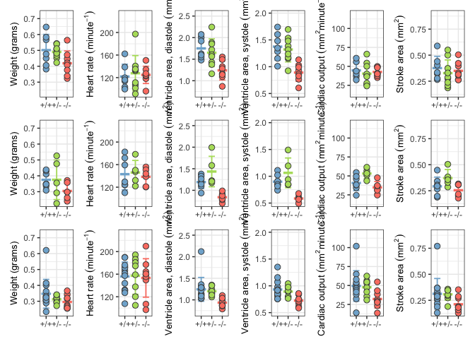

figure 2 - ultrasound and histology data
================
Bradley Demarest
2023-03-15

``` r
library(data.table)
library(ggplot2)
library(tidyverse)
library(gt)
library(here)
library(stringr)
library(patchwork)
```

``` r
# Load ultrasound data for 4- and 6-month from two tab-delimited text files.

utab4 = fread(here("figure_2",
                   "jag2b_summarized_ultrasound_4month_batch_1_2_n42_20230315.txt"))

# Remove 'line' column.
set(utab4, j="line", value=NULL)

# March 17 2023. fish f0092 is missing As and Ad values. 
# Leo found the values in the original csv files. 
# We will insert the correct mean As and mean Ad values into the 
# current working tab-delimited text file. 
# Warning! We have not corrected the fish f0092 values in the intermediate
# data files (where ultrasound replicate values are in separate columns
# such as As_1, As_2, etc.) Also, we do not have value ventricle Volume data for
# fish f0092. Eventually, we should go back and re-run the csv processing
# script.

utab6 = fread(here("figure_2",
                   "jag2b_summarized_ultrasound_6_8_month_n46_f0092_update_20230317.txt"))
# Add batch column (containing NA values).
utab6[, batch:=NA_character_]

utab = rbind(utab4, utab6)

# Remove 8-month old fish data. We are not including this timepoint
# in plots because of very small sample sizes.
utab = utab[age %in% c("4month", "6month")]

# Compute derived ultrasound variables.
utab[, SA:=Ad_avg - As_avg]
utab[, EFA:=SA / Ad_avg]
utab[, CO:=SA * HR_avg]

# Create new group variable.
utab[age %in% "4month" & batch %in% "batch_1", group:="4-month old, batch 1"]
utab[age %in% "4month" & batch %in% "batch_2", group:="4-month old, batch 2"]
utab[age %in% "6month", group:="6-month old"]

# Use simple genotype labels (+/+, +/-, etc.)
convert_genotype_labels = c(WT="+/+", HET="+/-", MUT="-/-")
utab[, genotype2:=convert_genotype_labels[genotype]]
# Set factor and level order of 'genotype2' column.
utab[, genotype2:=factor(genotype2, levels=convert_genotype_labels)]
```

``` r
# Create panels for 3 groups (4-month batch 1, 4-month batch 2, 6-month)
# and 6 variables (weight, HR, Ad, As, CO, SA).

group_vec = c("4-month old, batch 1", "4-month old, batch 2", "6-month old")


variable_vec = c("weight_gr", "HR_avg", "Ad_avg", "As_avg", "CO", "SA")
variable_labels = c("'Weight (grams)'", "'Heart rate '('minute'^-1)",
                    "'Ventricle area, diastole '('mm'^2)",
                    "'Ventricle area, systole '('mm'^2)",
                    "'Cardiac output '('mm'^2 * 'minute'^-1)",
                    "'Stroke area '('mm'^2)")

# Collect y-axis ranges for all variables.
yrange_res = list()

for (i in seq_along(variable_vec)) {
  tmp_var = variable_vec[i]
  yrange_res[[tmp_var]] = range(utab[[tmp_var]], na.rm=TRUE)
}


# Ultrasound data panel loop.
# as.name() is equivalent to rlang::sym()

genotype_colors  = c( "WT"="#80b1d3",
                     "HET"="#b3de69",
                     "MUT"="#fb8072")

genotype2_colors  = c("+/+"="#80b1d3",
                      "+/-"="#b3de69",
                      "-/-"="#fb8072")

point_size = 2.6
errorbar_width = 0.6
errorbar_linewidth = 0.625
meanbar_half_width = 0.45
meanbar_linewith = 1.2
# Expand y-axis 5% on bottom end and 25% on upper end, to make room for p-values.
yaxis_expand = expansion(mult=c(0.05, 0.25))

group_res = list()

# To do: 
# (1) [X] Use custom genotype colors.
# (2) [X] Apply per-variable y-axis range limits, so that all 3 panels have same range.
# (3) [X] Change order of genotypes on x-axis. Create factor, set levels.
# (4) [X] Remove x-axis titles ("genotype").
# (5) [X] Change color legend title from "genotype" to "Genotype".
# (6) [X] Parse/format y-axis variable labels.
# (7) [ ] 
# (8) [X] Add dark gray outline to plot points.
# (9) [X] Add mean (line) and std deviation (whiskers) to plot.
#(10) [X] Add extra space at top of each panel for adding p-values.

for (g in seq_along(group_vec)) {
  tmp_group = group_vec[g]
  tmp_data = utab[group %in% tmp_group]
  
  panel_res = list()
  
  for (v in seq_along(variable_vec)) {
    tmp_var = variable_vec[v]
    tmp_label = variable_labels[v]
    tmp_data[, label:=tmp_label]
    
    tmp_by_genotype = tmp_data[, list(mean_value=mean(get(tmp_var), na.rm=TRUE),
                                      sd_value=sd(get(tmp_var), na.rm=TRUE)),
                               by=list(genotype2)]
    
    tmp_panel = ggplot() +
                theme_bw() +
      
                geom_errorbar(data=tmp_by_genotype,
                              aes(x=genotype2,
                                  ymin=mean_value - sd_value,
                                  ymax=mean_value + sd_value,
                                  color=genotype2),
                              linewidth=errorbar_linewidth,
                              width=errorbar_width) +
                geom_segment(data=tmp_by_genotype,
                             aes(y=mean_value,
                                 yend=mean_value,
                                 x=as.integer(genotype2) - meanbar_half_width,
                                 xend=as.integer(genotype2) + meanbar_half_width,
                                 color=genotype2),
                             linewidth=meanbar_linewith) +

                geom_point(data=tmp_data,
                           aes(y=!!as.name(tmp_var),
                               x=genotype2,
                               color=genotype2,
                               fill=genotype2),
                           size=point_size, shape=21, color="grey30") +
                scale_color_manual(values=genotype2_colors) +
                scale_fill_manual(values=genotype2_colors) +
                scale_y_continuous(limits=yrange_res[[tmp_var]],
                                   expand=yaxis_expand) +
                guides(color="none") +
                guides(fill="none") + 
                labs(fill="Genotype") + 
                labs(y=parse(text=tmp_label)) + 
                theme(axis.title.x=element_blank()) +
                theme(axis.title.y=element_text(size=rel(0.9)))
    
    panel_res[[tmp_var]] = tmp_panel
  }
  
  group_res[[tmp_group]] = wrap_plots(panel_res, nrow=1) #+
                           #plot_layout(guides="collect") +
                           #plot_annotation(title=tmp_group)

}


ultrasound_fig = group_res[[1]] / group_res[[2]] / group_res[[3]]

ggsave(here("figure_2", "figure2_ultrasound_panels_20230329.pdf"),
       plot=ultrasound_fig,
       width=10, height=8, 
       useDingbats=FALSE)
```

    ## Warning: Removed 1 rows containing missing values (`geom_point()`).
    ## Removed 1 rows containing missing values (`geom_point()`).

``` r
# Problem: patchwork is not printing group titles for each set of panels
# when I try to combine the 3 panels.
```

``` r
print(ultrasound_fig)
```

    ## Warning: Removed 1 rows containing missing values (`geom_point()`).
    ## Removed 1 rows containing missing values (`geom_point()`).

<!-- -->

``` r
# Stats TO DO:
# ANOVA and Tukey HSD results (with correct contrasts)
# Needs to be done for Figure 1 also.
```
