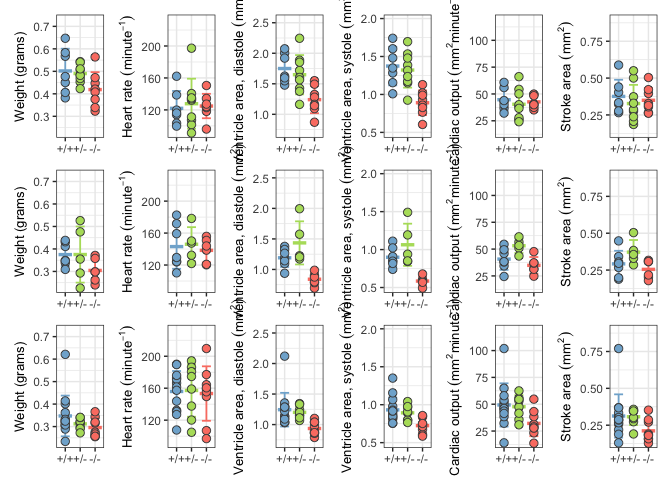
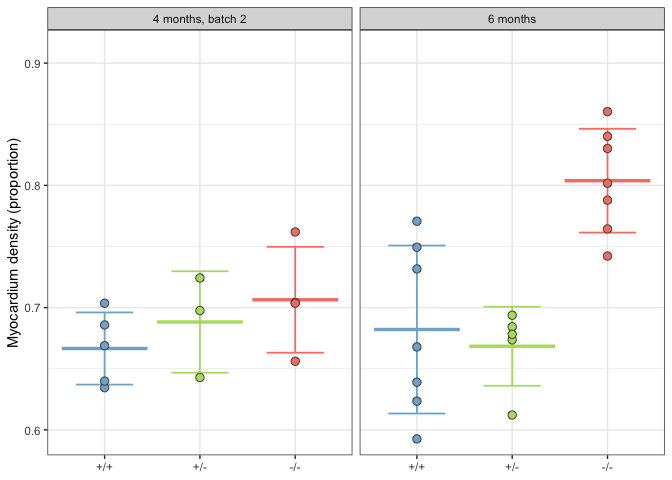
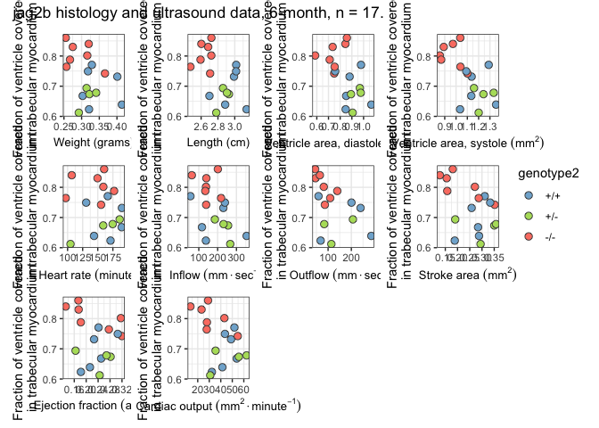

figure 2 - ultrasound and histology data
================
Bradley Demarest
2023-03-15

``` r
library(data.table)
library(ggplot2)
library(tidyverse)
library(gt)
library(here)
library(stringr)
library(patchwork)
```

``` r
# Load ultrasound data for 4- and 6-month from two tab-delimited text files.

utab4 = fread(here("figure_2",
                   "jag2b_summarized_ultrasound_4month_batch_1_2_n42_20230315.txt"))

# Remove 'line' column.
set(utab4, j="line", value=NULL)

# March 17 2023. fish f0092 is missing As and Ad values. 
# Leo found the values in the original csv files. 
# We will insert the correct mean As and mean Ad values into the 
# current working tab-delimited text file. 
# Warning! We have not corrected the fish f0092 values in the intermediate
# data files (where ultrasound replicate values are in separate columns
# such as As_1, As_2, etc.) Also, we do not have value ventricle Volume data for
# fish f0092. Eventually, we should go back and re-run the csv processing
# script.

utab6 = fread(here("figure_2",
                   "jag2b_summarized_ultrasound_6_8_month_n46_f0092_update_20230317.txt"))
# Add batch column (containing NA values).
utab6[, batch:=NA_character_]

utab = rbind(utab4, utab6)

# Remove 8-month old fish data. We are not including this timepoint
# in plots because of very small sample sizes.
utab = utab[age %in% c("4month", "6month")]

# Compute derived ultrasound variables.
utab[, SA:=Ad_avg - As_avg]
utab[, EFA:=SA / Ad_avg]
utab[, CO:=SA * HR_avg]

# Create new group variable.
utab[age %in% "4month" & batch %in% "batch_1", group:="4-month old, batch 1"]
utab[age %in% "4month" & batch %in% "batch_2", group:="4-month old, batch 2"]
utab[age %in% "6month", group:="6-month old"]

# Use simple genotype labels (+/+, +/-, etc.)
convert_genotype_labels = c(WT="+/+", HET="+/-", MUT="-/-")
utab[, genotype2:=convert_genotype_labels[genotype]]
# Set factor and level order of 'genotype2' column.
utab[, genotype2:=factor(genotype2, levels=convert_genotype_labels)]
```

``` r
# Create panels for 3 groups (4-month batch 1, 4-month batch 2, 6-month)
# and 6 variables (weight, HR, Ad, As, CO, SA).

group_vec = c("4-month old, batch 1", "4-month old, batch 2", "6-month old")


variable_vec = c("weight_gr", "HR_avg", "Ad_avg", "As_avg", "CO", "SA")
variable_labels = c("'Weight (grams)'", "'Heart rate '('minute'^-1)",
                    "'Ventricle area, diastole '('mm'^2)",
                    "'Ventricle area, systole '('mm'^2)",
                    "'Cardiac output '('mm'^2 * 'minute'^-1)",
                    "'Stroke area '('mm'^2)")

# Collect y-axis ranges for all variables.
yrange_res = list()

for (i in seq_along(variable_vec)) {
  tmp_var = variable_vec[i]
  yrange_res[[tmp_var]] = range(utab[[tmp_var]], na.rm=TRUE)
}


# Ultrasound data panel loop.
# as.name() is equivalent to rlang::sym()

genotype_colors  = c( "WT"="#80b1d3",
                     "HET"="#b3de69",
                     "MUT"="#fb8072")

genotype2_colors  = c("+/+"="#80b1d3",
                      "+/-"="#b3de69",
                      "-/-"="#fb8072")

point_size = 2.6
errorbar_width = 0.6
errorbar_linewidth = 0.625
meanbar_half_width = 0.45
meanbar_linewidth = 1.2
# Expand y-axis 5% on bottom end and 25% on upper end, to make room for p-values.
yaxis_expand = expansion(mult=c(0.05, 0.25))

group_res = list()

# To do: 
# (1) [X] Use custom genotype colors.
# (2) [X] Apply per-variable y-axis range limits, so that all 3 panels have same range.
# (3) [X] Change order of genotypes on x-axis. Create factor, set levels.
# (4) [X] Remove x-axis titles ("genotype").
# (5) [X] Change color legend title from "genotype" to "Genotype".
# (6) [X] Parse/format y-axis variable labels.
# (7) [ ] 
# (8) [X] Add dark gray outline to plot points.
# (9) [X] Add mean (line) and std deviation (whiskers) to plot.
#(10) [X] Add extra space at top of each panel for adding p-values.

for (g in seq_along(group_vec)) {
  tmp_group = group_vec[g]
  tmp_data = utab[group %in% tmp_group]
  
  panel_res = list()
  
  for (v in seq_along(variable_vec)) {
    tmp_var = variable_vec[v]
    tmp_label = variable_labels[v]
    tmp_data[, label:=tmp_label]
    
    tmp_by_genotype = tmp_data[, list(mean_value=mean(get(tmp_var), na.rm=TRUE),
                                      sd_value=sd(get(tmp_var), na.rm=TRUE)),
                               by=list(genotype2)]
    
    tmp_panel = ggplot() +
                theme_bw() +
      
                geom_errorbar(data=tmp_by_genotype,
                              aes(x=genotype2,
                                  ymin=mean_value - sd_value,
                                  ymax=mean_value + sd_value,
                                  color=genotype2),
                              linewidth=errorbar_linewidth,
                              width=errorbar_width) +
                geom_segment(data=tmp_by_genotype,
                             aes(y=mean_value,
                                 yend=mean_value,
                                 x=as.integer(genotype2) - meanbar_half_width,
                                 xend=as.integer(genotype2) + meanbar_half_width,
                                 color=genotype2),
                             linewidth=meanbar_linewidth) +

                geom_point(data=tmp_data,
                           aes(y=!!as.name(tmp_var),
                               x=genotype2,
                               color=genotype2,
                               fill=genotype2),
                           size=point_size, shape=21, color="grey30") +
                scale_color_manual(values=genotype2_colors) +
                scale_fill_manual(values=genotype2_colors) +
                scale_y_continuous(limits=yrange_res[[tmp_var]],
                                   expand=yaxis_expand) +
                guides(color="none") +
                guides(fill="none") + 
                labs(fill="Genotype") + 
                labs(y=parse(text=tmp_label)) + 
                theme(axis.title.x=element_blank()) +
                theme(axis.title.y=element_text(size=rel(0.9)))
    
    panel_res[[tmp_var]] = tmp_panel
  }
  
  group_res[[tmp_group]] = wrap_plots(panel_res, nrow=1) #+
                           #plot_layout(guides="collect") +
                           #plot_annotation(title=tmp_group)

}


ultrasound_fig = group_res[[1]] / group_res[[2]] / group_res[[3]]

ggsave(here("figure_2", "figure2_ultrasound_panels_20230329.pdf"),
       plot=ultrasound_fig,
       width=10, height=8, 
       useDingbats=FALSE)
```

    ## Warning: Removed 1 rows containing missing values (`geom_point()`).
    ## Removed 1 rows containing missing values (`geom_point()`).

``` r
print(ultrasound_fig)
```

    ## Warning: Removed 1 rows containing missing values (`geom_point()`).
    ## Removed 1 rows containing missing values (`geom_point()`).

<!-- -->

#### Pairwise t-test results for 6 ultrasound variables.

``` r
# Example code for pairwise t-test (wt-mut, het-mut, wt-het) for
# each timepoint.

# (1) Using Anova + TukeyHSD does not allow us to choose only the comparisons
#     of interest. For example we want 3 pairwise genotype comparison _within_
#     each timepoint.
# (2) Instead we will stick with previous method of running selected pairwise
#     t-tests, combined with FDR-corrected p-values.
# (3) Problem remaining -- How to correct 95% conf intervals for multiple
#     comparisons? `multcomp` package may have Tukey-stype 'family-wise' 
#     correction for confidence intervals.


group_vec = c("4-month old, batch 1", "4-month old, batch 2", "6-month old")


variable_vec = c("weight_gr", "HR_avg", "Ad_avg", "As_avg", "CO", "SA")


comp_tab = data.table(group1=rep(c("WT", "WT", "HET"), times=length(variable_vec)),
                      group2=rep(c("HET", "MUT", "MUT"), times=length(variable_vec)),
                      variable=rep(variable_vec, each=3), # modify
                      age_batch=rep(group_vec, each=3 * length(variable_vec)))

table(comp_tab$variable, comp_tab$age_batch)
```

    ##            
    ##             4-month old, batch 1 4-month old, batch 2 6-month old
    ##   Ad_avg                       3                    3           3
    ##   As_avg                       3                    3           3
    ##   CO                           3                    3           3
    ##   HR_avg                       3                    3           3
    ##   SA                           3                    3           3
    ##   weight_gr                    3                    3           3

``` r
tres_list = list()

for (i in seq(nrow(comp_tab))) {
  row_i = comp_tab[i]
  tmp_group1 = row_i$group1
  tmp_group2 = row_i$group2
  tmp_age_batch = row_i$age_batch
  tmp_var = row_i$variable
  group1_data = utab[genotype == tmp_group1 & group == tmp_age_batch, ..tmp_var]
  
  group2_data = utab[genotype == tmp_group2 & group == tmp_age_batch, ..tmp_var]
  
  if (nrow(group1_data) > 0L & nrow(group2_data) > 0L) {
      
    tmp_res = t.test(x=group1_data,
                     y=group2_data,
                     alternative = "two.sided",
                     conf.level=0.95)
  
    new_row = data.table(group1=tmp_group1,
                         group2=tmp_group2,
                         age_batch=tmp_age_batch,
                         comparison_variable=tmp_var,
                         effect_size=tmp_res$estimate[1] - tmp_res$estimate[2], # (mutant or het mean) - wt mean
                         pvalue=tmp_res$p.value,
                         conf_lower=tmp_res$conf.int[1],
                         conf_upper=tmp_res$conf.int[2],
                         sample_size_group1=nrow(group1_data),
                         sample_size_group2=nrow(group2_data),
                         t_statistic=tmp_res$statistic,
                         df=tmp_res$parameter)
  } else {
    # When one group has no fish, fill in t-test results with NA values.
    new_row = data.table(group1=tmp_group1,
                         group2=tmp_group2,
                         age_batch=tmp_age_batch,
                         comparison_variable=tmp_var,
                         effect_size=NA_real_,
                         pvalue=NA_real_,
                         conf_lower=NA_real_,
                         conf_upper=NA_real_,
                         sample_size_group1=nrow(group1_data),
                         sample_size_group2=nrow(group2_data),
                         t_statistic=NA_real_,
                         df=NA_real_)
  }
  
  tres_list[[i]] = new_row
                       
}


# Summary table of all pair-wise t.test results and related values.
stats_tab = rbindlist(tres_list)

n_comparisons = sum(!is.na(stats_tab$pvalue))

stats_tab[, padj:=p.adjust(pvalue, method="fdr", n=n_comparisons)]

stats_tab[, genotype_pair:=paste(group1, group2, sep="-")]

stats_tab[, genotype_pair:=factor(genotype_pair,
                                  levels=c("WT-HET", "HET-MUT", "WT-MUT"))]

# Format padj values for adding to figures.
# Format string: 0 = leading zeros, .2 = precision , 
# "g" = precision is interpreted as n of significant digits.
stats_tab[, padj_format:=sprintf("%0.2g", padj)]

# Output stats to text file.
fwrite(stats_tab, 
       file=here("figure_2",
                 "pairwise_ttest_results_6ultrasound_variables_3batches_20230403.txt"), 
       sep="\t")


# Write out a filtered, sorted version for Leo to use adding pvalues in AI.

stats2 = stats_tab[padj < 0.05, 
                   list(age_batch, comparison_variable, genotype_pair, padj_format)]


setorder(stats2, age_batch, comparison_variable, -genotype_pair)

library(writexl)
write_xlsx(stats2, 
           path=here("figure_2", 
                     "pairwise_ttest_padj05_table_for_figure_2_6ultrasound_vars_20230403.xlsx"))
```

<style>html {
  font-family: -apple-system, BlinkMacSystemFont, 'Segoe UI', Roboto, Oxygen, Ubuntu, Cantarell, 'Helvetica Neue', 'Fira Sans', 'Droid Sans', Arial, sans-serif;
}

#buwzfvjhvc .gt_table {
  display: table;
  border-collapse: collapse;
  margin-left: auto;
  /* table.margin.left */
  margin-right: auto;
  /* table.margin.right */
  color: #333333;
  font-size: 16px;
  /* table.font.size */
  background-color: #FFFFFF;
  /* table.background.color */
  width: auto;
  /* table.width */
  border-top-style: solid;
  /* table.border.top.style */
  border-top-width: 2px;
  /* table.border.top.width */
  border-top-color: #A8A8A8;
  /* table.border.top.color */
  border-bottom-style: solid;
  /* table.border.bottom.style */
  border-bottom-width: 2px;
  /* table.border.bottom.width */
  border-bottom-color: #A8A8A8;
  /* table.border.bottom.color */
}

#buwzfvjhvc .gt_heading {
  background-color: #FFFFFF;
  /* heading.background.color */
  border-bottom-color: #FFFFFF;
  /* table.background.color */
  border-left-style: hidden;
  /* heading.border.lr.style */
  border-left-width: 1px;
  /* heading.border.lr.width */
  border-left-color: #D3D3D3;
  /* heading.border.lr.color */
  border-right-style: hidden;
  /* heading.border.lr.style */
  border-right-width: 1px;
  /* heading.border.lr.width */
  border-right-color: #D3D3D3;
  /* heading.border.lr.color */
}

#buwzfvjhvc .gt_title {
  color: #333333;
  font-size: 125%;
  /* heading.title.font.size */
  font-weight: initial;
  /* heading.title.font.weight */
  padding-top: 4px;
  /* heading.top.padding - not yet used */
  padding-bottom: 4px;
  border-bottom-color: #FFFFFF;
  /* table.background.color */
  border-bottom-width: 0;
}

#buwzfvjhvc .gt_subtitle {
  color: #333333;
  font-size: 85%;
  /* heading.subtitle.font.size */
  font-weight: initial;
  /* heading.subtitle.font.weight */
  padding-top: 0;
  padding-bottom: 4px;
  /* heading.bottom.padding - not yet used */
  border-top-color: #FFFFFF;
  /* table.background.color */
  border-top-width: 0;
}

#buwzfvjhvc .gt_bottom_border {
  border-bottom-style: solid;
  /* heading.border.bottom.style */
  border-bottom-width: 2px;
  /* heading.border.bottom.width */
  border-bottom-color: #D3D3D3;
  /* heading.border.bottom.color */
}

#buwzfvjhvc .gt_column_spanner {
  border-bottom-style: solid;
  border-bottom-width: 2px;
  border-bottom-color: #D3D3D3;
  padding-top: 4px;
  padding-bottom: 4px;
}

#buwzfvjhvc .gt_col_headings {
  border-top-style: solid;
  /* column_labels.border.top.style */
  border-top-width: 2px;
  /* column_labels.border.top.width */
  border-top-color: #D3D3D3;
  /* column_labels.border.top.color */
  border-bottom-style: solid;
  /* column_labels.border.bottom.style */
  border-bottom-width: 2px;
  /* column_labels.border.bottom.width */
  border-bottom-color: #D3D3D3;
  /* column_labels.border.bottom.color */
  border-left-style: none;
  /* column_labels.border.lr.style */
  border-left-width: 1px;
  /* column_labels.border.lr.width */
  border-left-color: #D3D3D3;
  /* column_labels.border.lr.color */
  border-right-style: none;
  /* column_labels.border.lr.style */
  border-right-width: 1px;
  /* column_labels.border.lr.width */
  border-right-color: #D3D3D3;
  /* column_labels.border.lr.color */
}

#buwzfvjhvc .gt_col_heading {
  color: #333333;
  background-color: #FFFFFF;
  /* column_labels.background.color */
  font-size: 100%;
  /* column_labels.font.size */
  font-weight: normal;
  /* column_labels.font.weight */
  text-transform: inherit;
  /* column_labels.text_transform */
  vertical-align: middle;
  padding: 5px;
  margin: 10px;
  overflow-x: hidden;
}

#buwzfvjhvc .gt_sep_right {
  border-right: 5px solid #FFFFFF;
}

#buwzfvjhvc .gt_group_heading {
  padding: 8px;
  /* row_group.padding */
  color: #333333;
  background-color: #FFFFFF;
  /* row_group.background.color */
  font-size: 100%;
  /* row_group.font.size */
  font-weight: initial;
  /* row_group.font.weight */
  text-transform: inherit;
  /* row_group.text_transform */
  border-top-style: solid;
  /* row_group.border.top.style */
  border-top-width: 2px;
  /* row_group.border.top.width */
  border-top-color: #D3D3D3;
  /* row_group.border.top.color */
  border-bottom-style: solid;
  /* row_group.border.bottom.style */
  border-bottom-width: 2px;
  /* row_group.border.bottom.width */
  border-bottom-color: #D3D3D3;
  /* row_group.border.bottom.color */
  border-left-style: none;
  /* row_group.border.left.style */
  border-left-width: 1px;
  /* row_group.border.left.width */
  border-left-color: #D3D3D3;
  /* row_group.border.left.color */
  border-right-style: none;
  /* row_group.border.right.style */
  border-right-width: 1px;
  /* row_group.border.right.width */
  border-right-color: #D3D3D3;
  /* row_group.border.right.color */
  vertical-align: middle;
}

#buwzfvjhvc .gt_empty_group_heading {
  padding: 0.5px;
  color: #333333;
  background-color: #FFFFFF;
  /* row_group.background.color */
  font-size: 100%;
  /* row_group.font.size */
  font-weight: initial;
  /* row_group.font.weight */
  border-top-style: solid;
  /* row_group.border.top.style */
  border-top-width: 2px;
  /* row_group.border.top.width */
  border-top-color: #D3D3D3;
  /* row_group.border.top.color */
  border-bottom-style: solid;
  /* row_group.border.bottom.style */
  border-bottom-width: 2px;
  /* row_group.border.bottom.width */
  border-bottom-color: #D3D3D3;
  /* row_group.border.bottom.color */
  vertical-align: middle;
}

#buwzfvjhvc .gt_striped {
  background-color: rgba(128, 128, 128, 0.05);
  /* row.striping.background_color */
}

#buwzfvjhvc .gt_from_md > :first-child {
  margin-top: 0;
}

#buwzfvjhvc .gt_from_md > :last-child {
  margin-bottom: 0;
}

#buwzfvjhvc .gt_row {
  padding-top: 8px;
  /* data_row.padding */
  padding-bottom: 8px;
  /* data_row.padding */
  padding-left: 5px;
  padding-right: 5px;
  margin: 10px;
  border-top-style: solid;
  /* table_body.hlines.style */
  border-top-width: 1px;
  /* table_body.hlines.width */
  border-top-color: #D3D3D3;
  /* table_body.hlines.color */
  border-left-style: none;
  /* table_body.vlines.style */
  border-left-width: 1px;
  /* table_body.vlines.width */
  border-left-color: #D3D3D3;
  /* table_body.vlines.color */
  border-right-style: none;
  /* table_body.vlines.style */
  border-right-width: 1px;
  /* table_body.vlines.width */
  border-right-color: #D3D3D3;
  /* table_body.vlines.color */
  vertical-align: middle;
  overflow-x: hidden;
}

#buwzfvjhvc .gt_stub {
  color: #333333;
  background-color: #FFFFFF;
  /* stub.background.color */
  font-weight: initial;
  /* stub.font.weight */
  text-transform: inherit;
  /* stub.text_transform */
  border-right-style: solid;
  /* stub.border.style */
  border-right-width: 2px;
  /* stub.border.width */
  border-right-color: #D3D3D3;
  /* stub.border.color */
  padding-left: 12px;
}

#buwzfvjhvc .gt_summary_row {
  color: #333333;
  background-color: #FFFFFF;
  /* summary_row.background.color */
  text-transform: inherit;
  /* summary_row.text_transform */
  padding-top: 8px;
  /* summary_row.padding */
  padding-bottom: 8px;
  /* summary_row.padding */
  padding-left: 5px;
  padding-right: 5px;
}

#buwzfvjhvc .gt_first_summary_row {
  padding-top: 8px;
  /* summary_row.padding */
  padding-bottom: 8px;
  /* summary_row.padding */
  padding-left: 5px;
  padding-right: 5px;
  border-top-style: solid;
  /* summary_row.border.style */
  border-top-width: 2px;
  /* summary_row.border.width */
  border-top-color: #D3D3D3;
  /* summary_row.border.color */
}

#buwzfvjhvc .gt_grand_summary_row {
  color: #333333;
  background-color: #FFFFFF;
  /* grand_summary_row.background.color */
  text-transform: inherit;
  /* grand_summary_row.text_transform */
  padding-top: 8px;
  /* grand_summary_row.padding */
  padding-bottom: 8px;
  /* grand_summary_row.padding */
  padding-left: 5px;
  padding-right: 5px;
}

#buwzfvjhvc .gt_first_grand_summary_row {
  padding-top: 8px;
  /* grand_summary_row.padding */
  padding-bottom: 8px;
  /* grand_summary_row.padding */
  padding-left: 5px;
  padding-right: 5px;
  border-top-style: double;
  /* grand_summary_row.border.style */
  border-top-width: 6px;
  /* grand_summary_row.border.width */
  border-top-color: #D3D3D3;
  /* grand_summary_row.border.color */
}

#buwzfvjhvc .gt_table_body {
  border-top-style: solid;
  /* table_body.border.top.style */
  border-top-width: 2px;
  /* table_body.border.top.width */
  border-top-color: #D3D3D3;
  /* table_body.border.top.color */
  border-bottom-style: solid;
  /* table_body.border.bottom.style */
  border-bottom-width: 2px;
  /* table_body.border.bottom.width */
  border-bottom-color: #D3D3D3;
  /* table_body.border.bottom.color */
}

#buwzfvjhvc .gt_footnotes {
  color: #333333;
  background-color: #FFFFFF;
  /* footnotes.background.color */
  border-bottom-style: none;
  /* footnotes.border.bottom.style */
  border-bottom-width: 2px;
  /* footnotes.border.bottom.width */
  border-bottom-color: #D3D3D3;
  /* footnotes.border.bottom.color */
  border-left-style: none;
  /* footnotes.border.lr.color */
  border-left-width: 2px;
  /* footnotes.border.lr.color */
  border-left-color: #D3D3D3;
  /* footnotes.border.lr.color */
  border-right-style: none;
  /* footnotes.border.lr.color */
  border-right-width: 2px;
  /* footnotes.border.lr.color */
  border-right-color: #D3D3D3;
  /* footnotes.border.lr.color */
}

#buwzfvjhvc .gt_footnote {
  margin: 0px;
  font-size: 90%;
  /* footnotes.font.size */
  padding: 4px;
  /* footnotes.padding */
}

#buwzfvjhvc .gt_sourcenotes {
  color: #333333;
  background-color: #FFFFFF;
  /* source_notes.background.color */
  border-bottom-style: none;
  /* source_notes.border.bottom.style */
  border-bottom-width: 2px;
  /* source_notes.border.bottom.width */
  border-bottom-color: #D3D3D3;
  /* source_notes.border.bottom.color */
  border-left-style: none;
  /* source_notes.border.lr.style */
  border-left-width: 2px;
  /* source_notes.border.lr.style */
  border-left-color: #D3D3D3;
  /* source_notes.border.lr.style */
  border-right-style: none;
  /* source_notes.border.lr.style */
  border-right-width: 2px;
  /* source_notes.border.lr.style */
  border-right-color: #D3D3D3;
  /* source_notes.border.lr.style */
}

#buwzfvjhvc .gt_sourcenote {
  font-size: 90%;
  /* source_notes.font.size */
  padding: 4px;
  /* source_notes.padding */
}

#buwzfvjhvc .gt_left {
  text-align: left;
}

#buwzfvjhvc .gt_center {
  text-align: center;
}

#buwzfvjhvc .gt_right {
  text-align: right;
  font-variant-numeric: tabular-nums;
}

#buwzfvjhvc .gt_font_normal {
  font-weight: normal;
}

#buwzfvjhvc .gt_font_bold {
  font-weight: bold;
}

#buwzfvjhvc .gt_font_italic {
  font-style: italic;
}

#buwzfvjhvc .gt_super {
  font-size: 65%;
}

#buwzfvjhvc .gt_footnote_marks {
  font-style: italic;
  font-size: 65%;
}
</style>
<div id="buwzfvjhvc" style="overflow-x:auto;overflow-y:auto;width:auto;height:auto;"><table class="gt_table">
  <thead class="gt_header">
    <tr>
      <th colspan="4" class="gt_heading gt_title gt_font_normal gt_center" style>Ultrasound variables, pairwise t-test results within each batch-by-variable combo. FDR-adj p-value &lt; 0.05</th>
    </tr>
    <tr>
      <th colspan="4" class="gt_heading gt_subtitle gt_font_normal gt_center gt_bottom_border" style></th>
    </tr>
  </thead>
  <thead class="gt_col_headings">
    <tr>
      <th class="gt_col_heading gt_columns_bottom_border gt_left" rowspan="1" colspan="1">age_batch</th>
      <th class="gt_col_heading gt_columns_bottom_border gt_left" rowspan="1" colspan="1">comparison_variable</th>
      <th class="gt_col_heading gt_columns_bottom_border gt_center" rowspan="1" colspan="1">genotype_pair</th>
      <th class="gt_col_heading gt_columns_bottom_border gt_left" rowspan="1" colspan="1">padj_format</th>
    </tr>
  </thead>
  <tbody class="gt_table_body">
    <tr>
      <td class="gt_row gt_left">4-month old, batch 1</td>
      <td class="gt_row gt_left">Ad_avg</td>
      <td class="gt_row gt_center">WT-MUT</td>
      <td class="gt_row gt_left">0.0098</td>
    </tr>
    <tr>
      <td class="gt_row gt_left gt_striped">4-month old, batch 1</td>
      <td class="gt_row gt_left gt_striped">Ad_avg</td>
      <td class="gt_row gt_center gt_striped">HET-MUT</td>
      <td class="gt_row gt_left gt_striped">0.039</td>
    </tr>
    <tr>
      <td class="gt_row gt_left">4-month old, batch 1</td>
      <td class="gt_row gt_left">As_avg</td>
      <td class="gt_row gt_center">WT-MUT</td>
      <td class="gt_row gt_left">0.01</td>
    </tr>
    <tr>
      <td class="gt_row gt_left gt_striped">4-month old, batch 1</td>
      <td class="gt_row gt_left gt_striped">As_avg</td>
      <td class="gt_row gt_center gt_striped">HET-MUT</td>
      <td class="gt_row gt_left gt_striped">0.0068</td>
    </tr>
    <tr>
      <td class="gt_row gt_left">4-month old, batch 2</td>
      <td class="gt_row gt_left">Ad_avg</td>
      <td class="gt_row gt_center">WT-MUT</td>
      <td class="gt_row gt_left">0.0068</td>
    </tr>
    <tr>
      <td class="gt_row gt_left gt_striped">4-month old, batch 2</td>
      <td class="gt_row gt_left gt_striped">As_avg</td>
      <td class="gt_row gt_center gt_striped">WT-MUT</td>
      <td class="gt_row gt_left gt_striped">0.0068</td>
    </tr>
    <tr>
      <td class="gt_row gt_left">4-month old, batch 2</td>
      <td class="gt_row gt_left">CO</td>
      <td class="gt_row gt_center">HET-MUT</td>
      <td class="gt_row gt_left">0.014</td>
    </tr>
    <tr>
      <td class="gt_row gt_left gt_striped">6-month old</td>
      <td class="gt_row gt_left gt_striped">Ad_avg</td>
      <td class="gt_row gt_center gt_striped">WT-MUT</td>
      <td class="gt_row gt_left gt_striped">0.01</td>
    </tr>
    <tr>
      <td class="gt_row gt_left">6-month old</td>
      <td class="gt_row gt_left">Ad_avg</td>
      <td class="gt_row gt_center">HET-MUT</td>
      <td class="gt_row gt_left">0.0049</td>
    </tr>
    <tr>
      <td class="gt_row gt_left gt_striped">6-month old</td>
      <td class="gt_row gt_left gt_striped">As_avg</td>
      <td class="gt_row gt_center gt_striped">WT-MUT</td>
      <td class="gt_row gt_left gt_striped">0.0097</td>
    </tr>
    <tr>
      <td class="gt_row gt_left">6-month old</td>
      <td class="gt_row gt_left">As_avg</td>
      <td class="gt_row gt_center">HET-MUT</td>
      <td class="gt_row gt_left">0.015</td>
    </tr>
    <tr>
      <td class="gt_row gt_left gt_striped">6-month old</td>
      <td class="gt_row gt_left gt_striped">SA</td>
      <td class="gt_row gt_center gt_striped">HET-MUT</td>
      <td class="gt_row gt_left gt_striped">0.04</td>
    </tr>
  </tbody>
  
  
</table></div>

#### Load mef2 histology data.

``` r
htab = fread(here("figure_2",
                  "jag2b_mef2_summarized_histology_4_6_8_month_n38_20230417.txt"))
setnames(htab, old="genotype2", new="genotype")

batch_info = fread(here("figure_2", 
                        "jag2b_mef2_histology_4month_batch_info.txt"))

batch_info[, fish_id2_fct:=paste(genotype, fish_id, sep="_")]

htab = merge(htab, 
             batch_info[, list(fish_id2_fct, age, genotype, batch_id)], 
             by=c("fish_id2_fct", "age", "genotype"),
             all.x=TRUE, all.y=TRUE)

# Remove 4-month batch 1 fish (n=2).
htab = htab[!(age == "4month" & batch_id == "batch_1")]

# Remove 8-month fish (n=5).
htab = htab[!(age == "8month")]

# Now, compute the area in um^2 of Leo's 650x650 sampling area square.
# 650 px * 0.325 um/px = 211.25 um
# 211.25 um * 211.25 um = 44626.56 um^2

mef2_area_denominator = 44625.56
htab[, mef2_fraction:=mean_of_means_area / mef2_area_denominator]

convert_genotype_labels = c(WT="+/+", HET="+/-", MUT="-/-")
htab[, genotype2:=convert_genotype_labels[toupper(genotype)]]
# Set factor and level order of 'genotype2' column.
htab[, genotype2:=factor(genotype2, levels=convert_genotype_labels)]

# Create new group column with more legible age labels.
htab[age == "4month", group:="4 months, batch 2"]
htab[age == "6month", group:="6 months"]
```

``` r
dcast(data=htab, genotype ~ group, fun.aggregate=length) %>% 
  as_tibble() %>%
  gt() %>%
  tab_header(title="Histology sample summary")
```

<style>html {
  font-family: -apple-system, BlinkMacSystemFont, 'Segoe UI', Roboto, Oxygen, Ubuntu, Cantarell, 'Helvetica Neue', 'Fira Sans', 'Droid Sans', Arial, sans-serif;
}

#fcfkziixdb .gt_table {
  display: table;
  border-collapse: collapse;
  margin-left: auto;
  /* table.margin.left */
  margin-right: auto;
  /* table.margin.right */
  color: #333333;
  font-size: 16px;
  /* table.font.size */
  background-color: #FFFFFF;
  /* table.background.color */
  width: auto;
  /* table.width */
  border-top-style: solid;
  /* table.border.top.style */
  border-top-width: 2px;
  /* table.border.top.width */
  border-top-color: #A8A8A8;
  /* table.border.top.color */
  border-bottom-style: solid;
  /* table.border.bottom.style */
  border-bottom-width: 2px;
  /* table.border.bottom.width */
  border-bottom-color: #A8A8A8;
  /* table.border.bottom.color */
}

#fcfkziixdb .gt_heading {
  background-color: #FFFFFF;
  /* heading.background.color */
  border-bottom-color: #FFFFFF;
  /* table.background.color */
  border-left-style: hidden;
  /* heading.border.lr.style */
  border-left-width: 1px;
  /* heading.border.lr.width */
  border-left-color: #D3D3D3;
  /* heading.border.lr.color */
  border-right-style: hidden;
  /* heading.border.lr.style */
  border-right-width: 1px;
  /* heading.border.lr.width */
  border-right-color: #D3D3D3;
  /* heading.border.lr.color */
}

#fcfkziixdb .gt_title {
  color: #333333;
  font-size: 125%;
  /* heading.title.font.size */
  font-weight: initial;
  /* heading.title.font.weight */
  padding-top: 4px;
  /* heading.top.padding - not yet used */
  padding-bottom: 4px;
  border-bottom-color: #FFFFFF;
  /* table.background.color */
  border-bottom-width: 0;
}

#fcfkziixdb .gt_subtitle {
  color: #333333;
  font-size: 85%;
  /* heading.subtitle.font.size */
  font-weight: initial;
  /* heading.subtitle.font.weight */
  padding-top: 0;
  padding-bottom: 4px;
  /* heading.bottom.padding - not yet used */
  border-top-color: #FFFFFF;
  /* table.background.color */
  border-top-width: 0;
}

#fcfkziixdb .gt_bottom_border {
  border-bottom-style: solid;
  /* heading.border.bottom.style */
  border-bottom-width: 2px;
  /* heading.border.bottom.width */
  border-bottom-color: #D3D3D3;
  /* heading.border.bottom.color */
}

#fcfkziixdb .gt_column_spanner {
  border-bottom-style: solid;
  border-bottom-width: 2px;
  border-bottom-color: #D3D3D3;
  padding-top: 4px;
  padding-bottom: 4px;
}

#fcfkziixdb .gt_col_headings {
  border-top-style: solid;
  /* column_labels.border.top.style */
  border-top-width: 2px;
  /* column_labels.border.top.width */
  border-top-color: #D3D3D3;
  /* column_labels.border.top.color */
  border-bottom-style: solid;
  /* column_labels.border.bottom.style */
  border-bottom-width: 2px;
  /* column_labels.border.bottom.width */
  border-bottom-color: #D3D3D3;
  /* column_labels.border.bottom.color */
  border-left-style: none;
  /* column_labels.border.lr.style */
  border-left-width: 1px;
  /* column_labels.border.lr.width */
  border-left-color: #D3D3D3;
  /* column_labels.border.lr.color */
  border-right-style: none;
  /* column_labels.border.lr.style */
  border-right-width: 1px;
  /* column_labels.border.lr.width */
  border-right-color: #D3D3D3;
  /* column_labels.border.lr.color */
}

#fcfkziixdb .gt_col_heading {
  color: #333333;
  background-color: #FFFFFF;
  /* column_labels.background.color */
  font-size: 100%;
  /* column_labels.font.size */
  font-weight: normal;
  /* column_labels.font.weight */
  text-transform: inherit;
  /* column_labels.text_transform */
  vertical-align: middle;
  padding: 5px;
  margin: 10px;
  overflow-x: hidden;
}

#fcfkziixdb .gt_sep_right {
  border-right: 5px solid #FFFFFF;
}

#fcfkziixdb .gt_group_heading {
  padding: 8px;
  /* row_group.padding */
  color: #333333;
  background-color: #FFFFFF;
  /* row_group.background.color */
  font-size: 100%;
  /* row_group.font.size */
  font-weight: initial;
  /* row_group.font.weight */
  text-transform: inherit;
  /* row_group.text_transform */
  border-top-style: solid;
  /* row_group.border.top.style */
  border-top-width: 2px;
  /* row_group.border.top.width */
  border-top-color: #D3D3D3;
  /* row_group.border.top.color */
  border-bottom-style: solid;
  /* row_group.border.bottom.style */
  border-bottom-width: 2px;
  /* row_group.border.bottom.width */
  border-bottom-color: #D3D3D3;
  /* row_group.border.bottom.color */
  border-left-style: none;
  /* row_group.border.left.style */
  border-left-width: 1px;
  /* row_group.border.left.width */
  border-left-color: #D3D3D3;
  /* row_group.border.left.color */
  border-right-style: none;
  /* row_group.border.right.style */
  border-right-width: 1px;
  /* row_group.border.right.width */
  border-right-color: #D3D3D3;
  /* row_group.border.right.color */
  vertical-align: middle;
}

#fcfkziixdb .gt_empty_group_heading {
  padding: 0.5px;
  color: #333333;
  background-color: #FFFFFF;
  /* row_group.background.color */
  font-size: 100%;
  /* row_group.font.size */
  font-weight: initial;
  /* row_group.font.weight */
  border-top-style: solid;
  /* row_group.border.top.style */
  border-top-width: 2px;
  /* row_group.border.top.width */
  border-top-color: #D3D3D3;
  /* row_group.border.top.color */
  border-bottom-style: solid;
  /* row_group.border.bottom.style */
  border-bottom-width: 2px;
  /* row_group.border.bottom.width */
  border-bottom-color: #D3D3D3;
  /* row_group.border.bottom.color */
  vertical-align: middle;
}

#fcfkziixdb .gt_striped {
  background-color: rgba(128, 128, 128, 0.05);
  /* row.striping.background_color */
}

#fcfkziixdb .gt_from_md > :first-child {
  margin-top: 0;
}

#fcfkziixdb .gt_from_md > :last-child {
  margin-bottom: 0;
}

#fcfkziixdb .gt_row {
  padding-top: 8px;
  /* data_row.padding */
  padding-bottom: 8px;
  /* data_row.padding */
  padding-left: 5px;
  padding-right: 5px;
  margin: 10px;
  border-top-style: solid;
  /* table_body.hlines.style */
  border-top-width: 1px;
  /* table_body.hlines.width */
  border-top-color: #D3D3D3;
  /* table_body.hlines.color */
  border-left-style: none;
  /* table_body.vlines.style */
  border-left-width: 1px;
  /* table_body.vlines.width */
  border-left-color: #D3D3D3;
  /* table_body.vlines.color */
  border-right-style: none;
  /* table_body.vlines.style */
  border-right-width: 1px;
  /* table_body.vlines.width */
  border-right-color: #D3D3D3;
  /* table_body.vlines.color */
  vertical-align: middle;
  overflow-x: hidden;
}

#fcfkziixdb .gt_stub {
  color: #333333;
  background-color: #FFFFFF;
  /* stub.background.color */
  font-weight: initial;
  /* stub.font.weight */
  text-transform: inherit;
  /* stub.text_transform */
  border-right-style: solid;
  /* stub.border.style */
  border-right-width: 2px;
  /* stub.border.width */
  border-right-color: #D3D3D3;
  /* stub.border.color */
  padding-left: 12px;
}

#fcfkziixdb .gt_summary_row {
  color: #333333;
  background-color: #FFFFFF;
  /* summary_row.background.color */
  text-transform: inherit;
  /* summary_row.text_transform */
  padding-top: 8px;
  /* summary_row.padding */
  padding-bottom: 8px;
  /* summary_row.padding */
  padding-left: 5px;
  padding-right: 5px;
}

#fcfkziixdb .gt_first_summary_row {
  padding-top: 8px;
  /* summary_row.padding */
  padding-bottom: 8px;
  /* summary_row.padding */
  padding-left: 5px;
  padding-right: 5px;
  border-top-style: solid;
  /* summary_row.border.style */
  border-top-width: 2px;
  /* summary_row.border.width */
  border-top-color: #D3D3D3;
  /* summary_row.border.color */
}

#fcfkziixdb .gt_grand_summary_row {
  color: #333333;
  background-color: #FFFFFF;
  /* grand_summary_row.background.color */
  text-transform: inherit;
  /* grand_summary_row.text_transform */
  padding-top: 8px;
  /* grand_summary_row.padding */
  padding-bottom: 8px;
  /* grand_summary_row.padding */
  padding-left: 5px;
  padding-right: 5px;
}

#fcfkziixdb .gt_first_grand_summary_row {
  padding-top: 8px;
  /* grand_summary_row.padding */
  padding-bottom: 8px;
  /* grand_summary_row.padding */
  padding-left: 5px;
  padding-right: 5px;
  border-top-style: double;
  /* grand_summary_row.border.style */
  border-top-width: 6px;
  /* grand_summary_row.border.width */
  border-top-color: #D3D3D3;
  /* grand_summary_row.border.color */
}

#fcfkziixdb .gt_table_body {
  border-top-style: solid;
  /* table_body.border.top.style */
  border-top-width: 2px;
  /* table_body.border.top.width */
  border-top-color: #D3D3D3;
  /* table_body.border.top.color */
  border-bottom-style: solid;
  /* table_body.border.bottom.style */
  border-bottom-width: 2px;
  /* table_body.border.bottom.width */
  border-bottom-color: #D3D3D3;
  /* table_body.border.bottom.color */
}

#fcfkziixdb .gt_footnotes {
  color: #333333;
  background-color: #FFFFFF;
  /* footnotes.background.color */
  border-bottom-style: none;
  /* footnotes.border.bottom.style */
  border-bottom-width: 2px;
  /* footnotes.border.bottom.width */
  border-bottom-color: #D3D3D3;
  /* footnotes.border.bottom.color */
  border-left-style: none;
  /* footnotes.border.lr.color */
  border-left-width: 2px;
  /* footnotes.border.lr.color */
  border-left-color: #D3D3D3;
  /* footnotes.border.lr.color */
  border-right-style: none;
  /* footnotes.border.lr.color */
  border-right-width: 2px;
  /* footnotes.border.lr.color */
  border-right-color: #D3D3D3;
  /* footnotes.border.lr.color */
}

#fcfkziixdb .gt_footnote {
  margin: 0px;
  font-size: 90%;
  /* footnotes.font.size */
  padding: 4px;
  /* footnotes.padding */
}

#fcfkziixdb .gt_sourcenotes {
  color: #333333;
  background-color: #FFFFFF;
  /* source_notes.background.color */
  border-bottom-style: none;
  /* source_notes.border.bottom.style */
  border-bottom-width: 2px;
  /* source_notes.border.bottom.width */
  border-bottom-color: #D3D3D3;
  /* source_notes.border.bottom.color */
  border-left-style: none;
  /* source_notes.border.lr.style */
  border-left-width: 2px;
  /* source_notes.border.lr.style */
  border-left-color: #D3D3D3;
  /* source_notes.border.lr.style */
  border-right-style: none;
  /* source_notes.border.lr.style */
  border-right-width: 2px;
  /* source_notes.border.lr.style */
  border-right-color: #D3D3D3;
  /* source_notes.border.lr.style */
}

#fcfkziixdb .gt_sourcenote {
  font-size: 90%;
  /* source_notes.font.size */
  padding: 4px;
  /* source_notes.padding */
}

#fcfkziixdb .gt_left {
  text-align: left;
}

#fcfkziixdb .gt_center {
  text-align: center;
}

#fcfkziixdb .gt_right {
  text-align: right;
  font-variant-numeric: tabular-nums;
}

#fcfkziixdb .gt_font_normal {
  font-weight: normal;
}

#fcfkziixdb .gt_font_bold {
  font-weight: bold;
}

#fcfkziixdb .gt_font_italic {
  font-style: italic;
}

#fcfkziixdb .gt_super {
  font-size: 65%;
}

#fcfkziixdb .gt_footnote_marks {
  font-style: italic;
  font-size: 65%;
}
</style>
<div id="fcfkziixdb" style="overflow-x:auto;overflow-y:auto;width:auto;height:auto;"><table class="gt_table">
  <thead class="gt_header">
    <tr>
      <th colspan="3" class="gt_heading gt_title gt_font_normal gt_center" style>Histology sample summary</th>
    </tr>
    <tr>
      <th colspan="3" class="gt_heading gt_subtitle gt_font_normal gt_center gt_bottom_border" style></th>
    </tr>
  </thead>
  <thead class="gt_col_headings">
    <tr>
      <th class="gt_col_heading gt_columns_bottom_border gt_left" rowspan="1" colspan="1">genotype</th>
      <th class="gt_col_heading gt_columns_bottom_border gt_center" rowspan="1" colspan="1">4 months, batch 2</th>
      <th class="gt_col_heading gt_columns_bottom_border gt_center" rowspan="1" colspan="1">6 months</th>
    </tr>
  </thead>
  <tbody class="gt_table_body">
    <tr>
      <td class="gt_row gt_left">het</td>
      <td class="gt_row gt_center">3</td>
      <td class="gt_row gt_center">5</td>
    </tr>
    <tr>
      <td class="gt_row gt_left gt_striped">mut</td>
      <td class="gt_row gt_center gt_striped">4</td>
      <td class="gt_row gt_center gt_striped">7</td>
    </tr>
    <tr>
      <td class="gt_row gt_left">wt</td>
      <td class="gt_row gt_center">5</td>
      <td class="gt_row gt_center">7</td>
    </tr>
  </tbody>
  
  
</table></div>

``` r
by_genotype = htab[, list(mef2_mean=mean(mef2_fraction),
                             mef2_sd=sd(mef2_fraction)),
                      by=list(group, genotype2)]

genotype2_colors  = c("+/+"="#80b1d3",
                      "+/-"="#b3de69",
                      "-/-"="#fb8072")

point_size = 2.6
errorbar_width = 0.6
errorbar_linewidth = 0.625
meanbar_half_width = 0.45
meanbar_linewidth = 1.2
# Expand y-axis 5% on bottom end and 25% on upper end, to make room for p-values.
yaxis_expand = expansion(mult=c(0.05, 0.25))


d1 = ggplot() +
     theme_bw() +
     geom_errorbar(data=by_genotype,
                   aes(x=genotype2,
                       ymin=mef2_mean - mef2_sd,
                       ymax=mef2_mean + mef2_sd,
                       color=genotype2),
                   linewidth=errorbar_linewidth,
                   width=errorbar_width) +
     geom_segment(data=by_genotype,
                  aes(y=mef2_mean,
                      yend=mef2_mean,
                      x=as.integer(genotype2) - meanbar_half_width,
                      xend=as.integer(genotype2) + meanbar_half_width,
                      color=genotype2),
                  linewidth=meanbar_linewidth) +
     geom_point(data=htab,
                aes(x=genotype2, 
                    y=mef2_fraction,
                    fill=genotype2),
                size=point_size,
                shape=21,
                color="grey30") +
     scale_color_manual(values=genotype2_colors) +
     scale_fill_manual(values=genotype2_colors) +
     scale_y_continuous(expand=yaxis_expand) +
     guides(color="none") +
     guides(fill="none") + 
     labs(x=NULL) +
     labs(y="Myocardium density (proportion)") +
     facet_grid(cols=vars(group))

ggsave(filename=here("figure_2",
                     "figure2_histology_panels_4_6_month_20230417.pdf"), 
       plot=d1, 
       width=3.0, height=2.8, 
       useDingbats=FALSE) 
```

#### Mef2 staining coverage (fraction) for 4-month and 6-month fish.

``` r
print(d1)
```

<!-- -->

#### Pairwise t-test results for mef2 fraction data.

``` r
group_vec = c("4 months, batch 2", "6 months")

comp_tab = data.table(group1=c("WT", "WT", "HET"),
                      group2=c("HET", "MUT", "MUT"),
                      variable="mef2_fraction",
                      group=rep(group_vec, each=3))


tres_list = list()

for (i in seq(nrow(comp_tab))) {
  row_i = comp_tab[i]
  tmp_group1 = row_i$group1
  tmp_group2 = row_i$group2
  tmp_group = row_i$group
  group1_data = htab[toupper(genotype) == tmp_group1 & group == tmp_group, mef2_fraction]
  
  group2_data = htab[toupper(genotype) == tmp_group2 & group == tmp_group, mef2_fraction]
  
    tmp_res = t.test(x=group1_data,
                     y=group2_data,
                     alternative = "two.sided",
                     conf.level=0.95)
  
    new_row = data.table(group1=tmp_group1,
                         group2=tmp_group2,
                         age_batch=tmp_group,
                         comparison_variable="mef2_fraction",
                         effect_size=tmp_res$estimate[1] - tmp_res$estimate[2], # (mutant or het mean) - wt mean
                         pvalue=tmp_res$p.value,
                         conf_lower=tmp_res$conf.int[1],
                         conf_upper=tmp_res$conf.int[2],
                         sample_size_group1=nrow(group1_data),
                         sample_size_group2=nrow(group2_data),
                         t_statistic=tmp_res$statistic,
                         df=tmp_res$parameter)
 
  tres_list[[i]] = new_row
                       
}


# Summary table of all pair-wise t.test results and related values.
stats_tab = rbindlist(tres_list)

n_comparisons = sum(!is.na(stats_tab$pvalue))

stats_tab[, padj:=p.adjust(pvalue, method="fdr", n=n_comparisons)]

stats_tab[, genotype_pair:=paste(group1, group2, sep="-")]

stats_tab[, genotype_pair:=factor(genotype_pair,
                                  levels=c("WT-HET", "HET-MUT", "WT-MUT"))]

# Format padj values for adding to figures.
# Format string: 0 = leading zeros, .2 = precision , 
# "g" = precision is interpreted as n of significant digits.
stats_tab[, padj_format:=sprintf("%0.2g", padj)]

# Output stats to text file.
fwrite(stats_tab, 
       file=here("figure_2",
                 "pairwise_ttest_results_mef2_fraction_4_6_months_20230417.txt"), 
       sep="\t")
```

``` r
  stats_tab[, list(genotype_pair, age_batch, comparison_variable, padj_format, effect_size)] %>% as_tibble() %>%
  gt() %>%
  tab_header(title="Pairwise t-test results for mef2 fraction data.")
```

<style>html {
  font-family: -apple-system, BlinkMacSystemFont, 'Segoe UI', Roboto, Oxygen, Ubuntu, Cantarell, 'Helvetica Neue', 'Fira Sans', 'Droid Sans', Arial, sans-serif;
}

#kggyndocit .gt_table {
  display: table;
  border-collapse: collapse;
  margin-left: auto;
  /* table.margin.left */
  margin-right: auto;
  /* table.margin.right */
  color: #333333;
  font-size: 16px;
  /* table.font.size */
  background-color: #FFFFFF;
  /* table.background.color */
  width: auto;
  /* table.width */
  border-top-style: solid;
  /* table.border.top.style */
  border-top-width: 2px;
  /* table.border.top.width */
  border-top-color: #A8A8A8;
  /* table.border.top.color */
  border-bottom-style: solid;
  /* table.border.bottom.style */
  border-bottom-width: 2px;
  /* table.border.bottom.width */
  border-bottom-color: #A8A8A8;
  /* table.border.bottom.color */
}

#kggyndocit .gt_heading {
  background-color: #FFFFFF;
  /* heading.background.color */
  border-bottom-color: #FFFFFF;
  /* table.background.color */
  border-left-style: hidden;
  /* heading.border.lr.style */
  border-left-width: 1px;
  /* heading.border.lr.width */
  border-left-color: #D3D3D3;
  /* heading.border.lr.color */
  border-right-style: hidden;
  /* heading.border.lr.style */
  border-right-width: 1px;
  /* heading.border.lr.width */
  border-right-color: #D3D3D3;
  /* heading.border.lr.color */
}

#kggyndocit .gt_title {
  color: #333333;
  font-size: 125%;
  /* heading.title.font.size */
  font-weight: initial;
  /* heading.title.font.weight */
  padding-top: 4px;
  /* heading.top.padding - not yet used */
  padding-bottom: 4px;
  border-bottom-color: #FFFFFF;
  /* table.background.color */
  border-bottom-width: 0;
}

#kggyndocit .gt_subtitle {
  color: #333333;
  font-size: 85%;
  /* heading.subtitle.font.size */
  font-weight: initial;
  /* heading.subtitle.font.weight */
  padding-top: 0;
  padding-bottom: 4px;
  /* heading.bottom.padding - not yet used */
  border-top-color: #FFFFFF;
  /* table.background.color */
  border-top-width: 0;
}

#kggyndocit .gt_bottom_border {
  border-bottom-style: solid;
  /* heading.border.bottom.style */
  border-bottom-width: 2px;
  /* heading.border.bottom.width */
  border-bottom-color: #D3D3D3;
  /* heading.border.bottom.color */
}

#kggyndocit .gt_column_spanner {
  border-bottom-style: solid;
  border-bottom-width: 2px;
  border-bottom-color: #D3D3D3;
  padding-top: 4px;
  padding-bottom: 4px;
}

#kggyndocit .gt_col_headings {
  border-top-style: solid;
  /* column_labels.border.top.style */
  border-top-width: 2px;
  /* column_labels.border.top.width */
  border-top-color: #D3D3D3;
  /* column_labels.border.top.color */
  border-bottom-style: solid;
  /* column_labels.border.bottom.style */
  border-bottom-width: 2px;
  /* column_labels.border.bottom.width */
  border-bottom-color: #D3D3D3;
  /* column_labels.border.bottom.color */
  border-left-style: none;
  /* column_labels.border.lr.style */
  border-left-width: 1px;
  /* column_labels.border.lr.width */
  border-left-color: #D3D3D3;
  /* column_labels.border.lr.color */
  border-right-style: none;
  /* column_labels.border.lr.style */
  border-right-width: 1px;
  /* column_labels.border.lr.width */
  border-right-color: #D3D3D3;
  /* column_labels.border.lr.color */
}

#kggyndocit .gt_col_heading {
  color: #333333;
  background-color: #FFFFFF;
  /* column_labels.background.color */
  font-size: 100%;
  /* column_labels.font.size */
  font-weight: normal;
  /* column_labels.font.weight */
  text-transform: inherit;
  /* column_labels.text_transform */
  vertical-align: middle;
  padding: 5px;
  margin: 10px;
  overflow-x: hidden;
}

#kggyndocit .gt_sep_right {
  border-right: 5px solid #FFFFFF;
}

#kggyndocit .gt_group_heading {
  padding: 8px;
  /* row_group.padding */
  color: #333333;
  background-color: #FFFFFF;
  /* row_group.background.color */
  font-size: 100%;
  /* row_group.font.size */
  font-weight: initial;
  /* row_group.font.weight */
  text-transform: inherit;
  /* row_group.text_transform */
  border-top-style: solid;
  /* row_group.border.top.style */
  border-top-width: 2px;
  /* row_group.border.top.width */
  border-top-color: #D3D3D3;
  /* row_group.border.top.color */
  border-bottom-style: solid;
  /* row_group.border.bottom.style */
  border-bottom-width: 2px;
  /* row_group.border.bottom.width */
  border-bottom-color: #D3D3D3;
  /* row_group.border.bottom.color */
  border-left-style: none;
  /* row_group.border.left.style */
  border-left-width: 1px;
  /* row_group.border.left.width */
  border-left-color: #D3D3D3;
  /* row_group.border.left.color */
  border-right-style: none;
  /* row_group.border.right.style */
  border-right-width: 1px;
  /* row_group.border.right.width */
  border-right-color: #D3D3D3;
  /* row_group.border.right.color */
  vertical-align: middle;
}

#kggyndocit .gt_empty_group_heading {
  padding: 0.5px;
  color: #333333;
  background-color: #FFFFFF;
  /* row_group.background.color */
  font-size: 100%;
  /* row_group.font.size */
  font-weight: initial;
  /* row_group.font.weight */
  border-top-style: solid;
  /* row_group.border.top.style */
  border-top-width: 2px;
  /* row_group.border.top.width */
  border-top-color: #D3D3D3;
  /* row_group.border.top.color */
  border-bottom-style: solid;
  /* row_group.border.bottom.style */
  border-bottom-width: 2px;
  /* row_group.border.bottom.width */
  border-bottom-color: #D3D3D3;
  /* row_group.border.bottom.color */
  vertical-align: middle;
}

#kggyndocit .gt_striped {
  background-color: rgba(128, 128, 128, 0.05);
  /* row.striping.background_color */
}

#kggyndocit .gt_from_md > :first-child {
  margin-top: 0;
}

#kggyndocit .gt_from_md > :last-child {
  margin-bottom: 0;
}

#kggyndocit .gt_row {
  padding-top: 8px;
  /* data_row.padding */
  padding-bottom: 8px;
  /* data_row.padding */
  padding-left: 5px;
  padding-right: 5px;
  margin: 10px;
  border-top-style: solid;
  /* table_body.hlines.style */
  border-top-width: 1px;
  /* table_body.hlines.width */
  border-top-color: #D3D3D3;
  /* table_body.hlines.color */
  border-left-style: none;
  /* table_body.vlines.style */
  border-left-width: 1px;
  /* table_body.vlines.width */
  border-left-color: #D3D3D3;
  /* table_body.vlines.color */
  border-right-style: none;
  /* table_body.vlines.style */
  border-right-width: 1px;
  /* table_body.vlines.width */
  border-right-color: #D3D3D3;
  /* table_body.vlines.color */
  vertical-align: middle;
  overflow-x: hidden;
}

#kggyndocit .gt_stub {
  color: #333333;
  background-color: #FFFFFF;
  /* stub.background.color */
  font-weight: initial;
  /* stub.font.weight */
  text-transform: inherit;
  /* stub.text_transform */
  border-right-style: solid;
  /* stub.border.style */
  border-right-width: 2px;
  /* stub.border.width */
  border-right-color: #D3D3D3;
  /* stub.border.color */
  padding-left: 12px;
}

#kggyndocit .gt_summary_row {
  color: #333333;
  background-color: #FFFFFF;
  /* summary_row.background.color */
  text-transform: inherit;
  /* summary_row.text_transform */
  padding-top: 8px;
  /* summary_row.padding */
  padding-bottom: 8px;
  /* summary_row.padding */
  padding-left: 5px;
  padding-right: 5px;
}

#kggyndocit .gt_first_summary_row {
  padding-top: 8px;
  /* summary_row.padding */
  padding-bottom: 8px;
  /* summary_row.padding */
  padding-left: 5px;
  padding-right: 5px;
  border-top-style: solid;
  /* summary_row.border.style */
  border-top-width: 2px;
  /* summary_row.border.width */
  border-top-color: #D3D3D3;
  /* summary_row.border.color */
}

#kggyndocit .gt_grand_summary_row {
  color: #333333;
  background-color: #FFFFFF;
  /* grand_summary_row.background.color */
  text-transform: inherit;
  /* grand_summary_row.text_transform */
  padding-top: 8px;
  /* grand_summary_row.padding */
  padding-bottom: 8px;
  /* grand_summary_row.padding */
  padding-left: 5px;
  padding-right: 5px;
}

#kggyndocit .gt_first_grand_summary_row {
  padding-top: 8px;
  /* grand_summary_row.padding */
  padding-bottom: 8px;
  /* grand_summary_row.padding */
  padding-left: 5px;
  padding-right: 5px;
  border-top-style: double;
  /* grand_summary_row.border.style */
  border-top-width: 6px;
  /* grand_summary_row.border.width */
  border-top-color: #D3D3D3;
  /* grand_summary_row.border.color */
}

#kggyndocit .gt_table_body {
  border-top-style: solid;
  /* table_body.border.top.style */
  border-top-width: 2px;
  /* table_body.border.top.width */
  border-top-color: #D3D3D3;
  /* table_body.border.top.color */
  border-bottom-style: solid;
  /* table_body.border.bottom.style */
  border-bottom-width: 2px;
  /* table_body.border.bottom.width */
  border-bottom-color: #D3D3D3;
  /* table_body.border.bottom.color */
}

#kggyndocit .gt_footnotes {
  color: #333333;
  background-color: #FFFFFF;
  /* footnotes.background.color */
  border-bottom-style: none;
  /* footnotes.border.bottom.style */
  border-bottom-width: 2px;
  /* footnotes.border.bottom.width */
  border-bottom-color: #D3D3D3;
  /* footnotes.border.bottom.color */
  border-left-style: none;
  /* footnotes.border.lr.color */
  border-left-width: 2px;
  /* footnotes.border.lr.color */
  border-left-color: #D3D3D3;
  /* footnotes.border.lr.color */
  border-right-style: none;
  /* footnotes.border.lr.color */
  border-right-width: 2px;
  /* footnotes.border.lr.color */
  border-right-color: #D3D3D3;
  /* footnotes.border.lr.color */
}

#kggyndocit .gt_footnote {
  margin: 0px;
  font-size: 90%;
  /* footnotes.font.size */
  padding: 4px;
  /* footnotes.padding */
}

#kggyndocit .gt_sourcenotes {
  color: #333333;
  background-color: #FFFFFF;
  /* source_notes.background.color */
  border-bottom-style: none;
  /* source_notes.border.bottom.style */
  border-bottom-width: 2px;
  /* source_notes.border.bottom.width */
  border-bottom-color: #D3D3D3;
  /* source_notes.border.bottom.color */
  border-left-style: none;
  /* source_notes.border.lr.style */
  border-left-width: 2px;
  /* source_notes.border.lr.style */
  border-left-color: #D3D3D3;
  /* source_notes.border.lr.style */
  border-right-style: none;
  /* source_notes.border.lr.style */
  border-right-width: 2px;
  /* source_notes.border.lr.style */
  border-right-color: #D3D3D3;
  /* source_notes.border.lr.style */
}

#kggyndocit .gt_sourcenote {
  font-size: 90%;
  /* source_notes.font.size */
  padding: 4px;
  /* source_notes.padding */
}

#kggyndocit .gt_left {
  text-align: left;
}

#kggyndocit .gt_center {
  text-align: center;
}

#kggyndocit .gt_right {
  text-align: right;
  font-variant-numeric: tabular-nums;
}

#kggyndocit .gt_font_normal {
  font-weight: normal;
}

#kggyndocit .gt_font_bold {
  font-weight: bold;
}

#kggyndocit .gt_font_italic {
  font-style: italic;
}

#kggyndocit .gt_super {
  font-size: 65%;
}

#kggyndocit .gt_footnote_marks {
  font-style: italic;
  font-size: 65%;
}
</style>
<div id="kggyndocit" style="overflow-x:auto;overflow-y:auto;width:auto;height:auto;"><table class="gt_table">
  <thead class="gt_header">
    <tr>
      <th colspan="5" class="gt_heading gt_title gt_font_normal gt_center" style>Pairwise t-test results for mef2 fraction data.</th>
    </tr>
    <tr>
      <th colspan="5" class="gt_heading gt_subtitle gt_font_normal gt_center gt_bottom_border" style></th>
    </tr>
  </thead>
  <thead class="gt_col_headings">
    <tr>
      <th class="gt_col_heading gt_columns_bottom_border gt_center" rowspan="1" colspan="1">genotype_pair</th>
      <th class="gt_col_heading gt_columns_bottom_border gt_left" rowspan="1" colspan="1">age_batch</th>
      <th class="gt_col_heading gt_columns_bottom_border gt_left" rowspan="1" colspan="1">comparison_variable</th>
      <th class="gt_col_heading gt_columns_bottom_border gt_left" rowspan="1" colspan="1">padj_format</th>
      <th class="gt_col_heading gt_columns_bottom_border gt_right" rowspan="1" colspan="1">effect_size</th>
    </tr>
  </thead>
  <tbody class="gt_table_body">
    <tr>
      <td class="gt_row gt_center">WT-HET</td>
      <td class="gt_row gt_left">4 months, batch 2</td>
      <td class="gt_row gt_left">mef2_fraction</td>
      <td class="gt_row gt_left">0.66</td>
      <td class="gt_row gt_right">-0.02168399</td>
    </tr>
    <tr>
      <td class="gt_row gt_center gt_striped">WT-MUT</td>
      <td class="gt_row gt_left gt_striped">4 months, batch 2</td>
      <td class="gt_row gt_left gt_striped">mef2_fraction</td>
      <td class="gt_row gt_left gt_striped">0.35</td>
      <td class="gt_row gt_right gt_striped">-0.03987492</td>
    </tr>
    <tr>
      <td class="gt_row gt_center">HET-MUT</td>
      <td class="gt_row gt_left">4 months, batch 2</td>
      <td class="gt_row gt_left">mef2_fraction</td>
      <td class="gt_row gt_left">0.66</td>
      <td class="gt_row gt_right">-0.01819093</td>
    </tr>
    <tr>
      <td class="gt_row gt_center gt_striped">WT-HET</td>
      <td class="gt_row gt_left gt_striped">6 months</td>
      <td class="gt_row gt_left gt_striped">mef2_fraction</td>
      <td class="gt_row gt_left gt_striped">0.66</td>
      <td class="gt_row gt_right gt_striped">0.01368578</td>
    </tr>
    <tr>
      <td class="gt_row gt_center">WT-MUT</td>
      <td class="gt_row gt_left">6 months</td>
      <td class="gt_row gt_left">mef2_fraction</td>
      <td class="gt_row gt_left">0.0077</td>
      <td class="gt_row gt_right">-0.12172493</td>
    </tr>
    <tr>
      <td class="gt_row gt_center gt_striped">HET-MUT</td>
      <td class="gt_row gt_left gt_striped">6 months</td>
      <td class="gt_row gt_left gt_striped">mef2_fraction</td>
      <td class="gt_row gt_left gt_striped">0.00058</td>
      <td class="gt_row gt_right gt_striped">-0.13541071</td>
    </tr>
  </tbody>
  
  
</table></div>

#### Histology and ultrasound data for n = 17 6-month old fish.

``` r
# Fix the fish_id column in 'htab'.
htab[, fish_id:=str_remove(fish_id2_fct, "^.+_")]
htab[, fish_id:=str_replace(fish_id, "F", "f")]

ctab = merge(utab, 
             htab[, list(fish_id, age, genotype=toupper(genotype), 
                         genotype2, mef2_fraction)], 
             by=c("fish_id", "age", "genotype2", "genotype"))
# 
# ctab should have 17 fish (fish_ids that have both ultrasound and
# histology data). Currently only 16 fish are included.

# 17 Apr 2023 Leo audited fish f0118 because it was
# recorded as WT in the ultrasound data file, and as HET in the 
# histology data. 
# Lab notebook shows that correct f0118 genotype is WT.


# f0118 fish genotype needs to be corrected:
# [ ] (1) Need to correct excel sheet 
#         mef2_histology_analysis_jag2b_6_month_2023-03-09_correct_age.xlsx
# [ ] (2) Need to re-run .Rmd and commit and push to
#         https://github.com/bdemarest/jag2b_mef2_histology
# [XX] (3) Need to correct
#         ~/work/lalmero/jag2b_manuscript_figures/figure_2/jag2b_mef2_summarized_histology_4_6_8_month_n38_20230310.txt
# [ ] (4) re-run, commit and push to 
#         https://github.com/bdemarest/jag2b_manuscript_figures


# EDA.
# Plot weight, len, all ultrasound variables, against mef2_fraction.

# Measurement units notes:
# Weight: grams
# Length: centimeters
# Ventricle areas: mm-squared
# Heartrate: beats per minute
# Inflow, outflow: mm per second
# Stroke area: mm-squared
# Ejection fraction: dimensionless
# Cardiac Output: mm-squared per minute

     
xvar_vec = c("weight_gr", "length_cm", "As_avg", "Ad_avg",
             "HR_avg", "inflow_avg", "outflow_avg", "SA",
             "EFA", "CO")

xvar_labels = c("'Weight (grams)'",
                "'Length (cm)'",
                "'Ventricle area, diastole '('mm'^2)",
                "'Ventricle area, systole '('mm'^2)",
                "'Heart rate '('minute'^-1)",
                "'Inflow '('mm' %.% 'sec'^-1)",
                "'Outflow '('mm' %.% 'sec'^-1)",
                "'Stroke area '('mm'^2)",
                "'Ejection fraction '('area')", 
                "'Cardiac output '('mm'^2 %.% 'minute'^-1)")


genotype2_colors  = c("+/+"="#80b1d3",
                      "+/-"="#b3de69",
                      "-/-"="#fb8072")

point_size = 2.6
point_outline_color = "grey30"
fit_line_width = 1.2
fit_line_color = "grey60"
fit_line_width_small = 0.8
xtitle_scale = 0.9


# Expand y-axis 5% on bottom end and 25% on upper end, to make room for p-values.
yaxis_expand = expansion(mult=c(0.05, 0.25))

#mef2_axis_label = "Myocardium density"
mef2_axis_label = "Fraction of ventricle covered\nin trabecular myocardium"

plot_page_title = "jag2b histology and ultrasound data, 6-month, n = 17."
  
plt_list = list()


for (i in seq_along(xvar_vec)) {
  tmp_xvar = xvar_vec[i]
  tmp_label = xvar_labels[i] 
  
  tmp_plot = ggplot(data=ctab,
                    aes(x=!!as.name(tmp_xvar),
                        y=mef2_fraction,
                        color=genotype2,
                        fill=genotype2)) +
             theme_bw() +
             geom_point(size=point_size,
                        shape=21,
                        color=point_outline_color) +
             scale_fill_manual(values=genotype2_colors) +
             scale_color_manual(values=genotype2_colors) +
             guides(color="none") +
             labs(x=parse(text=tmp_label)) + 
             labs(y=mef2_axis_label) +
             theme(axis.title.x=element_text(size=rel(xtitle_scale)))

   
  
  plt_list[[i]] = tmp_plot
  
}


p01 =  wrap_plots(plt_list, nrow=3) + 
       plot_layout(guides="collect") +
       plot_annotation(title=plot_page_title)

ggsave(here("figure_2",
            "mef2_fraction_vs_10ultrasound_vars_6month_n17_20230417.pdf"),
       plot=p01, width=10, height=8, useDingbats=FALSE)
```

    ## Warning: Removed 2 rows containing missing values (`geom_point()`).

``` r
print(p01)
```

    ## Warning: Removed 2 rows containing missing values (`geom_point()`).

<!-- -->

``` r
#---------------
# p02, linear fits for overall + individual genotypes.

plt_list2 = list()

for (i in seq_along(xvar_vec)) {
  tmp_xvar = xvar_vec[i]
  tmp_label = xvar_labels[i] 
  
  tmp_plot = ggplot(data=ctab,
                    aes(x=!!as.name(tmp_xvar),
                        y=mef2_fraction,
                        color=genotype2,
                        fill=genotype2)) +
             theme_bw() +
             geom_smooth(aes(group=1),
                         method="lm",
                         se=FALSE,
                         linewidth=fit_line_width,
                         color=fit_line_color,
                         show.legend=FALSE) +
             geom_smooth(method="lm",
                         se=FALSE,
                         linewidth=fit_line_width_small,
                         show.legend=FALSE) +
             geom_point(size=point_size,
                        shape=21,
                        color=fit_line_color) +
             scale_fill_manual(values=genotype2_colors) +
             scale_color_manual(values=genotype2_colors) +
             guides(color="none") +
             labs(x=parse(text=tmp_label)) + 
             labs(y=mef2_axis_label) +
             theme(axis.title.x=element_text(size=rel(xtitle_scale)))
   
  
  plt_list2[[i]] = tmp_plot
  
}

p02 =  wrap_plots(plt_list2, nrow=3) + 
       plot_layout(guides="collect") +
       plot_annotation(title=plot_page_title)


#---------------
# p03, linear fits for overall + individual genotypes, with std error ribbons for both.

plt_list3 = list()

for (i in seq_along(xvar_vec)) {
  tmp_xvar = xvar_vec[i]
  tmp_label = xvar_labels[i] 
  
  tmp_plot = ggplot(data=ctab,
                    aes(x=!!as.name(tmp_xvar),
                        y=mef2_fraction,
                        color=genotype2,
                        fill=genotype2)) +
             theme_bw() +
             geom_smooth(aes(group=1),
                         method="lm",
                         se=TRUE,
                         linewidth=fit_line_width,
                         color=fit_line_color,
                         show.legend=FALSE) +
             geom_smooth(method="lm",
                         se=TRUE,
                         linewidth=fit_line_width_small,
                         show.legend=FALSE) +
             geom_point(size=point_size,
                        shape=21,
                        color=point_outline_color) +
             scale_fill_manual(values=genotype2_colors) +
             scale_color_manual(values=genotype2_colors) +
             guides(color="none") +
             labs(x=parse(text=tmp_label)) + 
             labs(y=mef2_axis_label) +
             theme(axis.title.x=element_text(size=rel(xtitle_scale)))
   
  
  plt_list3[[i]] = tmp_plot
  
}

p03 =  wrap_plots(plt_list3, nrow=3) + 
       plot_layout(guides="collect") +
       plot_annotation(title=plot_page_title)

#---------------
# p04, linear fits for overall only, with std error ribbon.

plt_list4 = list()

for (i in seq_along(xvar_vec)) {
  tmp_xvar = xvar_vec[i]
  tmp_label = xvar_labels[i] 
  
  tmp_plot = ggplot(data=ctab,
                    aes(x=!!as.name(tmp_xvar),
                        y=mef2_fraction,
                        color=genotype2,
                        fill=genotype2)) +
             theme_bw() +
             geom_smooth(aes(group=1),
                         method="lm",
                         se=TRUE,
                         linewidth=fit_line_width,
                         color=fit_line_color,
                         show.legend=FALSE) +
             geom_point(size=point_size,
                        shape=21,
                        color=point_outline_color) +
             scale_fill_manual(values=genotype2_colors) +
             scale_color_manual(values=genotype2_colors) +
             guides(color="none") +
             labs(x=parse(text=tmp_label)) + 
             labs(y=mef2_axis_label) +
             theme(axis.title.x=element_text(size=rel(xtitle_scale)))
   
  
  plt_list4[[i]] = tmp_plot
  
}

p04 =  wrap_plots(plt_list4, nrow=3) + 
       plot_layout(guides="collect") +
       plot_annotation(title=plot_page_title)


#---------------
# p05, linear fits for overall only, _without_ std error ribbon.

plt_list5 = list()

for (i in seq_along(xvar_vec)) {
  tmp_xvar = xvar_vec[i]
  tmp_label = xvar_labels[i] 
  
  tmp_plot = ggplot(data=ctab,
                    aes(x=!!as.name(tmp_xvar),
                        y=mef2_fraction,
                        color=genotype2,
                        fill=genotype2)) +
             theme_bw() +
             geom_smooth(aes(group=1),
                         method="lm",
                         se=FALSE,
                         linewidth=fit_line_width,
                         color=fit_line_color,
                         show.legend=FALSE) +
             geom_point(size=point_size,
                        shape=21,
                        color=point_outline_color) +
             scale_fill_manual(values=genotype2_colors) +
             scale_color_manual(values=genotype2_colors) +
             guides(color="none") +
             labs(x=parse(text=tmp_label)) + 
             labs(y=mef2_axis_label) +
             theme(axis.title.x=element_text(size=rel(xtitle_scale)))
   
  
  plt_list5[[i]] = tmp_plot
  
}

p05 =  wrap_plots(plt_list5, nrow=3) + 
       plot_layout(guides="collect") +
       plot_annotation(title=plot_page_title)


pdf(here("figure_2",
         "mef2_fraction_vs_10ultrasound_vars_6month_n17_all_versions_20230418.pdf"),
         width=12, height=8, useDingbats=FALSE)

print(p05)
```

    ## `geom_smooth()` using formula = 'y ~ x'

    ## Warning: The following aesthetics were dropped during statistical transformation: fill
    ## ℹ This can happen when ggplot fails to infer the correct grouping structure in
    ##   the data.
    ## ℹ Did you forget to specify a `group` aesthetic or to convert a numerical
    ##   variable into a factor?

    ## `geom_smooth()` using formula = 'y ~ x'

    ## Warning: The following aesthetics were dropped during statistical transformation: fill
    ## ℹ This can happen when ggplot fails to infer the correct grouping structure in
    ##   the data.
    ## ℹ Did you forget to specify a `group` aesthetic or to convert a numerical
    ##   variable into a factor?

    ## `geom_smooth()` using formula = 'y ~ x'

    ## Warning: The following aesthetics were dropped during statistical transformation: fill
    ## ℹ This can happen when ggplot fails to infer the correct grouping structure in
    ##   the data.
    ## ℹ Did you forget to specify a `group` aesthetic or to convert a numerical
    ##   variable into a factor?

    ## `geom_smooth()` using formula = 'y ~ x'

    ## Warning: The following aesthetics were dropped during statistical transformation: fill
    ## ℹ This can happen when ggplot fails to infer the correct grouping structure in
    ##   the data.
    ## ℹ Did you forget to specify a `group` aesthetic or to convert a numerical
    ##   variable into a factor?

    ## `geom_smooth()` using formula = 'y ~ x'

    ## Warning: The following aesthetics were dropped during statistical transformation: fill
    ## ℹ This can happen when ggplot fails to infer the correct grouping structure in
    ##   the data.
    ## ℹ Did you forget to specify a `group` aesthetic or to convert a numerical
    ##   variable into a factor?

    ## `geom_smooth()` using formula = 'y ~ x'

    ## Warning: The following aesthetics were dropped during statistical transformation: fill
    ## ℹ This can happen when ggplot fails to infer the correct grouping structure in
    ##   the data.
    ## ℹ Did you forget to specify a `group` aesthetic or to convert a numerical
    ##   variable into a factor?

    ## `geom_smooth()` using formula = 'y ~ x'

    ## Warning: Removed 2 rows containing non-finite values (`stat_smooth()`).

    ## Warning: The following aesthetics were dropped during statistical transformation: fill
    ## ℹ This can happen when ggplot fails to infer the correct grouping structure in
    ##   the data.
    ## ℹ Did you forget to specify a `group` aesthetic or to convert a numerical
    ##   variable into a factor?

    ## Warning: Removed 2 rows containing missing values (`geom_point()`).

    ## `geom_smooth()` using formula = 'y ~ x'

    ## Warning: The following aesthetics were dropped during statistical transformation: fill
    ## ℹ This can happen when ggplot fails to infer the correct grouping structure in
    ##   the data.
    ## ℹ Did you forget to specify a `group` aesthetic or to convert a numerical
    ##   variable into a factor?

    ## `geom_smooth()` using formula = 'y ~ x'

    ## Warning: The following aesthetics were dropped during statistical transformation: fill
    ## ℹ This can happen when ggplot fails to infer the correct grouping structure in
    ##   the data.
    ## ℹ Did you forget to specify a `group` aesthetic or to convert a numerical
    ##   variable into a factor?

    ## `geom_smooth()` using formula = 'y ~ x'

    ## Warning: The following aesthetics were dropped during statistical transformation: fill
    ## ℹ This can happen when ggplot fails to infer the correct grouping structure in
    ##   the data.
    ## ℹ Did you forget to specify a `group` aesthetic or to convert a numerical
    ##   variable into a factor?

``` r
print(p04)
```

    ## `geom_smooth()` using formula = 'y ~ x'

    ## Warning: The following aesthetics were dropped during statistical transformation: fill
    ## ℹ This can happen when ggplot fails to infer the correct grouping structure in
    ##   the data.
    ## ℹ Did you forget to specify a `group` aesthetic or to convert a numerical
    ##   variable into a factor?

    ## `geom_smooth()` using formula = 'y ~ x'

    ## Warning: The following aesthetics were dropped during statistical transformation: fill
    ## ℹ This can happen when ggplot fails to infer the correct grouping structure in
    ##   the data.
    ## ℹ Did you forget to specify a `group` aesthetic or to convert a numerical
    ##   variable into a factor?

    ## `geom_smooth()` using formula = 'y ~ x'

    ## Warning: The following aesthetics were dropped during statistical transformation: fill
    ## ℹ This can happen when ggplot fails to infer the correct grouping structure in
    ##   the data.
    ## ℹ Did you forget to specify a `group` aesthetic or to convert a numerical
    ##   variable into a factor?

    ## `geom_smooth()` using formula = 'y ~ x'

    ## Warning: The following aesthetics were dropped during statistical transformation: fill
    ## ℹ This can happen when ggplot fails to infer the correct grouping structure in
    ##   the data.
    ## ℹ Did you forget to specify a `group` aesthetic or to convert a numerical
    ##   variable into a factor?

    ## `geom_smooth()` using formula = 'y ~ x'

    ## Warning: The following aesthetics were dropped during statistical transformation: fill
    ## ℹ This can happen when ggplot fails to infer the correct grouping structure in
    ##   the data.
    ## ℹ Did you forget to specify a `group` aesthetic or to convert a numerical
    ##   variable into a factor?

    ## `geom_smooth()` using formula = 'y ~ x'

    ## Warning: The following aesthetics were dropped during statistical transformation: fill
    ## ℹ This can happen when ggplot fails to infer the correct grouping structure in
    ##   the data.
    ## ℹ Did you forget to specify a `group` aesthetic or to convert a numerical
    ##   variable into a factor?

    ## `geom_smooth()` using formula = 'y ~ x'

    ## Warning: Removed 2 rows containing non-finite values (`stat_smooth()`).

    ## Warning: The following aesthetics were dropped during statistical transformation: fill
    ## ℹ This can happen when ggplot fails to infer the correct grouping structure in
    ##   the data.
    ## ℹ Did you forget to specify a `group` aesthetic or to convert a numerical
    ##   variable into a factor?

    ## Warning: Removed 2 rows containing missing values (`geom_point()`).

    ## `geom_smooth()` using formula = 'y ~ x'

    ## Warning: The following aesthetics were dropped during statistical transformation: fill
    ## ℹ This can happen when ggplot fails to infer the correct grouping structure in
    ##   the data.
    ## ℹ Did you forget to specify a `group` aesthetic or to convert a numerical
    ##   variable into a factor?

    ## `geom_smooth()` using formula = 'y ~ x'

    ## Warning: The following aesthetics were dropped during statistical transformation: fill
    ## ℹ This can happen when ggplot fails to infer the correct grouping structure in
    ##   the data.
    ## ℹ Did you forget to specify a `group` aesthetic or to convert a numerical
    ##   variable into a factor?

    ## `geom_smooth()` using formula = 'y ~ x'

    ## Warning: The following aesthetics were dropped during statistical transformation: fill
    ## ℹ This can happen when ggplot fails to infer the correct grouping structure in
    ##   the data.
    ## ℹ Did you forget to specify a `group` aesthetic or to convert a numerical
    ##   variable into a factor?

``` r
print(p01)
```

    ## Warning: Removed 2 rows containing missing values (`geom_point()`).

``` r
print(p02)
```

    ## `geom_smooth()` using formula = 'y ~ x'

    ## Warning: The following aesthetics were dropped during statistical transformation: fill
    ## ℹ This can happen when ggplot fails to infer the correct grouping structure in
    ##   the data.
    ## ℹ Did you forget to specify a `group` aesthetic or to convert a numerical
    ##   variable into a factor?

    ## `geom_smooth()` using formula = 'y ~ x'
    ## `geom_smooth()` using formula = 'y ~ x'

    ## Warning: The following aesthetics were dropped during statistical transformation: fill
    ## ℹ This can happen when ggplot fails to infer the correct grouping structure in
    ##   the data.
    ## ℹ Did you forget to specify a `group` aesthetic or to convert a numerical
    ##   variable into a factor?

    ## `geom_smooth()` using formula = 'y ~ x'
    ## `geom_smooth()` using formula = 'y ~ x'

    ## Warning: The following aesthetics were dropped during statistical transformation: fill
    ## ℹ This can happen when ggplot fails to infer the correct grouping structure in
    ##   the data.
    ## ℹ Did you forget to specify a `group` aesthetic or to convert a numerical
    ##   variable into a factor?

    ## `geom_smooth()` using formula = 'y ~ x'
    ## `geom_smooth()` using formula = 'y ~ x'

    ## Warning: The following aesthetics were dropped during statistical transformation: fill
    ## ℹ This can happen when ggplot fails to infer the correct grouping structure in
    ##   the data.
    ## ℹ Did you forget to specify a `group` aesthetic or to convert a numerical
    ##   variable into a factor?

    ## `geom_smooth()` using formula = 'y ~ x'
    ## `geom_smooth()` using formula = 'y ~ x'

    ## Warning: The following aesthetics were dropped during statistical transformation: fill
    ## ℹ This can happen when ggplot fails to infer the correct grouping structure in
    ##   the data.
    ## ℹ Did you forget to specify a `group` aesthetic or to convert a numerical
    ##   variable into a factor?

    ## `geom_smooth()` using formula = 'y ~ x'
    ## `geom_smooth()` using formula = 'y ~ x'

    ## Warning: The following aesthetics were dropped during statistical transformation: fill
    ## ℹ This can happen when ggplot fails to infer the correct grouping structure in
    ##   the data.
    ## ℹ Did you forget to specify a `group` aesthetic or to convert a numerical
    ##   variable into a factor?

    ## `geom_smooth()` using formula = 'y ~ x'
    ## `geom_smooth()` using formula = 'y ~ x'

    ## Warning: Removed 2 rows containing non-finite values (`stat_smooth()`).

    ## Warning: The following aesthetics were dropped during statistical transformation: fill
    ## ℹ This can happen when ggplot fails to infer the correct grouping structure in
    ##   the data.
    ## ℹ Did you forget to specify a `group` aesthetic or to convert a numerical
    ##   variable into a factor?

    ## `geom_smooth()` using formula = 'y ~ x'

    ## Warning: Removed 2 rows containing non-finite values (`stat_smooth()`).

    ## Warning: Removed 2 rows containing missing values (`geom_point()`).

    ## `geom_smooth()` using formula = 'y ~ x'

    ## Warning: The following aesthetics were dropped during statistical transformation: fill
    ## ℹ This can happen when ggplot fails to infer the correct grouping structure in
    ##   the data.
    ## ℹ Did you forget to specify a `group` aesthetic or to convert a numerical
    ##   variable into a factor?

    ## `geom_smooth()` using formula = 'y ~ x'
    ## `geom_smooth()` using formula = 'y ~ x'

    ## Warning: The following aesthetics were dropped during statistical transformation: fill
    ## ℹ This can happen when ggplot fails to infer the correct grouping structure in
    ##   the data.
    ## ℹ Did you forget to specify a `group` aesthetic or to convert a numerical
    ##   variable into a factor?

    ## `geom_smooth()` using formula = 'y ~ x'
    ## `geom_smooth()` using formula = 'y ~ x'

    ## Warning: The following aesthetics were dropped during statistical transformation: fill
    ## ℹ This can happen when ggplot fails to infer the correct grouping structure in
    ##   the data.
    ## ℹ Did you forget to specify a `group` aesthetic or to convert a numerical
    ##   variable into a factor?

    ## `geom_smooth()` using formula = 'y ~ x'

``` r
print(p03)
```

    ## `geom_smooth()` using formula = 'y ~ x'

    ## Warning: The following aesthetics were dropped during statistical transformation: fill
    ## ℹ This can happen when ggplot fails to infer the correct grouping structure in
    ##   the data.
    ## ℹ Did you forget to specify a `group` aesthetic or to convert a numerical
    ##   variable into a factor?

    ## `geom_smooth()` using formula = 'y ~ x'
    ## `geom_smooth()` using formula = 'y ~ x'

    ## Warning: The following aesthetics were dropped during statistical transformation: fill
    ## ℹ This can happen when ggplot fails to infer the correct grouping structure in
    ##   the data.
    ## ℹ Did you forget to specify a `group` aesthetic or to convert a numerical
    ##   variable into a factor?

    ## `geom_smooth()` using formula = 'y ~ x'
    ## `geom_smooth()` using formula = 'y ~ x'

    ## Warning: The following aesthetics were dropped during statistical transformation: fill
    ## ℹ This can happen when ggplot fails to infer the correct grouping structure in
    ##   the data.
    ## ℹ Did you forget to specify a `group` aesthetic or to convert a numerical
    ##   variable into a factor?

    ## `geom_smooth()` using formula = 'y ~ x'
    ## `geom_smooth()` using formula = 'y ~ x'

    ## Warning: The following aesthetics were dropped during statistical transformation: fill
    ## ℹ This can happen when ggplot fails to infer the correct grouping structure in
    ##   the data.
    ## ℹ Did you forget to specify a `group` aesthetic or to convert a numerical
    ##   variable into a factor?

    ## `geom_smooth()` using formula = 'y ~ x'
    ## `geom_smooth()` using formula = 'y ~ x'

    ## Warning: The following aesthetics were dropped during statistical transformation: fill
    ## ℹ This can happen when ggplot fails to infer the correct grouping structure in
    ##   the data.
    ## ℹ Did you forget to specify a `group` aesthetic or to convert a numerical
    ##   variable into a factor?

    ## `geom_smooth()` using formula = 'y ~ x'
    ## `geom_smooth()` using formula = 'y ~ x'

    ## Warning: The following aesthetics were dropped during statistical transformation: fill
    ## ℹ This can happen when ggplot fails to infer the correct grouping structure in
    ##   the data.
    ## ℹ Did you forget to specify a `group` aesthetic or to convert a numerical
    ##   variable into a factor?

    ## `geom_smooth()` using formula = 'y ~ x'
    ## `geom_smooth()` using formula = 'y ~ x'

    ## Warning: Removed 2 rows containing non-finite values (`stat_smooth()`).

    ## Warning: The following aesthetics were dropped during statistical transformation: fill
    ## ℹ This can happen when ggplot fails to infer the correct grouping structure in
    ##   the data.
    ## ℹ Did you forget to specify a `group` aesthetic or to convert a numerical
    ##   variable into a factor?

    ## `geom_smooth()` using formula = 'y ~ x'

    ## Warning: Removed 2 rows containing non-finite values (`stat_smooth()`).

    ## Warning: Removed 2 rows containing missing values (`geom_point()`).

    ## `geom_smooth()` using formula = 'y ~ x'

    ## Warning: The following aesthetics were dropped during statistical transformation: fill
    ## ℹ This can happen when ggplot fails to infer the correct grouping structure in
    ##   the data.
    ## ℹ Did you forget to specify a `group` aesthetic or to convert a numerical
    ##   variable into a factor?

    ## `geom_smooth()` using formula = 'y ~ x'
    ## `geom_smooth()` using formula = 'y ~ x'

    ## Warning: The following aesthetics were dropped during statistical transformation: fill
    ## ℹ This can happen when ggplot fails to infer the correct grouping structure in
    ##   the data.
    ## ℹ Did you forget to specify a `group` aesthetic or to convert a numerical
    ##   variable into a factor?

    ## `geom_smooth()` using formula = 'y ~ x'
    ## `geom_smooth()` using formula = 'y ~ x'

    ## Warning: The following aesthetics were dropped during statistical transformation: fill
    ## ℹ This can happen when ggplot fails to infer the correct grouping structure in
    ##   the data.
    ## ℹ Did you forget to specify a `group` aesthetic or to convert a numerical
    ##   variable into a factor?

    ## `geom_smooth()` using formula = 'y ~ x'

``` r
dev.off()
```

    ## quartz_off_screen 
    ##                 2
